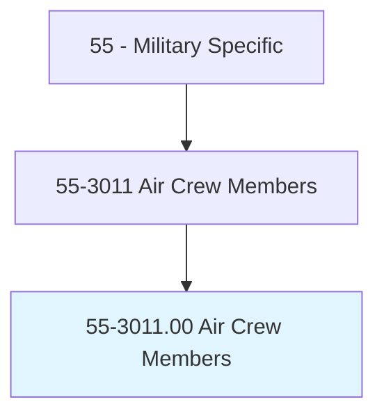
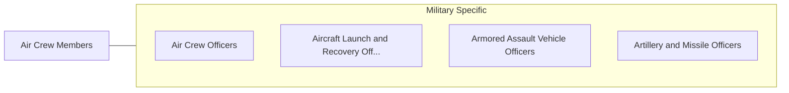

# Air Crew Members

> Perform in-flight duties to ensure the successful completion of combat, reconnaissance, transport, and search and rescue missions. Duties include operating aircraft communications and detection equipment, including establishing satellite linkages and jamming enemy communications capabilities; conducting preflight, in-flight, and postflight inspections of onboard equipment; operating and maintaining aircraft weapons and defensive systems; operating and maintaining aircraft in-flight refueling systems; executing aircraft safety and emergency procedures; computing and verifying passenger, cargo, fuel, and emergency and special equipment weight and balance data; and conducting cargo and personnel drops.

## Overview

Air Crew Members is an occupation within the Military Specific category. Perform in-flight duties to ensure the successful completion of combat, reconnaissance, transport, and search and rescue missions. 

## Classification Hierarchy

## Key Statistics

| Metric | Value |
|--------|-------|
| SOC Code | 55-3011.00 |
| Category | [Military Specific](/occupations/Military/index) |
| Task Count | 0 |
| Source | O*NET |

## Core Tasks

Task data is being compiled for this occupation. See [O*NET 55-3011.00](https://www.onetonline.org/link/summary/55-3011.00) for detailed task information.

## Skills & Competencies

### Technical Skills
- **Military Operations** - Advanced
- **Tactical Planning** - Advanced
- **Leadership** - Advanced

### Soft Skills
- **Communication** - Essential
- **Problem Solving** - Essential
- **Critical Thinking** - Important
- **Teamwork** - Important
- **Adaptability** - Important

## Related Occupations

## Industries

This occupation is found across multiple industries. See [Industries](/industries) for sector-specific employment data.

## Career Progression

---

*Source: O*NET 55-3011.00 - ONETOccupation*
