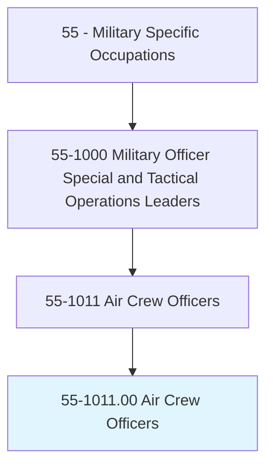
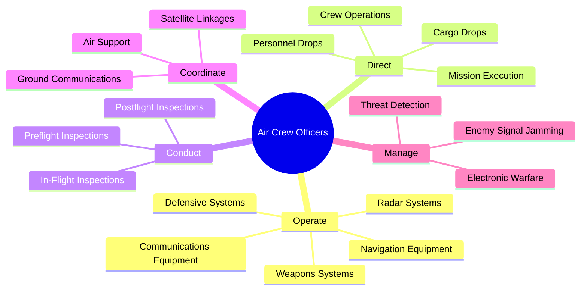
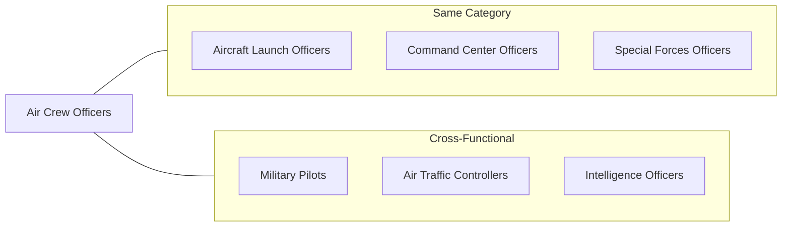
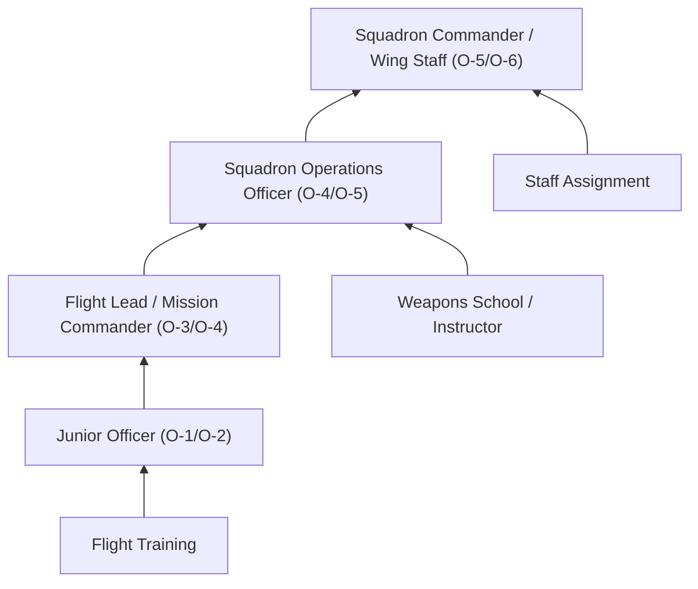

# Air Crew Officers

> Perform and direct in-flight duties to ensure the successful completion of combat, reconnaissance, transport, and search and rescue missions. Duties include operating aircraft communications and radar equipment, such as establishing satellite linkages and jamming enemy communications capabilities; operating aircraft weapons and defensive systems; conducting preflight, in-flight, and postflight inspections of onboard equipment; and directing cargo and personnel drops.

## Overview

Air Crew Officers serve as mission specialists aboard military aircraft, responsible for operating complex communications, navigation, radar, and weapons systems during flight operations. Unlike pilots who focus on aircraft control, these officers manage tactical systems, coordinate mission objectives, and ensure successful mission completion across diverse operational scenarios including combat, reconnaissance, transport, and search and rescue. They work closely with pilots and ground command to execute missions while managing onboard crew members and equipment.

## Classification Hierarchy

## Key Statistics

| Metric | Value |
|--------|-------|
| SOC Code | 55-1011.00 |
| Job Zone | 4 (Considerable Preparation) |
| Category | [Military Specific](/occupations/Military/index) |
| Core Tasks | 12+ |
| Source | O*NET |

## Core Tasks

### operate.AircraftCommunications

Air Crew Officers manage sophisticated communications systems to maintain tactical connectivity during missions.

**Actions:**
- `operate.AircraftCommunications.to.establish.SatelliteLinkages` - Configure and maintain satellite communication channels
- `operate.AircraftCommunications.to.coordinate.GroundForces` - Relay tactical information to ground units
- `operate.AircraftCommunications.to.jam.EnemyCommunications` - Disrupt adversary communication capabilities
- `operate.AircraftCommunications.to.transmit.MissionData` - Send reconnaissance and intelligence data

### operate.RadarEquipment

Air Crew Officers utilize radar and detection systems to support mission objectives and situational awareness.

**Actions:**
- `operate.RadarEquipment.to.detect.Threats` - Identify potential hostile aircraft and surface threats
- `operate.RadarEquipment.to.track.Targets` - Maintain surveillance on mission-relevant targets
- `operate.RadarEquipment.to.navigate.Terrain` - Support low-altitude flight operations
- `operate.RadarEquipment.to.coordinate.Intercepts` - Guide intercept operations against hostile aircraft

### operate.WeaponsSystems

Air Crew Officers manage aircraft weapons and defensive countermeasures in combat situations.

**Actions:**
- `operate.WeaponsSystems.to.engage.Targets` - Deploy weapons against designated targets
- `operate.WeaponsSystems.to.defend.Aircraft` - Activate defensive countermeasures against threats
- `operate.WeaponsSystems.to.coordinate.Strikes` - Synchronize weapons employment with mission objectives
- `operate.WeaponsSystems.to.manage.Ordnance` - Track and manage weapons inventory during missions

### direct.CargoAndPersonnelDrops

Air Crew Officers coordinate aerial delivery operations for cargo and personnel.

**Actions:**
- `direct.CargoDrops.to.deliver.Supplies` - Coordinate precision cargo delivery to ground forces
- `direct.PersonnelDrops.to.deploy.Paratroopers` - Manage paratrooper deployment operations
- `direct.AirdropOperations.to.support.SearchAndRescue` - Coordinate equipment drops for rescue missions
- `direct.CargoDrops.to.resupply.ForwardUnits` - Execute resupply missions to forward-deployed units

### conduct.Inspections

Air Crew Officers ensure mission readiness through systematic equipment inspections.

**Actions:**
- `conduct.PreflightInspections.to.verify.SystemReadiness` - Check all onboard systems before departure
- `conduct.InFlightInspections.to.monitor.EquipmentStatus` - Continuously assess system performance during missions
- `conduct.PostflightInspections.to.identify.Maintenance` - Document equipment issues for maintenance action
- `conduct.Inspections.to.ensure.SafetyCompliance` - Verify adherence to safety protocols

## Skills & Competencies

### Technical Skills
- **Aviation Electronics** - Expert
- **Radar and Sensor Operations** - Expert
- **Communications Systems** - Advanced
- **Weapons Systems** - Advanced
- **Navigation Systems** - Advanced
- **Electronic Warfare** - Advanced
- **Mission Planning** - Advanced

### Soft Skills
- **Situational Awareness** - Critical
- **Decision Making** - Critical
- **Teamwork** - Critical
- **Communication** - Essential
- **Stress Management** - Essential

## Related Occupations

## Branch Variations

### Navy / Marine Corps
- **Naval Flight Officer (NFO)** - Operates weapons systems on carrier-based aircraft
- **Radar Intercept Officer (RIO)** - Manages radar and weapons on fighter aircraft
- **Weapons Systems Officer (WSO)** - Coordinates weapons employment
- **Electronic Warfare Officer (EWO)** - Manages electronic countermeasures

### Air Force
- **Combat Systems Officer (CSO)** - Operates navigation and weapons systems
- **Navigator** - Manages navigation and mission systems on bombers
- **Electronic Warfare Officer** - Specializes in electronic countermeasures
- **Weapons Director** - Coordinates air-to-air and air-to-ground weapons

### Army
- **Helicopter Officer** - Manages systems on rotary-wing aircraft
- **Airdrop Systems Officer** - Coordinates aerial delivery operations

## Industries

- [Defense](/industries/Defense) - Primary employment in all military branches
- [Government](/industries/Government) - National Guard and Reserve components
- [Aerospace](/industries/Aerospace) - Contractor support and training roles

## Career Progression

### Rank Progression

| Level | Rank | Typical Role |
|-------|------|--------------|
| Entry | O-1/O-2 (2LT/1LT or ENS/LTJG) | Student / Wingman |
| Mid-Career | O-3 (CPT/LT) | Mission Commander |
| Senior | O-4/O-5 (MAJ/LTC or LCDR/CDR) | Operations Officer |
| Executive | O-6+ (COL or CAPT) | Squadron/Wing Commander |

## Education & Training

| Requirement | Details |
|-------------|---------|
| Typical Education | Bachelor's degree (required for commissioning) |
| Commissioning Source | Military Academy, ROTC, OCS/OTS |
| Initial Training | Undergraduate Flight Training (NFO/CSO) - 12-18 months |
| Specialized Training | Aircraft-specific qualification - 6-12 months |
| Ongoing Development | Weapons School, Professional Military Education |

### Key Qualifications
- Aviation physiology and survival training
- Aircraft-specific systems certification
- Combat mission qualification
- Weapons employment certification
- Electronic warfare training (as applicable)

## Civilian Transition Paths

Air Crew Officers develop skills valued in civilian aviation and defense sectors:

- [Commercial Aviation](/occupations/Transportation/index) - Flight operations, crew resource management
- [Defense Contractors](/industries/Defense) - Systems engineering, program management
- [Air Traffic Control](/occupations/Transportation/index) - FAA and contract ATC positions
- [Aerospace Engineering](/occupations/Engineering) - Aviation systems development
- [Cybersecurity](/occupations/Technology/index) - Electronic warfare translates to cyber operations

## Departments

This occupation typically works in:
- [Flight Operations](/departments/Operations/index)
- [Squadron Operations](/departments/Operations/index)
- [Wing Command](/departments/Command)
- [Air Operations Center](/departments/Command)

## Related Job Titles

- Naval Flight Officer (NFO)
- Combat Systems Officer (CSO)
- Weapons Systems Officer (WSO)
- Radar Intercept Officer (RIO)
- Electronic Warfare Officer (EWO)
- Navigator/Bombardier
- Airborne Mission Commander
- Astronaut Mission Specialist

---

*Source: O*NET 55-1011.00 - ONETOccupation*
