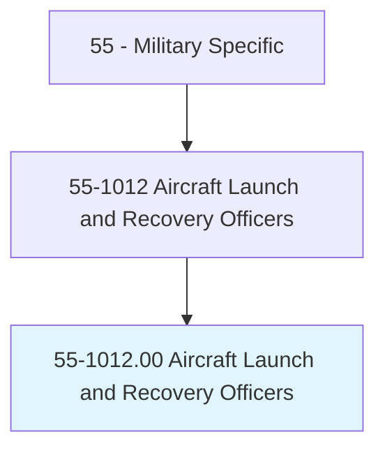
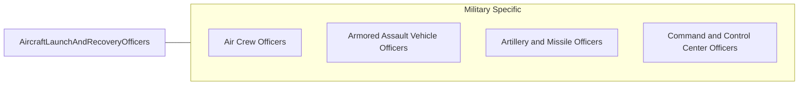

# Aircraft Launch and Recovery Officers

> Plan and direct the operation and maintenance of catapults, arresting gear, and associated mechanical, hydraulic, and control systems involved primarily in aircraft carrier takeoff and landing operations. Duties include supervision of readiness and safety of arresting gear, launching equipment, barricades, and visual landing aid systems; planning and coordinating the design, development, and testing of launch and recovery systems; preparing specifications for catapult and arresting gear installations; evaluating design proposals; determining handling equipment needed for new aircraft; preparing technical data and instructions for operation of landing aids; and training personnel in carrier takeoff and landing procedures.

## Overview

Aircraft Launch and Recovery Officers is an occupation within the Military Specific category. Plan and direct the operation and maintenance of catapults, arresting gear, and associated mechanical, hydraulic, and control systems involved primarily in aircraft carrier takeoff and landing operations. 

## Classification Hierarchy

## Key Statistics

| Metric | Value |
|--------|-------|
| SOC Code | 55-1012.00 |
| Category | [Military Specific](/occupations/Military/index) |
| Task Count | 0 |
| Source | O*NET |

## Core Tasks

Task data is being compiled for this occupation. See [O*NET 55-1012.00](https://www.onetonline.org/link/summary/55-1012.00) for detailed task information.

## Skills & Competencies

### Technical Skills
- **Military Operations** - Advanced
- **Tactical Planning** - Advanced
- **Leadership** - Advanced

### Soft Skills
- **Communication** - Essential
- **Problem Solving** - Essential
- **Critical Thinking** - Important
- **Teamwork** - Important
- **Adaptability** - Important

## Related Occupations

## Industries

This occupation is found across multiple industries. See [Industries](/industries) for sector-specific employment data.

## Career Progression

---

*Source: O*NET 55-1012.00 - ONETOccupation*
