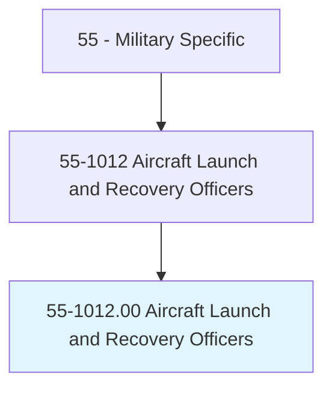
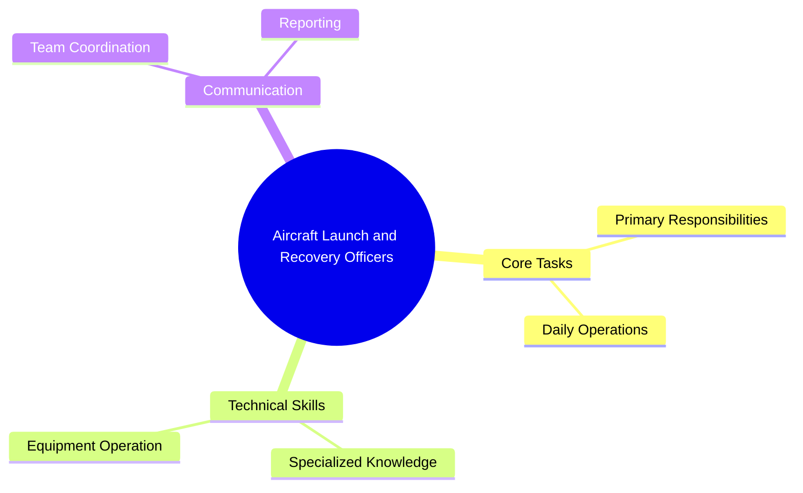
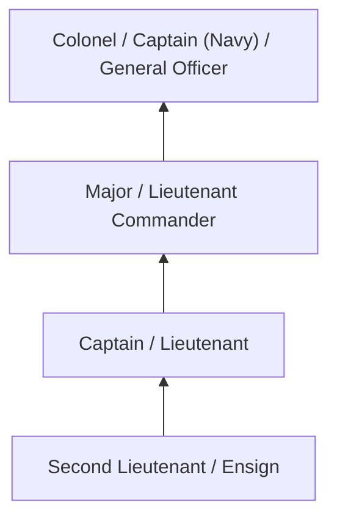
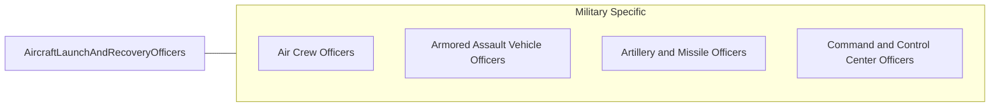

# Aircraft Launch and Recovery Officers

> Plan and direct the operation and maintenance of catapults, arresting gear, and associated mechanical, hydraulic, and control systems involved primarily in aircraft carrier takeoff and landing operations. Duties include supervision of readiness and safety of arresting gear, launching equipment, barricades, and visual landing aid systems; planning and coordinating the design, development, and testing of launch and recovery systems; preparing specifications for catapult and arresting gear installations; evaluating design proposals; determining handling equipment needed for new aircraft; preparing technical data and instructions for operation of landing aids; and training personnel in carrier takeoff and landing procedures.

## Overview

Aircraft Launch and Recovery Officers professionals plan and direct the operation and maintenance of catapults, arresting gear, and associated mechanical, hydraulic, and control systems involved primarily in aircraft carrier takeoff and landing operations. This occupation falls within the Military Specific category and requires a combination of specialized knowledge, technical skills, and practical experience.

These professionals work across diverse settings and organizational contexts, applying their expertise to meet the demands of their field. They must stay current with industry standards, emerging practices, and regulatory requirements that affect their work. The role demands both independent judgment and collaborative skills, as practitioners regularly interact with colleagues, stakeholders, and the public.

As the field continues to evolve, Aircraft Launch and Recovery Officers professionals increasingly leverage technology and data-driven approaches to enhance their effectiveness. Career opportunities span the public and private sectors, with demand influenced by economic conditions, demographic shifts, and technological advancement.

## Classification Hierarchy



## Key Statistics

| Metric | Value |
|--------|-------|
| SOC Code | 55-1012.00 |
| Job Zone | N/A |
| Category | [Military Specific](/occupations/Military/index) |
| Core Tasks | N/A+ |
| Salary Range | $30,000 - $100,000 |
| Median Salary | $55,000 |
| Growth Outlook | 3% (Slower than average) |
| Source | O*NET |

## Core Tasks



### Technical Skills
- **Military Operations** - Advanced
- **Tactical Planning** - Advanced
- **Leadership** - Advanced

### Soft Skills
- **Communication** - Essential
- **Problem Solving** - Essential
- **Critical Thinking** - Important
- **Teamwork** - Important
- **Adaptability** - Important


## Skills & Competencies

### Technical Skills
- **Military Operations** - Expert
- **Tactical Planning** - Advanced
- **Weapons Systems** - Advanced
- **Communications** - Advanced
- **Physical Fitness** - Advanced
- **First Aid** - Proficient

### Soft Skills
- **Leadership** - Critical
- **Discipline** - Critical
- **Teamwork** - Essential
- **Decision Making** - Essential
- **Adaptability** - Essential

## Education & Certifications

| Requirement | Details |
|-------------|---------|
| Typical Education | Varies; officer roles require bachelor's degree minimum |
| Work Experience | Varies by rank and specialty |
| On-the-Job Training | Extensive - basic training plus specialty school |
| Certifications | Military Occupational Specialty (MOS) qualification |

## Career Progression



## Industry Variations

### Active Duty
Full-time military service with deployment readiness. Aircraft Launch and Recovery Officers professionals maintain combat and operational readiness.

### Reserve Forces
Part-time military service with periodic training and activation. Balance between civilian career and military obligations.

### Special Operations
Elite military units with advanced training and high-risk missions. Emphasis on physical fitness, specialized skills, and teamwork.

### Support and Logistics
Operational support ensuring combat forces have necessary resources. Focus on supply chain, maintenance, and administration.

## Technology & Tools

- **Command and control systems**
- **Military communications equipment**
- **Weapons systems**
- **Intelligence analysis software**
- **Simulation and training systems**

## Related Occupations



## Industries

- [Department of Defense](/industries/Defense) - Primary Employment
- [National Guard](/industries/NationalGuard) - Part-Time Employment
- [Coast Guard](/industries/CoastGuard) - Moderate Employment
- [Defense Contractors](/industries/DefenseContractors) - Related Employment

## Departments

This occupation typically works in:
- [Operations](/departments/Operations/index)
- [Training and Readiness](/departments/Training)
- [Logistics](/departments/Logistics)

## GraphDL Semantic Structure

```
Aircraft Launch and Recovery Officers perform:
- execute.Missions.according.to.Orders
- maintain.Readiness.for.Operations
- lead.Personnel.in.TacticalOperations
- coordinate.Activities.with.CommandStructure
- train.Subordinates.in.MilitaryProcedures
```

---

*Source: O*NET 55-1012.00 - ONETOccupation*
