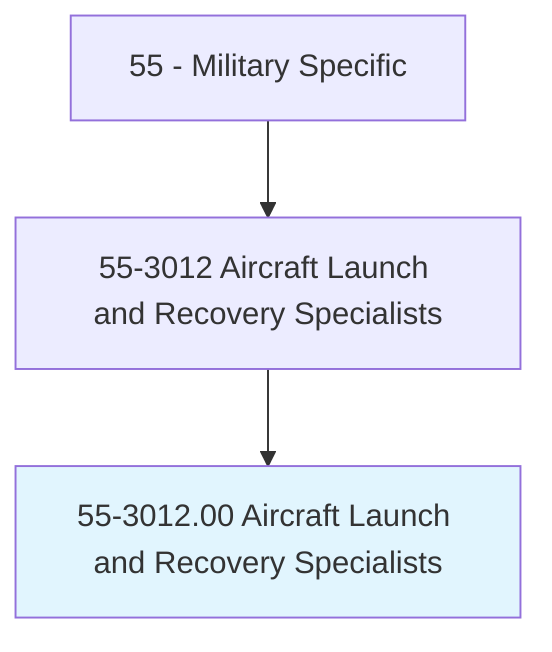

# Aircraft Launch and Recovery Specialists

> Operate and maintain catapults, arresting gear, and associated mechanical, hydraulic, and control systems involved primarily in aircraft carrier takeoff and landing operations. Duties include installing and maintaining visual landing aids; testing and maintaining launch and recovery equipment using electric and mechanical test equipment and hand tools; activating airfield arresting systems, such as crash barriers and cables, during emergency landing situations; directing aircraft launch and recovery operations using hand or light signals; and maintaining logs of airplane launches, recoveries, and equipment maintenance.

## Overview

Aircraft Launch and Recovery Specialists is an occupation within the Military Specific category. Operate and maintain catapults, arresting gear, and associated mechanical, hydraulic, and control systems involved primarily in aircraft carrier takeoff and landing operations. 

## Classification Hierarchy

## Key Statistics

| Metric | Value |
|--------|-------|
| SOC Code | 55-3012.00 |
| Category | [Military Specific](/occupations/Military) |
| Task Count | 0 |
| Source | O*NET |

## Core Tasks

Task data is being compiled for this occupation. See [O*NET 55-3012.00](https://www.onetonline.org/link/summary/55-3012.00) for detailed task information.

## Skills & Competencies

### Technical Skills
- **Military Operations** - Advanced
- **Tactical Planning** - Advanced
- **Leadership** - Advanced

### Soft Skills
- **Communication** - Essential
- **Problem Solving** - Essential
- **Critical Thinking** - Important
- **Teamwork** - Important
- **Adaptability** - Important

## Related Occupations

## Industries

This occupation is found across multiple industries. See [Industries](/industries) for sector-specific employment data.

## Career Progression

---

*Source: O*NET 55-3012.00 - ONETOccupation*
