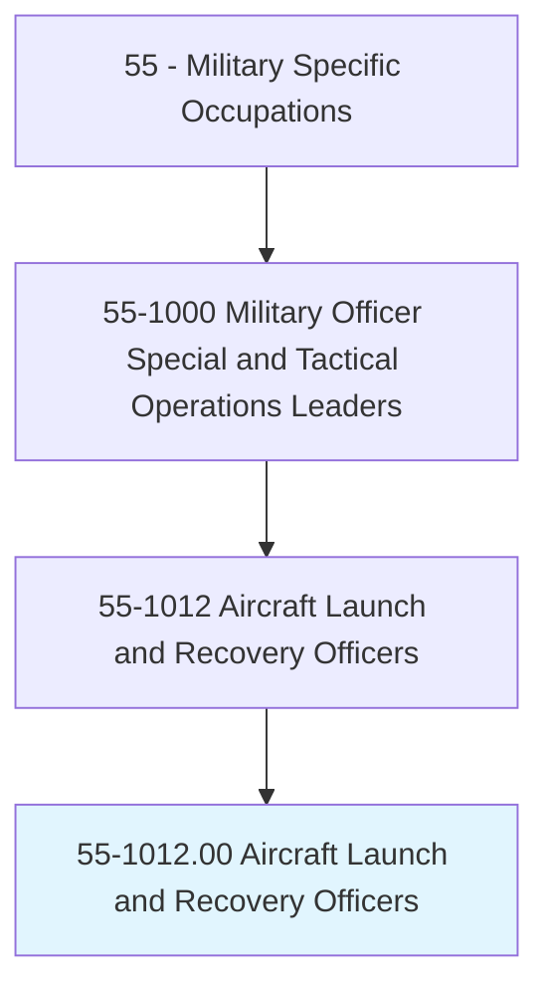
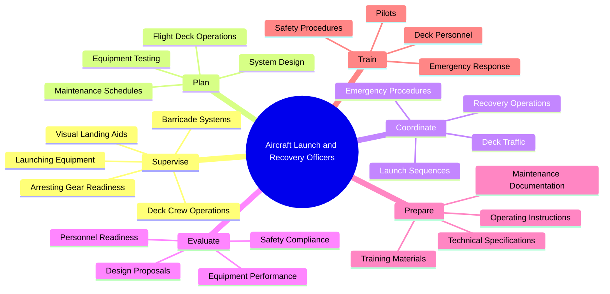
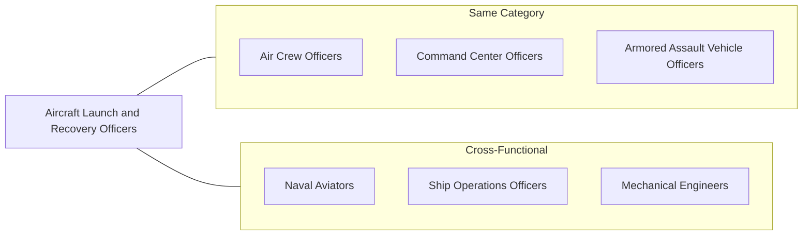
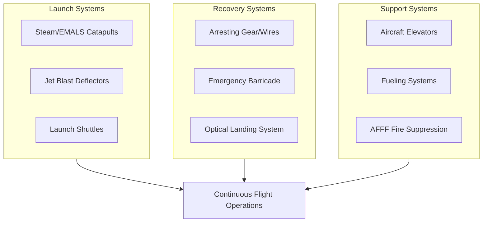
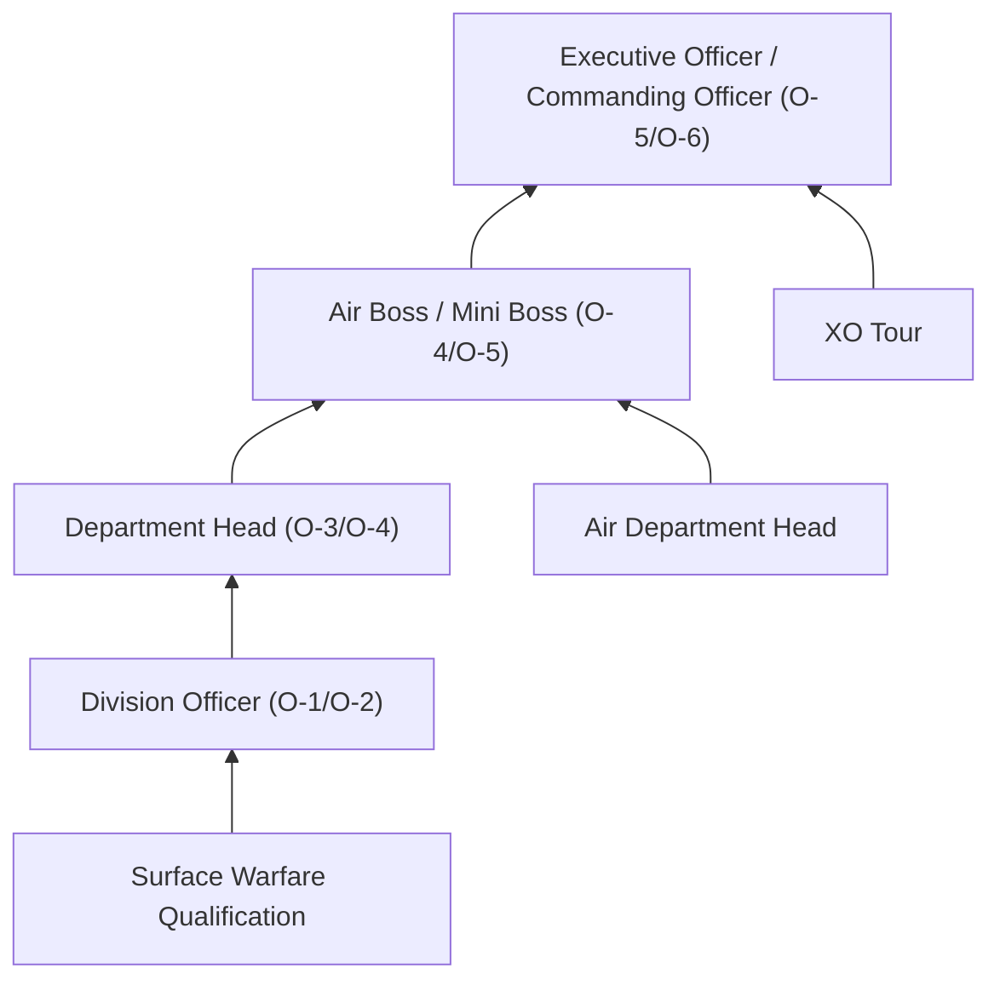
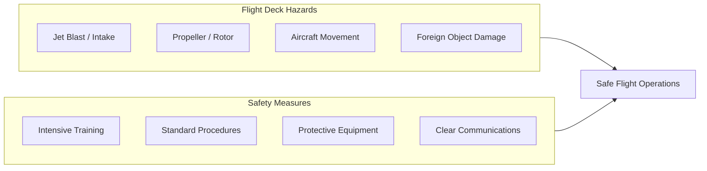

# Aircraft Launch and Recovery Officers

> Plan and direct the operation and maintenance of catapults, arresting gear, and associated mechanical, hydraulic, and control systems involved primarily in aircraft carrier takeoff and landing operations. Duties include supervision of readiness and safety of arresting gear, launching equipment, barricades, and visual landing aid systems; planning and coordinating the design, development, and testing of launch and recovery systems; preparing specifications for catapult and arresting gear installations; evaluating design proposals; determining handling equipment needed for new aircraft; preparing technical data and instructions for operation of landing aids; and training personnel in carrier takeoff and landing procedures.

## Overview

Aircraft Launch and Recovery Officers are specialized naval officers responsible for the complex systems that enable aircraft to take off from and land on aircraft carriers. These officers manage the catapult systems that launch aircraft and the arresting gear systems that safely recover them, overseeing one of the most dangerous and technically demanding operations in military aviation. They ensure the safety and readiness of critical flight deck systems while coordinating with pilots, deck crews, and ship's command to maintain continuous flight operations.

## Classification Hierarchy

## Key Statistics

| Metric | Value |
|--------|-------|
| SOC Code | 55-1012.00 |
| Job Zone | 4 (Considerable Preparation) |
| Category | [Military Specific](/occupations/Military/index) |
| Core Tasks | 15+ |
| Source | O*NET |

## Core Tasks

### supervise.LaunchAndRecoverySystems

Aircraft Launch and Recovery Officers oversee the readiness and operation of critical flight deck systems.

**Actions:**
- `supervise.ArrestingGear.to.ensure.SafetyReadiness` - Maintain arresting wire systems in operational condition
- `supervise.CatapultSystems.to.ensure.LaunchCapability` - Oversee steam and electromagnetic catapult readiness
- `supervise.BarricadeSystems.to.prepare.EmergencyRecovery` - Manage emergency landing barrier systems
- `supervise.VisualLandingAids.to.support.CarrierLandings` - Maintain optical landing systems (meatball)

### plan.SystemOperations

Aircraft Launch and Recovery Officers develop plans for equipment design, testing, and operational procedures.

**Actions:**
- `plan.SystemDesign.to.improve.LaunchCapabilities` - Coordinate development of next-generation systems
- `plan.EquipmentTesting.to.verify.SystemPerformance` - Establish testing protocols for launch and recovery gear
- `plan.MaintenanceSchedules.to.ensure.ContinuousOperations` - Develop preventive maintenance programs
- `plan.FlightDeckOperations.to.maximize.Sortie.Rates` - Optimize launch and recovery cycle times

### coordinate.FlightDeckOperations

Aircraft Launch and Recovery Officers synchronize complex flight deck activities for safe and efficient operations.

**Actions:**
- `coordinate.LaunchSequences.to.execute.AircraftDepartures` - Time and sequence catapult launches
- `coordinate.RecoveryOperations.to.recover.ReturningAircraft` - Manage aircraft landing sequences
- `coordinate.EmergencyProcedures.to.respond.DeckEmergencies` - Direct emergency barricade arrestments
- `coordinate.DeckTraffic.to.prevent.Accidents` - Manage aircraft and personnel movement

### evaluate.EquipmentAndDesigns

Aircraft Launch and Recovery Officers assess system performance and proposed improvements.

**Actions:**
- `evaluate.DesignProposals.to.select.NewEquipment` - Review and approve new system designs
- `evaluate.EquipmentPerformance.to.identify.Improvements` - Analyze operational data for optimization
- `evaluate.SafetyCompliance.to.maintain.Standards` - Verify adherence to safety regulations
- `evaluate.HandlingEquipment.to.accommodate.NewAircraft` - Assess compatibility with new aircraft types

### prepare.TechnicalDocumentation

Aircraft Launch and Recovery Officers develop specifications, instructions, and training materials.

**Actions:**
- `prepare.TechnicalSpecifications.to.guide.Installation` - Create detailed equipment specifications
- `prepare.OperatingInstructions.to.standardize.Procedures` - Develop standard operating procedures
- `prepare.TrainingMaterials.to.educate.Personnel` - Create curriculum for operator training
- `prepare.MaintenanceDocumentation.to.support.Repairs` - Document maintenance procedures and requirements

### train.Personnel

Aircraft Launch and Recovery Officers develop competency in deck crews and pilots.

**Actions:**
- `train.DeckPersonnel.to.operate.LaunchSystems` - Instruct catapult and arresting gear operators
- `train.Pilots.to.execute.CarrierLandings` - Support carrier qualification training
- `train.SafetyProcedures.to.prevent.Accidents` - Conduct safety training and drills
- `train.EmergencyResponse.to.handle.Incidents` - Prepare personnel for emergency situations

## Skills & Competencies

### Technical Skills
- **Mechanical Engineering** - Expert
- **Hydraulic Systems** - Expert
- **Catapult Systems** - Expert
- **Arresting Gear Systems** - Expert
- **Visual Landing Systems** - Advanced
- **Aircraft Handling** - Advanced
- **Safety Management** - Advanced

### Soft Skills
- **Leadership** - Critical
- **Decision Making** - Critical
- **Attention to Detail** - Critical
- **Communication** - Essential
- **Stress Management** - Essential

## Related Occupations

## Branch-Specific Roles

### Navy
- **Catapult and Arresting Gear Officer (V-2 Division Officer)** - Primary flight deck systems officer
- **Flight Deck Officer** - Oversees all flight deck operations
- **Air Department Officer** - Senior air operations leadership
- **Landing Signal Officer (LSO)** - Guides pilots during carrier landings
- **Aircraft Handling Officer** - Manages aircraft movement on deck and hangar

### Marine Corps
- **V/STOL Landing Signal Officer** - Specializes in vertical/short takeoff aircraft
- **Amphibious Operations Aviation Officer** - Supports aviation operations on amphibious ships

## Flight Deck Systems

## Industries

- [Defense - Navy](/industries/Defense) - Aircraft carrier operations
- [Defense - Marine Corps](/industries/Defense) - Amphibious assault ship operations
- [Aerospace](/industries/Aerospace) - Systems development and testing

## Career Progression

### Rank Progression

| Level | Rank | Typical Role |
|-------|------|--------------|
| Entry | O-1/O-2 (ENS/LTJG) | V-2 Division Officer |
| Mid-Career | O-3/O-4 (LT/LCDR) | Aircraft Handling Officer |
| Senior | O-4/O-5 (LCDR/CDR) | Air Boss (Primary Flight Control) |
| Executive | O-5/O-6 (CDR/CAPT) | Ship Executive Officer / CO |

## Education & Training

| Requirement | Details |
|-------------|---------|
| Typical Education | Bachelor's degree in Engineering or related field |
| Commissioning Source | Naval Academy, NROTC, OCS |
| Initial Training | Surface Warfare Officers School |
| Specialized Training | Catapult and Arresting Gear Course |
| Ongoing Development | Landing Signal Officer School, Air Department Head Course |

### Key Qualifications
- Surface Warfare Officer (SWO) qualification
- Catapult and Arresting Gear (CATCC) certification
- Flight Deck Safety certification
- Aircraft Handling Officer qualification
- Landing Signal Officer (LSO) qualification (optional)

## Safety Considerations

Flight deck operations are among the most hazardous in the military:

## Civilian Transition Paths

Aircraft Launch and Recovery Officers develop skills valued in civilian sectors:

- [Aerospace Engineering](/occupations/Engineering) - Systems design and testing
- [Aviation Management](/occupations/Management/index) - Airport and airline operations
- [Manufacturing](/industries/Manufacturing/index) - Heavy equipment and hydraulic systems
- [Quality Assurance](/occupations/Business/index) - Safety and compliance management
- [Defense Contractors](/industries/Defense) - Navy shipbuilding and systems integration

## Departments

This occupation typically works in:
- [Air Department (V-2 Division)](/departments/Operations/index)
- [Flight Deck Control](/departments/Operations/index)
- [Primary Flight Control (Air Boss)](/departments/Command)
- [Ship Operations](/departments/Operations/index)

## Related Job Titles

- Catapult and Arresting Gear Officer
- Flight Deck Officer
- Landing Signal Officer (LSO)
- V/STOL Landing Signal Officer
- Aircraft Handling Officer
- Air Boss
- Mini Boss (Assistant Air Boss)
- Air Department Head

---

*Source: O*NET 55-1012.00 - ONETOccupation*
