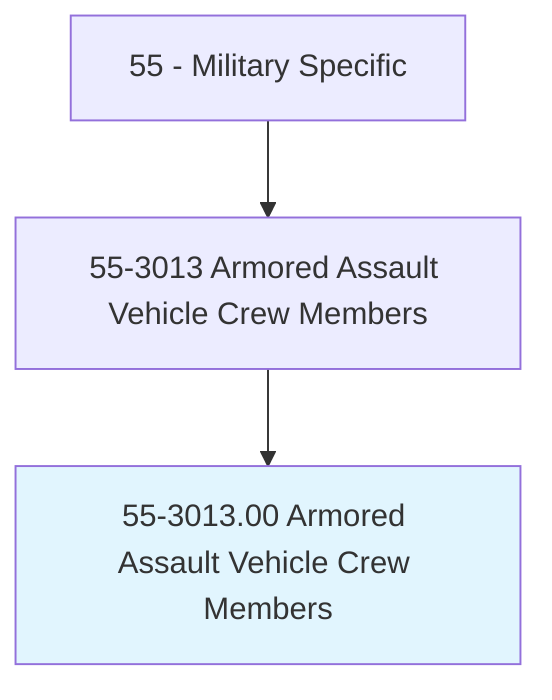
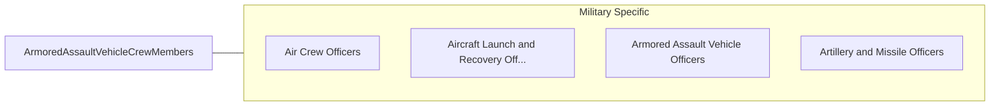

# Armored Assault Vehicle Crew Members

> Operate tanks, light armor, and amphibious assault vehicles during combat situations on land or in aquatic environments. Duties include driving armored vehicles that require specialized training; operating and maintaining targeting and firing systems; operating and maintaining advanced onboard communications and navigation equipment; transporting personnel and equipment in a combat environment; and operating and maintaining auxiliary weapons, including machine guns and grenade launchers.

## Overview

Armored Assault Vehicle Crew Members is an occupation within the Military Specific category. Operate tanks, light armor, and amphibious assault vehicles during combat situations on land or in aquatic environments. 

## Classification Hierarchy

## Key Statistics

| Metric | Value |
|--------|-------|
| SOC Code | 55-3013.00 |
| Category | [Military Specific](/occupations/Military/index) |
| Task Count | 0 |
| Source | O*NET |

## Core Tasks

Task data is being compiled for this occupation. See [O*NET 55-3013.00](https://www.onetonline.org/link/summary/55-3013.00) for detailed task information.

## Skills & Competencies

### Technical Skills
- **Military Operations** - Advanced
- **Tactical Planning** - Advanced
- **Leadership** - Advanced

### Soft Skills
- **Communication** - Essential
- **Problem Solving** - Essential
- **Critical Thinking** - Important
- **Teamwork** - Important
- **Adaptability** - Important

## Related Occupations

## Industries

This occupation is found across multiple industries. See [Industries](/industries) for sector-specific employment data.

## Career Progression

---

*Source: O*NET 55-3013.00 - ONETOccupation*
