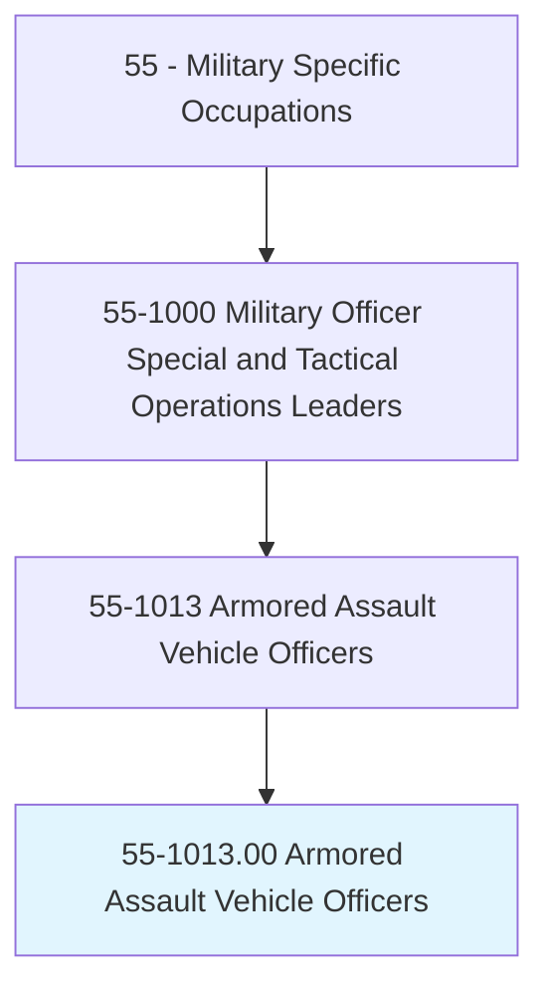
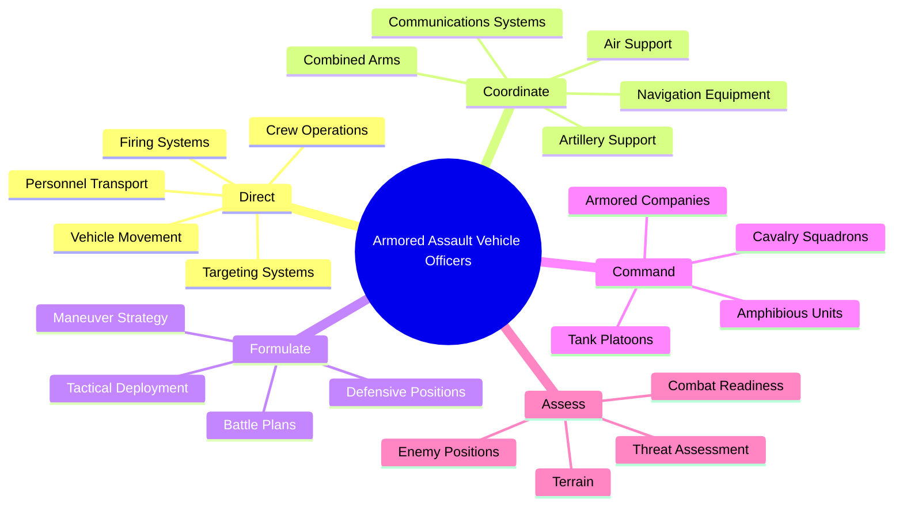
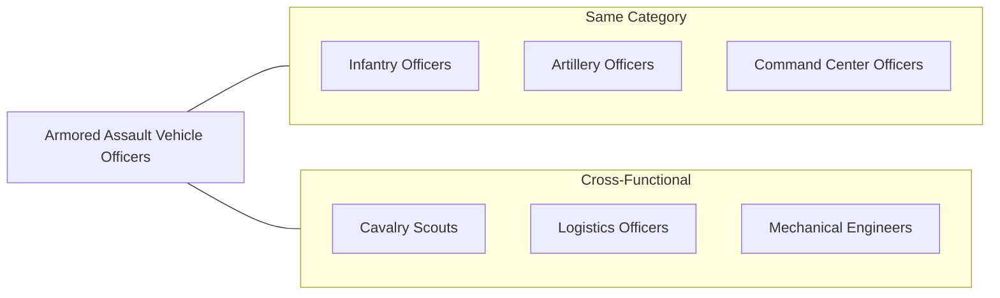
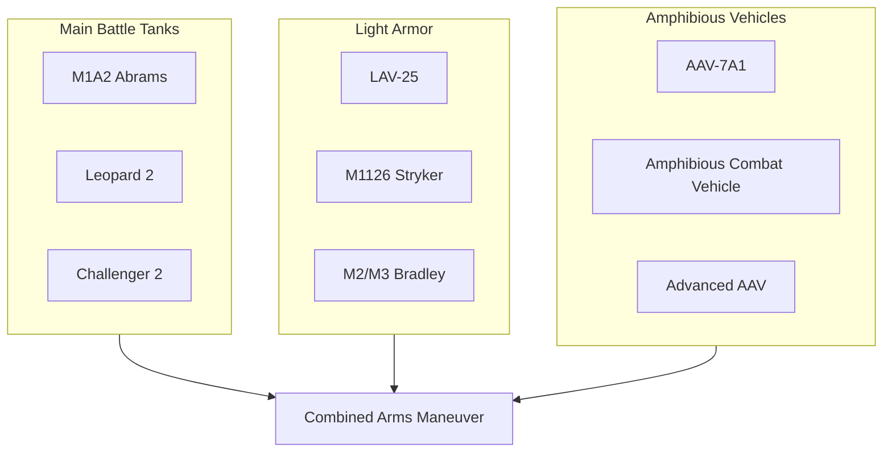
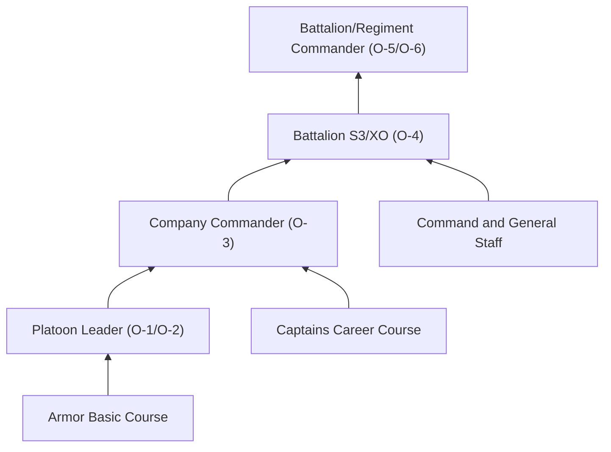
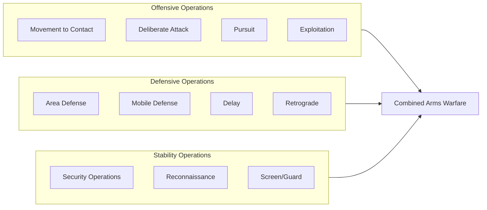

# Armored Assault Vehicle Officers

> Direct the operation of tanks, light armor, and amphibious assault vehicle units during combat situations on land or in aquatic environments. Duties include directing crew members in the operation of targeting and firing systems; coordinating the operation of advanced onboard communications and navigation equipment; directing the transport of personnel and equipment during combat; formulating and implementing battle plans, including the tactical employment of armored vehicle units; and coordinating with infantry, artillery, and air support units.

## Overview

Armored Assault Vehicle Officers command tank, armored cavalry, and amphibious assault units in ground combat operations. They lead crews operating some of the military's most powerful and technologically advanced ground combat systems, from main battle tanks to amphibious assault vehicles capable of transitioning from ship to shore. These officers are responsible for tactical maneuver, combined arms coordination, and the protection and offensive capabilities of mechanized forces in both offensive and defensive operations.

## Classification Hierarchy

## Key Statistics

| Metric | Value |
|--------|-------|
| SOC Code | 55-1013.00 |
| Job Zone | 4 (Considerable Preparation) |
| Category | [Military Specific](/occupations/Military) |
| Core Tasks | 12+ |
| Source | O*NET |

## Core Tasks

### direct.CrewOperations

Armored Assault Vehicle Officers lead vehicle crews in combat operations and systems employment.

**Actions:**
- `direct.CrewMembers.to.operate.TargetingSystems` - Guide gunners in acquiring and engaging targets
- `direct.CrewMembers.to.operate.FiringSystems` - Supervise main gun and weapons employment
- `direct.VehicleDrivers.to.maneuver.TacticalPositions` - Direct movement and positioning
- `direct.LoaderOperations.to.maintain.CombatReadiness` - Ensure ammunition readiness and gun operation

### coordinate.CommunicationsAndNavigation

Armored Assault Vehicle Officers manage onboard systems for battlefield coordination.

**Actions:**
- `coordinate.CommunicationsSystems.to.maintain.BattlefieldAwareness` - Manage tactical radio networks
- `coordinate.NavigationEquipment.to.execute.MovementOrders` - Utilize GPS and digital mapping systems
- `coordinate.DataSystems.to.share.BattlefieldInformation` - Operate Blue Force Tracker and similar systems
- `coordinate.CombinedArms.to.integrate.SupportingFires` - Synchronize with infantry, artillery, and air assets

### formulate.BattlePlans

Armored Assault Vehicle Officers develop tactical plans for armored operations.

**Actions:**
- `formulate.BattlePlans.to.achieve.TacticalObjectives` - Develop schemes of maneuver
- `formulate.TacticalDeployment.to.employ.ArmoredUnits` - Position forces for maximum effectiveness
- `formulate.ManeuverStrategy.to.exploit.EnemyWeaknesses` - Plan offensive operations
- `formulate.DefensivePositions.to.protect.KeyTerrain` - Establish defensive fighting positions

### command.ArmoredUnits

Armored Assault Vehicle Officers exercise command authority over mechanized formations.

**Actions:**
- `command.TankPlatoons.to.execute.Missions` - Lead 4-tank sections in combat
- `command.ArmoredCompanies.to.conduct.Operations` - Direct company-level maneuver
- `command.CavalrySquadrons.to.perform.Reconnaissance` - Lead reconnaissance and security missions
- `command.AmphibiousUnits.to.conduct.ShipToShore` - Direct beach assault operations

### direct.Transport

Armored Assault Vehicle Officers manage personnel and equipment transport in combat.

**Actions:**
- `direct.PersonnelTransport.to.deliver.Infantry` - Coordinate troop movement in armored carriers
- `direct.EquipmentTransport.to.support.CombatOperations` - Manage logistics movement
- `direct.AmphibiousOperations.to.transition.ShipToShore` - Execute water-to-land movement
- `direct.CasualtyEvacuation.to.protect.Personnel` - Coordinate medical evacuation support

## Skills & Competencies

### Technical Skills
- **Armored Vehicle Systems** - Expert
- **Weapons Employment** - Expert
- **Tactical Maneuver** - Expert
- **Combined Arms Operations** - Advanced
- **Navigation and Land Navigation** - Advanced
- **Communications Systems** - Advanced
- **Maintenance Management** - Advanced

### Soft Skills
- **Leadership** - Critical
- **Decision Making Under Pressure** - Critical
- **Tactical Thinking** - Critical
- **Communication** - Essential
- **Physical Fitness** - Essential

## Related Occupations

## Branch Variations

### Army
- **Armor Officer** - Commands tank units in armored divisions
- **Cavalry Officer** - Leads armored cavalry reconnaissance units
- **Stryker Officer** - Commands Stryker infantry carrier vehicles

### Marine Corps
- **Assault Amphibious Vehicle (AAV) Officer** - Commands ship-to-shore assault vehicles
- **Light Armored Reconnaissance (LAR) Officer** - Leads LAV reconnaissance units
- **Tank Officer** - Commands Marine tank units

## Vehicle Systems

## Industries

- [Defense - Army](/industries/Defense) - Armored and cavalry units
- [Defense - Marine Corps](/industries/Defense) - Tank and amphibious assault battalions
- [Defense Contractors](/industries/Defense) - Vehicle development and testing

## Career Progression

### Rank Progression

| Level | Rank | Typical Role |
|-------|------|--------------|
| Entry | O-1/O-2 (2LT/1LT) | Tank/AAV Platoon Leader |
| Mid-Career | O-3 (CPT) | Company Commander |
| Senior | O-4 (MAJ) | Battalion Operations Officer (S3) |
| Executive | O-5/O-6 (LTC/COL) | Battalion/Brigade Commander |

## Education & Training

| Requirement | Details |
|-------------|---------|
| Typical Education | Bachelor's degree (any field) |
| Commissioning Source | Military Academy, ROTC, OCS |
| Initial Training | Armor Basic Officer Leader Course (ABOLC) - 18 weeks |
| Advanced Training | Maneuver Captain's Career Course, Ranger School |
| Ongoing Development | Command and General Staff College, War College |

### Key Qualifications
- Armor/Cavalry Basic Course completion
- Gunnery qualification (Tank Commander)
- Ranger qualification (highly encouraged)
- Airborne qualification (common)
- Master Gunner certification (specialty)

## Tactical Operations

## Civilian Transition Paths

Armored Assault Vehicle Officers develop skills valued in civilian sectors:

- [Management](/occupations/Management) - Leadership and operations management
- [Logistics](/occupations/Business) - Supply chain and transportation management
- [Law Enforcement](/occupations/ProtectiveService) - Tactical team leadership
- [Manufacturing](/industries/Manufacturing) - Heavy equipment operations
- [Defense Contractors](/industries/Defense) - Vehicle systems development and training

## Departments

This occupation typically works in:
- [Combat Arms Units](/departments/Operations)
- [Armored Battalions/Regiments](/departments/Operations)
- [Cavalry Squadrons](/departments/Operations)
- [Amphibious Assault Units](/departments/Operations)

## Related Job Titles

- Armor Officer
- Cavalry Officer
- Tank Platoon Leader
- Tank Company Commander
- Assault Amphibious Vehicle (AAV) Officer
- Light-Armored Reconnaissance Officer
- Light-Armored Vehicle Officer
- Stryker Platoon Leader
- Armored Cavalry Troop Commander

---

*Source: O*NET 55-1013.00 - ONETOccupation*
