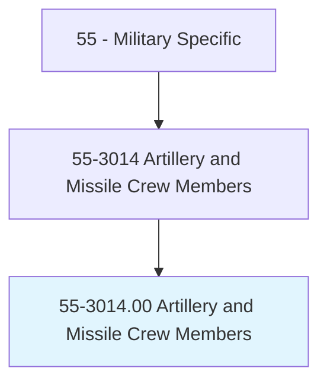
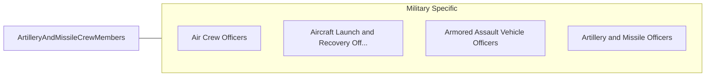

# Artillery and Missile Crew Members

> Target, fire, and maintain weapons used to destroy enemy positions, aircraft, and vessels. Field artillery crew members predominantly use guns, cannons, and howitzers in ground combat operations, while air defense artillery crew members predominantly use missiles and rockets. Naval artillery crew members predominantly use torpedoes and missiles launched from a ship or submarine. Duties include testing, inspecting, and storing ammunition, missiles, and torpedoes; conducting preventive and routine maintenance on weapons and related equipment; establishing and maintaining radio and wire communications; and operating weapons targeting, firing, and launch computer systems.

## Overview

Artillery and Missile Crew Members is an occupation within the Military Specific category. Target, fire, and maintain weapons used to destroy enemy positions, aircraft, and vessels. Field artillery crew members predominantly use guns, cannons, and howitzers in ground combat operations, while air defense artillery crew members predominantly use missiles and rockets.

## Classification Hierarchy

## Key Statistics

| Metric | Value |
|--------|-------|
| SOC Code | 55-3014.00 |
| Category | [Military Specific](/occupations/Military) |
| Task Count | 0 |
| Source | O*NET |

## Core Tasks

Task data is being compiled for this occupation. See [O*NET 55-3014.00](https://www.onetonline.org/link/summary/55-3014.00) for detailed task information.

## Skills & Competencies

### Technical Skills
- **Military Operations** - Advanced
- **Tactical Planning** - Advanced
- **Leadership** - Advanced

### Soft Skills
- **Communication** - Essential
- **Problem Solving** - Essential
- **Critical Thinking** - Important
- **Teamwork** - Important
- **Adaptability** - Important

## Related Occupations

## Industries

This occupation is found across multiple industries. See [Industries](/industries) for sector-specific employment data.

## Career Progression

---

*Source: O*NET 55-3014.00 - ONETOccupation*
