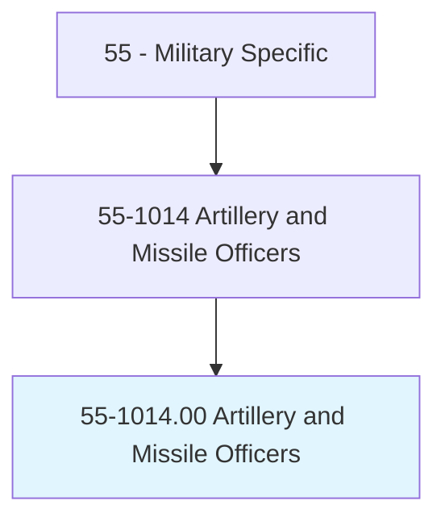
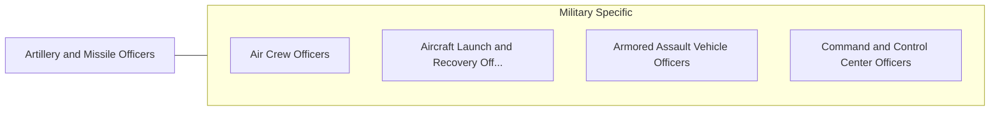

# Artillery and Missile Officers

> Manage personnel and weapons operations to destroy enemy positions, aircraft, and vessels. Duties include planning, targeting, and coordinating the tactical deployment of field artillery and air defense artillery missile systems units; directing the establishment and operation of fire control communications systems; targeting and launching intercontinental ballistic missiles; directing the storage and handling of nuclear munitions and components; overseeing security of weapons storage and launch facilities; and managing maintenance of weapons systems.

## Overview

Artillery and Missile Officers is an occupation within the Military Specific category. Manage personnel and weapons operations to destroy enemy positions, aircraft, and vessels. 

## Classification Hierarchy

## Key Statistics

| Metric | Value |
|--------|-------|
| SOC Code | 55-1014.00 |
| Category | [Military Specific](/occupations/Military) |
| Task Count | 0 |
| Source | O*NET |

## Core Tasks

Task data is being compiled for this occupation. See [O*NET 55-1014.00](https://www.onetonline.org/link/summary/55-1014.00) for detailed task information.

## Skills & Competencies

### Technical Skills
- **Military Operations** - Advanced
- **Tactical Planning** - Advanced
- **Leadership** - Advanced

### Soft Skills
- **Communication** - Essential
- **Problem Solving** - Essential
- **Critical Thinking** - Important
- **Teamwork** - Important
- **Adaptability** - Important

## Related Occupations

## Industries

This occupation is found across multiple industries. See [Industries](/industries) for sector-specific employment data.

## Career Progression

---

*Source: O*NET 55-1014.00 - ONETOccupation*
