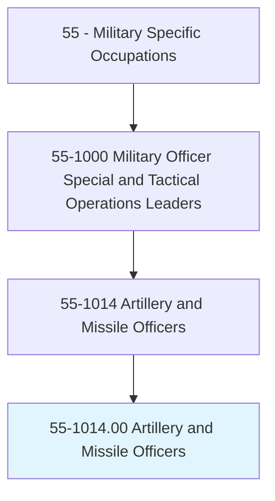
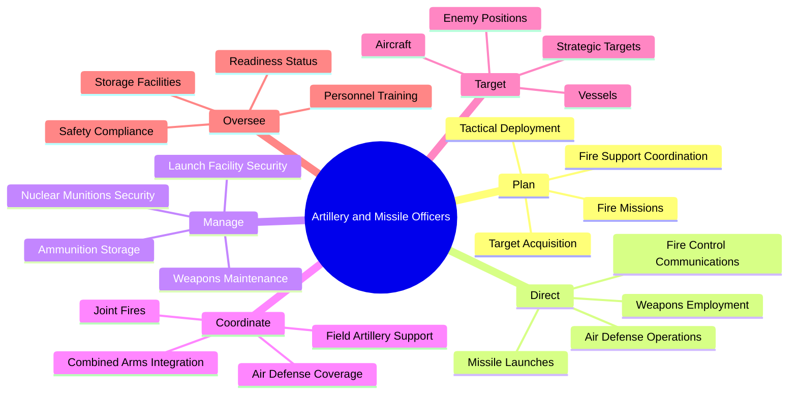
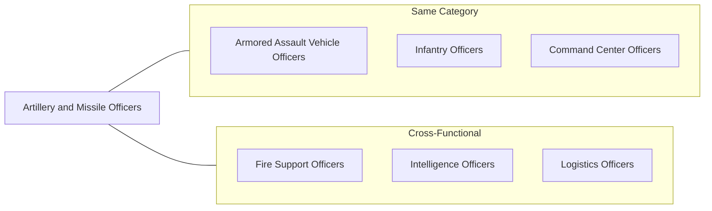
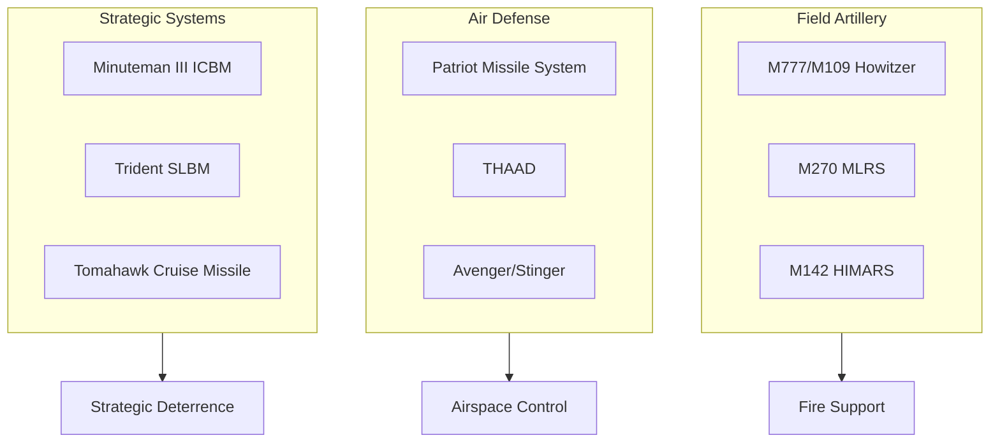
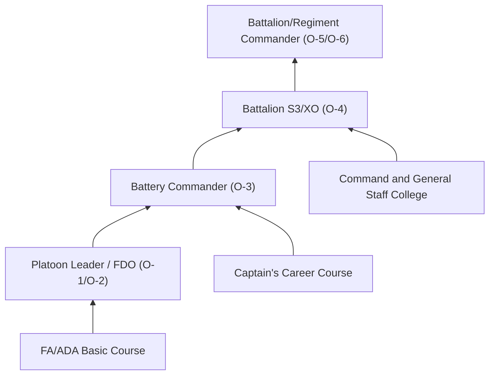
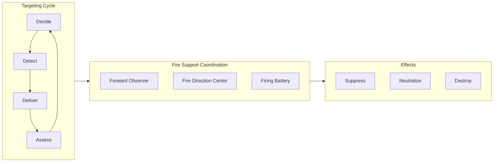

# Artillery and Missile Officers

> Manage personnel and weapons operations to destroy enemy positions, aircraft, and vessels. Duties include planning, targeting, and coordinating the tactical deployment of field artillery and air defense artillery missile systems units; directing the establishment and operation of fire control communications systems; targeting and launching intercontinental ballistic missiles; directing the storage and handling of nuclear munitions and components; overseeing security of weapons storage and launch facilities; and managing maintenance of weapons systems.

## Overview

Artillery and Missile Officers command units responsible for delivering indirect fire support and air defense capabilities. They lead personnel operating field artillery systems (howitzers, rocket launchers), air defense missile systems, and in some cases, strategic nuclear weapons. These officers are masters of fire support coordination, integrating lethal fires with maneuver forces while ensuring the safety and security of some of the military's most powerful weapons systems. Their role spans tactical fire support to strategic deterrence operations.

## Classification Hierarchy

## Key Statistics

| Metric | Value |
|--------|-------|
| SOC Code | 55-1014.00 |
| Job Zone | 4 (Considerable Preparation) |
| Category | [Military Specific](/occupations/Military) |
| Core Tasks | 15+ |
| Source | O*NET |

## Core Tasks

### plan.TacticalDeployment

Artillery and Missile Officers develop plans for positioning and employing artillery and missile systems.

**Actions:**
- `plan.TacticalDeployment.to.position.ArtilleryUnits` - Determine optimal firing positions
- `plan.FireMissions.to.support.ManeuverOperations` - Coordinate fires with ground maneuver
- `plan.TargetAcquisition.to.identify.EnemyPositions` - Develop target lists and priorities
- `plan.FireSupportCoordination.to.integrate.CombinedArms` - Synchronize fires across formations

### direct.WeaponsOperations

Artillery and Missile Officers lead the execution of fire missions and weapons employment.

**Actions:**
- `direct.FireControlCommunications.to.coordinate.FireMissions` - Manage tactical fire direction
- `direct.WeaponsEmployment.to.engage.Targets` - Command firing of artillery and missiles
- `direct.MissileLaunches.to.defend.Airspace` - Execute air defense engagements
- `direct.BallisticMissileLaunches.to.conduct.StrategicMissions` - Execute nuclear deterrence operations

### manage.WeaponsSystems

Artillery and Missile Officers oversee the maintenance, security, and readiness of weapons systems.

**Actions:**
- `manage.WeaponsMaintenance.to.ensure.Readiness` - Direct preventive and corrective maintenance
- `manage.AmmunitionStorage.to.ensure.SafeHandling` - Oversee ammunition supply and handling
- `manage.NuclearMunitionsSecurity.to.protect.StrategicAssets` - Maintain nuclear weapons security
- `manage.LaunchFacilitySecurity.to.prevent.UnauthorizedAccess` - Direct physical security operations

### coordinate.FireSupport

Artillery and Missile Officers integrate fires with other combat elements.

**Actions:**
- `coordinate.FieldArtillerySupport.to.enable.GroundManeuver` - Provide responsive fire support
- `coordinate.AirDefenseCoverage.to.protect.Forces` - Establish air defense umbrellas
- `coordinate.CombinedArmsIntegration.to.maximize.Effects` - Synchronize with infantry, armor, and aviation
- `coordinate.JointFires.to.leverage.ServiceCapabilities` - Integrate joint and coalition fires

### target.EnemyAssets

Artillery and Missile Officers direct targeting operations against threat forces.

**Actions:**
- `target.EnemyPositions.to.destroy.Threats` - Engage ground targets with artillery
- `target.Aircraft.to.defend.Airspace` - Engage hostile aircraft with air defense systems
- `target.Vessels.to.support.NavalOperations` - Provide coastal defense and ship engagement
- `target.StrategicTargets.to.execute.NationalPolicy` - Support strategic deterrence missions

## Skills & Competencies

### Technical Skills
- **Fire Direction and Control** - Expert
- **Artillery Systems** - Expert
- **Missile Systems** - Expert
- **Target Acquisition** - Advanced
- **Fire Support Coordination** - Advanced
- **Air Defense Operations** - Advanced
- **Nuclear Weapons Security** - Advanced (where applicable)

### Soft Skills
- **Leadership** - Critical
- **Decision Making** - Critical
- **Mathematical/Analytical Thinking** - Critical
- **Communication** - Essential
- **Attention to Detail** - Essential

## Related Occupations

## Branch Variations

### Army
- **Field Artillery Officer** - Commands howitzer and rocket units
- **Air Defense Artillery (ADA) Officer** - Commands air defense missile systems
- **Targeting Officer** - Specializes in target development

### Navy
- **Surface Warfare Officer (Weapons)** - Manages ship-based weapons systems
- **Weapons Officer** - Directs naval gunfire and missile operations
- **Fleet Ballistic Missile Officer** - Commands submarine-launched missiles

### Air Force
- **Missile Combat Crew Officer** - Commands ICBM launch facilities
- **Space and Missile Operations Officer** - Manages strategic systems

### Marine Corps
- **Artillery Officer** - Commands Marine artillery batteries
- **Low Altitude Air Defense (LAAD) Officer** - Leads MANPAD and SHORAD units

## Weapons Systems

## Industries

- [Defense - Army](/industries/Defense) - Field and Air Defense Artillery
- [Defense - Navy](/industries/Defense) - Surface and submarine weapons
- [Defense - Air Force](/industries/Defense) - ICBM and strategic operations
- [Defense - Marine Corps](/industries/Defense) - Marine artillery and LAAD
- [Defense Contractors](/industries/Defense) - Weapons systems development

## Career Progression

### Rank Progression (Field Artillery)

| Level | Rank | Typical Role |
|-------|------|--------------|
| Entry | O-1/O-2 (2LT/1LT) | Fire Direction Officer / Platoon Leader |
| Mid-Career | O-3 (CPT) | Battery Commander / Fire Support Officer |
| Senior | O-4 (MAJ) | Battalion S3 / Division Artillery FSE |
| Executive | O-5/O-6 (LTC/COL) | Battalion / Division Artillery Commander |

### Rank Progression (Strategic Missiles)

| Level | Rank | Typical Role |
|-------|------|--------------|
| Entry | O-1/O-2 | Deputy Missile Combat Crew Commander |
| Mid-Career | O-3 (CPT) | Missile Combat Crew Commander |
| Senior | O-4/O-5 (MAJ/LTC) | Squadron Operations Officer |
| Executive | O-6 (COL) | Missile Wing Commander |

## Education & Training

| Requirement | Details |
|-------------|---------|
| Typical Education | Bachelor's degree (STEM preferred for some specialties) |
| Commissioning Source | Military Academy, ROTC, OCS |
| Initial Training | Field Artillery/ADA Basic Officer Leader Course |
| Specialized Training | Fire Support Officer Course, Missile Operations Training |
| Ongoing Development | Captain's Career Course, Command and General Staff College |

### Key Qualifications
- Field Artillery/ADA Basic Course completion
- Fire Support certification
- Missile crew certification (for ADA/Strategic)
- Joint Firepower Course (advanced)
- Nuclear weapons certification (where applicable)

## Fire Support Process

## Civilian Transition Paths

Artillery and Missile Officers develop skills valued in civilian sectors:

- [Management](/occupations/Management) - Operations and project management
- [Logistics](/occupations/Business) - Supply chain management
- [Engineering](/occupations/Engineering) - Systems engineering and defense technology
- [Nuclear Industry](/industries/Energy) - Nuclear facility operations and security
- [Defense Contractors](/industries/Defense) - Weapons systems development and training
- [Law Enforcement](/occupations/ProtectiveService) - Tactical planning and leadership

## Departments

This occupation typically works in:
- [Field Artillery Battalions](/departments/Operations)
- [Air Defense Artillery Units](/departments/Operations)
- [Fire Support Elements](/departments/Operations)
- [Strategic Missile Wings](/departments/Operations)
- [Ship Weapons Departments](/departments/Operations)

## Related Job Titles

- Field Artillery Officer
- Air Defense Artillery Officer
- Fire Support Officer
- Targeting Officer
- Missile Combat Crew Officer
- Weapons Officer (Navy)
- PATRIOT Missile Air Defense Artillery
- HAWK Missile Air Defense Artillery
- Low Altitude Air Defense Officer
- Space and Missile Operations Officer
- Division Officer, Weapons Department
- Ordnance Officer
- Fire Control Officer

---

*Source: O*NET 55-1014.00 - ONETOccupation*
