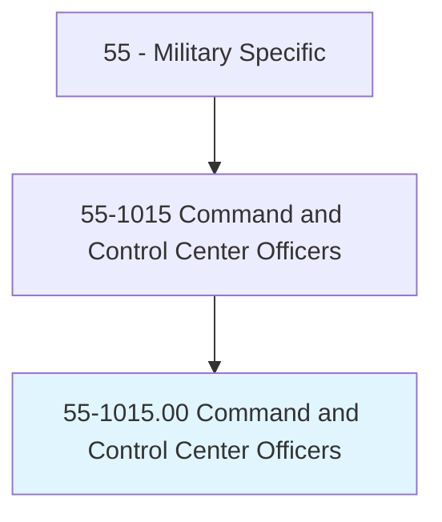
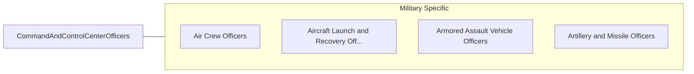

# Command and Control Center Officers

> Manage the operation of communications, detection, and weapons systems essential for controlling air, ground, and naval operations. Duties include managing critical communication links between air, naval, and ground forces; formulating and implementing emergency plans for natural and wartime disasters; coordinating emergency response teams and agencies; evaluating command center information and need for high-level military and government reporting; managing the operation of surveillance and detection systems; providing technical information and advice on capabilities and operational readiness; and directing operation of weapons targeting, firing, and launch computer systems.

## Overview

Command and Control Center Officers is an occupation within the Military Specific category. Manage the operation of communications, detection, and weapons systems essential for controlling air, ground, and naval operations. 

## Classification Hierarchy

## Key Statistics

| Metric | Value |
|--------|-------|
| SOC Code | 55-1015.00 |
| Category | [Military Specific](/occupations/Military/index) |
| Task Count | 0 |
| Source | O*NET |

## Core Tasks

Task data is being compiled for this occupation. See [O*NET 55-1015.00](https://www.onetonline.org/link/summary/55-1015.00) for detailed task information.

## Skills & Competencies

### Technical Skills
- **Military Operations** - Advanced
- **Tactical Planning** - Advanced
- **Leadership** - Advanced

### Soft Skills
- **Communication** - Essential
- **Problem Solving** - Essential
- **Critical Thinking** - Important
- **Teamwork** - Important
- **Adaptability** - Important

## Related Occupations

## Industries

This occupation is found across multiple industries. See [Industries](/industries) for sector-specific employment data.

## Career Progression

---

*Source: O*NET 55-1015.00 - ONETOccupation*
