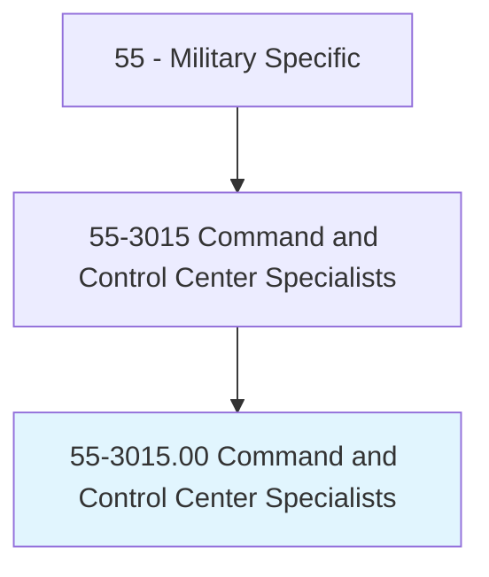
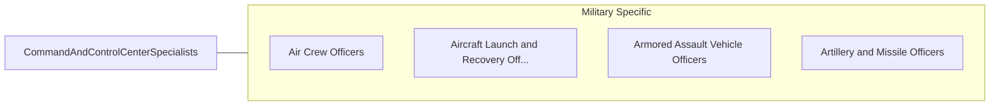

# Command and Control Center Specialists

> Operate and monitor communications, detection, and weapons systems essential for controlling air, ground, and naval operations. Duties include maintaining and relaying critical communications between air, naval, and ground forces; implementing emergency plans for natural and wartime disasters; relaying command center information to high-level military and government decisionmakers; monitoring surveillance and detection systems, such as air defense; interpreting and evaluating tactical situations and making recommendations to superiors; and operating weapons targeting, firing, and launch computer systems.

## Overview

Command and Control Center Specialists is an occupation within the Military Specific category. Operate and monitor communications, detection, and weapons systems essential for controlling air, ground, and naval operations. 

## Classification Hierarchy

## Key Statistics

| Metric | Value |
|--------|-------|
| SOC Code | 55-3015.00 |
| Category | [Military Specific](/occupations/Military/index) |
| Task Count | 0 |
| Source | O*NET |

## Core Tasks

Task data is being compiled for this occupation. See [O*NET 55-3015.00](https://www.onetonline.org/link/summary/55-3015.00) for detailed task information.

## Skills & Competencies

### Technical Skills
- **Military Operations** - Advanced
- **Tactical Planning** - Advanced
- **Leadership** - Advanced

### Soft Skills
- **Communication** - Essential
- **Problem Solving** - Essential
- **Critical Thinking** - Important
- **Teamwork** - Important
- **Adaptability** - Important

## Related Occupations

## Industries

This occupation is found across multiple industries. See [Industries](/industries) for sector-specific employment data.

## Career Progression

---

*Source: O*NET 55-3015.00 - ONETOccupation*
