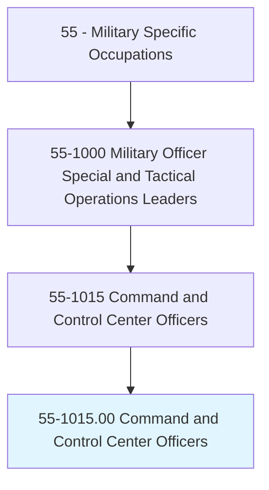
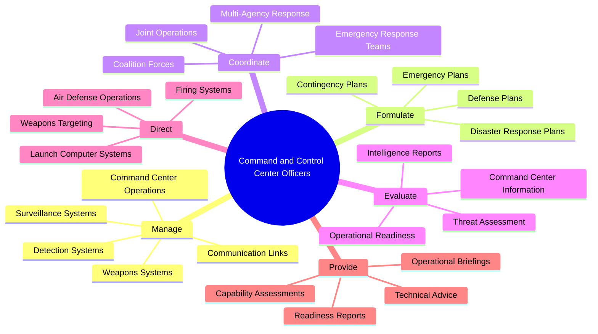
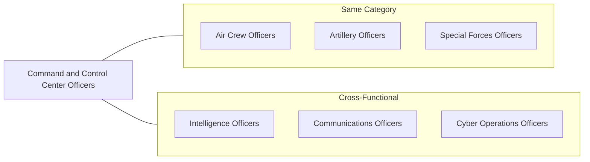
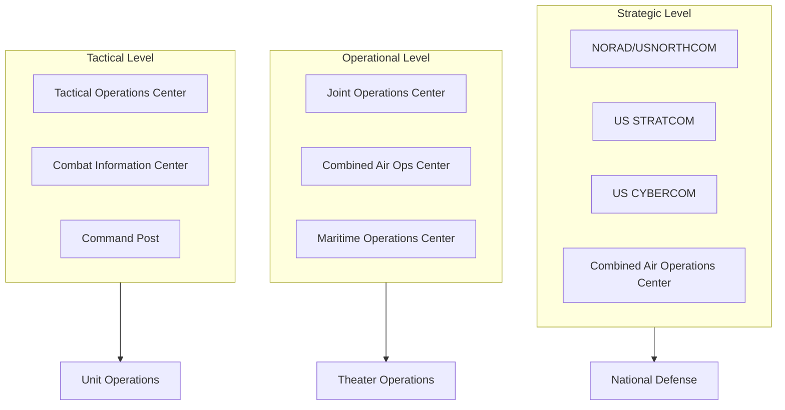
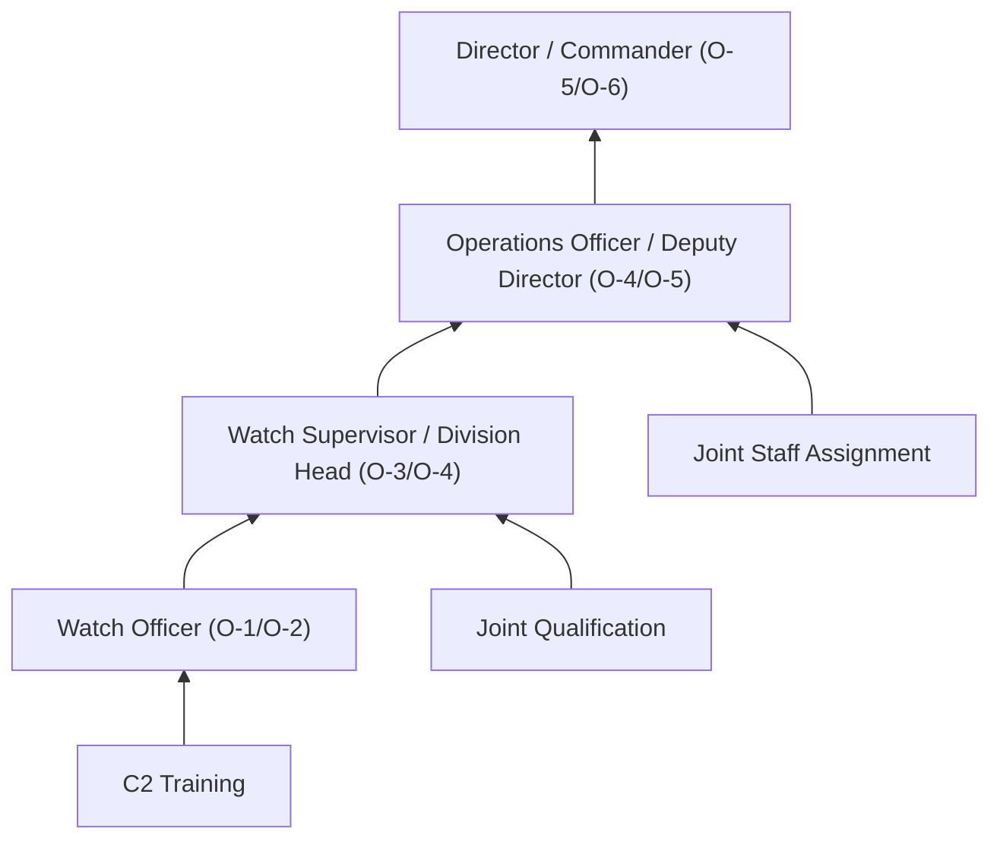
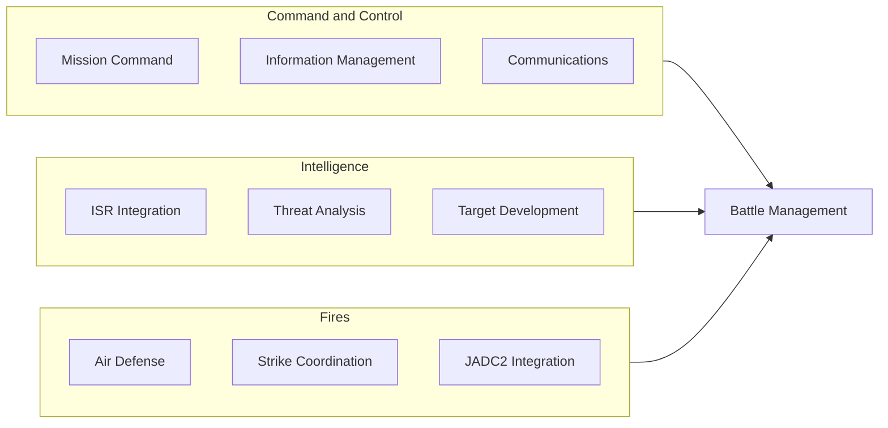

# Command and Control Center Officers

> Manage the operation of communications, detection, and weapons systems essential for controlling air, ground, and naval operations. Duties include managing critical communication links between air, naval, and ground forces; formulating and implementing emergency plans for natural and wartime disasters; coordinating emergency response teams and agencies; evaluating command center information and need for high-level military and government reporting; managing the operation of surveillance and detection systems; providing technical information and advice on capabilities and operational readiness; and directing operation of weapons targeting, firing, and launch computer systems.

## Overview

Command and Control Center Officers serve as the nerve center of military operations, managing the complex communications, surveillance, and weapons systems that enable commanders to direct forces across multiple domains. They operate in command centers ranging from tactical operations centers to strategic facilities like NORAD, integrating information from diverse sources to maintain situational awareness and coordinate joint operations. These officers ensure that commanders have the information and connectivity needed to make timely decisions and that those decisions are effectively communicated to forces in the field.

## Classification Hierarchy

## Key Statistics

| Metric | Value |
|--------|-------|
| SOC Code | 55-1015.00 |
| Job Zone | 4 (Considerable Preparation) |
| Category | [Military Specific](/occupations/Military) |
| Core Tasks | 15+ |
| Source | O*NET |

## Core Tasks

### manage.CommunicationsAndSystems

Command and Control Center Officers oversee the communications and systems infrastructure enabling command operations.

**Actions:**
- `manage.CommunicationLinks.to.connect.AirNavalGroundForces` - Maintain tactical and strategic communications
- `manage.SurveillanceSystems.to.monitor.OperationalEnvironment` - Direct radar and sensor network operations
- `manage.DetectionSystems.to.identify.Threats` - Operate early warning and threat detection systems
- `manage.WeaponsSystems.to.enable.DefenseOperations` - Coordinate weapons system integration

### formulate.EmergencyPlans

Command and Control Center Officers develop plans for emergency response and disaster operations.

**Actions:**
- `formulate.EmergencyPlans.to.respond.NaturalDisasters` - Develop civil emergency response procedures
- `formulate.EmergencyPlans.to.respond.WartimeContingencies` - Create wartime operations plans
- `formulate.DefensePlans.to.protect.CriticalAssets` - Develop air, missile, and space defense plans
- `formulate.ContinuityPlans.to.maintain.Operations` - Ensure continuity of command functions

### coordinate.Operations

Command and Control Center Officers synchronize multi-domain and multi-agency operations.

**Actions:**
- `coordinate.EmergencyResponseTeams.to.respond.Incidents` - Direct first responder integration
- `coordinate.JointOperations.to.synchronize.ServiceCapabilities` - Integrate Army, Navy, Air Force, Marine operations
- `coordinate.MultiAgencyResponse.to.unify.CivilMilitaryEfforts` - Work with FEMA, state, and local agencies
- `coordinate.CoalitionForces.to.execute.AlliedOperations` - Integrate partner nation forces

### evaluate.Information

Command and Control Center Officers assess information for decision support and reporting.

**Actions:**
- `evaluate.CommandCenterInformation.to.support.Decisions` - Analyze tactical and operational data
- `evaluate.OperationalReadiness.to.assess.UnitCapability` - Monitor force readiness status
- `evaluate.ThreatAssessment.to.inform.Commanders` - Synthesize intelligence for threat evaluation
- `evaluate.IntelligenceReports.to.maintain.SituationalAwareness` - Process multi-source intelligence

### direct.WeaponsTargetingAndFiring

Command and Control Center Officers oversee weapons employment through command center systems.

**Actions:**
- `direct.WeaponsTargeting.to.engage.Threats` - Manage target development and assignment
- `direct.FiringSystems.to.execute.Engagements` - Coordinate weapons release authority
- `direct.LaunchComputerSystems.to.employ.Missiles` - Operate missile defense engagement systems
- `direct.AirDefenseOperations.to.protect.Airspace` - Manage integrated air defense

### provide.TechnicalAdvice

Command and Control Center Officers advise commanders on capabilities and readiness.

**Actions:**
- `provide.TechnicalAdvice.to.inform.CommandDecisions` - Advise on system capabilities
- `provide.CapabilityAssessments.to.support.Planning` - Evaluate operational options
- `provide.ReadinessReports.to.brief.Leadership` - Report status to higher headquarters
- `provide.OperationalBriefings.to.update.Commanders` - Conduct situation briefings

## Skills & Competencies

### Technical Skills
- **Command and Control Systems** - Expert
- **Communications Systems** - Expert
- **Surveillance and Detection Systems** - Advanced
- **Air Defense Operations** - Advanced
- **Intelligence Analysis** - Advanced
- **Battle Management** - Advanced
- **Cybersecurity** - Advanced

### Soft Skills
- **Decision Making** - Critical
- **Analytical Thinking** - Critical
- **Communication** - Critical
- **Leadership** - Essential
- **Stress Management** - Essential

## Related Occupations

## Branch Variations

### Air Force
- **Air Battle Manager** - Controls air operations from AWACS or ground-based facilities
- **Space and Missile Operations** - Manages satellite command and missile warning
- **Cyberspace Operations** - Directs cyber command center operations

### Navy
- **Combat Information Center (CIC) Officer** - Manages ship combat systems
- **Air Control/Anti-Air Warfare Officer** - Directs carrier air operations
- **Naval Tactical Data System Officer** - Operates fleet combat networks

### Army
- **Signal/Communications Officer** - Manages tactical communications networks
- **Air Defense Operations Officer** - Directs IAMD command centers
- **Battle Captain** - Leads tactical operations centers

### Marine Corps
- **Air Support Control Officer** - Coordinates Marine air-ground operations
- **MAGTF Intelligence Officer** - Integrates Marine task force C2

## Command Center Types

## Industries

- [Defense - All Branches](/industries/Defense) - Command center operations
- [Government](/industries/Government) - Emergency management agencies
- [Aerospace](/industries/Aerospace) - Space operations and satellite control
- [Defense Contractors](/industries/Defense) - C2 systems development

## Career Progression

### Rank Progression

| Level | Rank | Typical Role |
|-------|------|--------------|
| Entry | O-1/O-2 | Watch Officer / Duty Officer |
| Mid-Career | O-3/O-4 (CPT/MAJ or LT/LCDR) | Watch Supervisor / Branch Chief |
| Senior | O-4/O-5 (MAJ/LTC or LCDR/CDR) | Operations Officer / Division Director |
| Executive | O-5/O-6 (LTC/COL or CDR/CAPT) | Command Center Director |

## Education & Training

| Requirement | Details |
|-------------|---------|
| Typical Education | Bachelor's degree (technical fields preferred) |
| Commissioning Source | Military Academy, ROTC, OCS |
| Initial Training | Branch-specific C2 courses |
| Specialized Training | Air Battle Manager Course, CIC Officer Course, Joint C2 |
| Ongoing Development | Joint Professional Military Education, War College |

### Key Qualifications
- Command and Control qualification
- Joint Qualification System (JQS) certification
- Air Battle Manager certification (Air Force)
- CIC Watch Officer qualification (Navy)
- Space Operations certification (Space Force)

## C2 Warfighting Functions

## Civilian Transition Paths

Command and Control Center Officers develop skills valued in civilian sectors:

- [Information Technology](/occupations/Technology) - IT operations and network management
- [Emergency Management](/occupations/ProtectiveService) - FEMA, state, and local emergency operations
- [Cybersecurity](/occupations/Technology) - Security operations centers
- [Defense Contractors](/industries/Defense) - C2 systems development and operations
- [Aviation](/occupations/Transportation) - Air traffic control and flight operations
- [Management](/occupations/Management) - Operations management and crisis response

## Departments

This occupation typically works in:
- [Operations Centers](/departments/Operations)
- [Combat Information Centers](/departments/Operations)
- [Joint Operations Centers](/departments/Operations)
- [Air Operations Centers](/departments/Operations)
- [Emergency Management](/departments/Operations)

## Related Job Titles

- Air Battle Manager
- Combat Information Center Officer
- Command and Control Officer
- Combat Systems Officer
- Air Control/Anti-Air Warfare Officer
- Air Defense Control Officer
- Air Intercept Controller Supervisor
- Air Support Control Officer
- Operations Control Center Officer
- Staff Command and Control Officer
- C4I Officer (Command, Control, Communications, Computers, Intelligence)
- Joint Terminal Attack Controller Officer
- Military Analyst
- Senior Air Director
- Force Deployment Planning and Execution Officer

---

*Source: O*NET 55-1015.00 - ONETOccupation*
