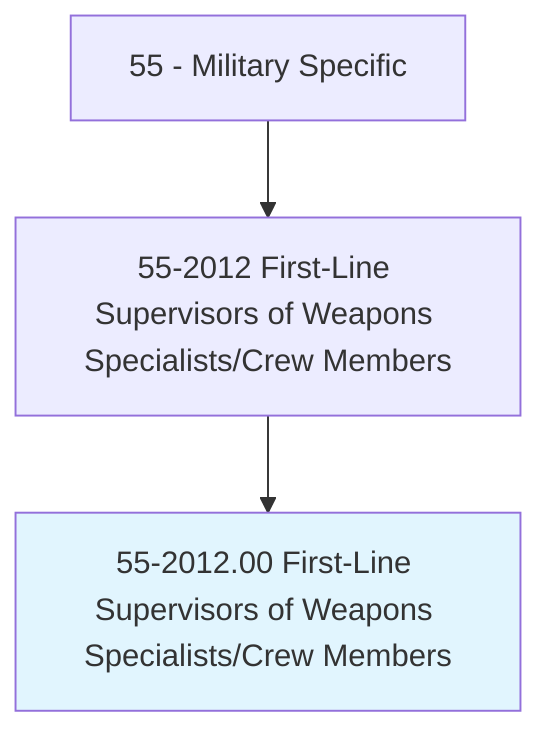
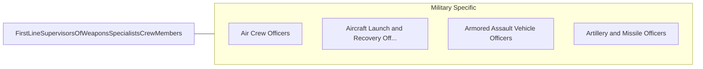

# First-Line Supervisors of Weapons Specialists/Crew Members

> Supervise and coordinate the activities of weapons specialists/crew members. Supervisors may also perform the same activities as the workers they supervise.

## Overview

First-Line Supervisors of Weapons Specialists/Crew Members is an occupation within the Military Specific category. Supervise and coordinate the activities of weapons specialists/crew members. 

## Classification Hierarchy

## Key Statistics

| Metric | Value |
|--------|-------|
| SOC Code | 55-2012.00 |
| Category | [Military Specific](/occupations/Military) |
| Task Count | 0 |
| Source | O*NET |

## Core Tasks

Task data is being compiled for this occupation. See [O*NET 55-2012.00](https://www.onetonline.org/link/summary/55-2012.00) for detailed task information.

## Skills & Competencies

### Technical Skills
- **Military Operations** - Advanced
- **Tactical Planning** - Advanced
- **Leadership** - Advanced

### Soft Skills
- **Communication** - Essential
- **Problem Solving** - Essential
- **Critical Thinking** - Important
- **Teamwork** - Important
- **Adaptability** - Important

## Related Occupations

## Industries

This occupation is found across multiple industries. See [Industries](/industries) for sector-specific employment data.

## Career Progression

---

*Source: O*NET 55-2012.00 - ONETOccupation*
