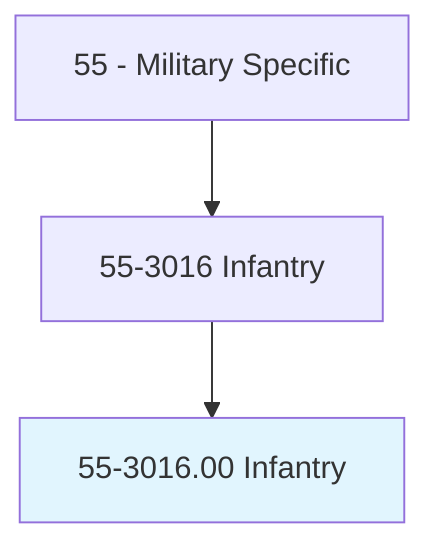
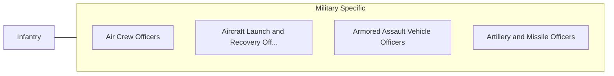

# Infantry

> Operate weapons and equipment in ground combat operations. Duties include operating and maintaining weapons, such as rifles, machine guns, mortars, and hand grenades; locating, constructing, and camouflaging infantry positions and equipment; evaluating terrain and recording topographical information; operating and maintaining field communications equipment; assessing need for and directing supporting fire; placing explosives and performing minesweeping activities on land; and participating in basic reconnaissance operations.

## Overview

Infantry is an occupation within the Military Specific category. Operate weapons and equipment in ground combat operations. 

## Classification Hierarchy

## Key Statistics

| Metric | Value |
|--------|-------|
| SOC Code | 55-3016.00 |
| Category | [Military Specific](/occupations/Military/index) |
| Task Count | 0 |
| Source | O*NET |

## Core Tasks

Task data is being compiled for this occupation. See [O*NET 55-3016.00](https://www.onetonline.org/link/summary/55-3016.00) for detailed task information.

## Skills & Competencies

### Technical Skills
- **Military Operations** - Advanced
- **Tactical Planning** - Advanced
- **Leadership** - Advanced

### Soft Skills
- **Communication** - Essential
- **Problem Solving** - Essential
- **Critical Thinking** - Important
- **Teamwork** - Important
- **Adaptability** - Important

## Related Occupations

## Industries

This occupation is found across multiple industries. See [Industries](/industries) for sector-specific employment data.

## Career Progression

---

*Source: O*NET 55-3016.00 - ONETOccupation*
