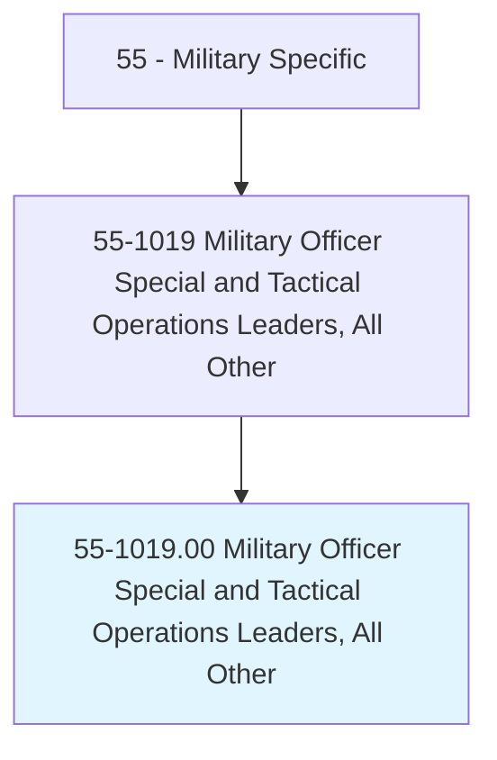
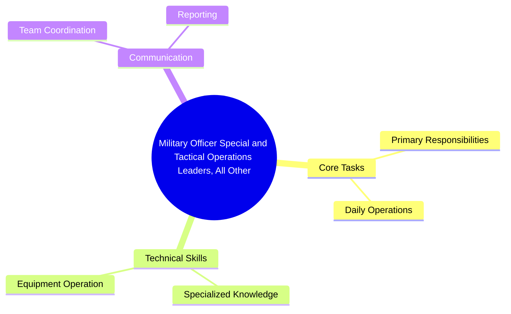
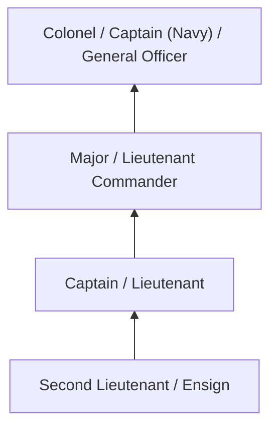
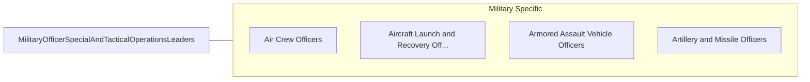

# Military Officer Special and Tactical Operations Leaders, All Other

> All military officer special and tactical operations leaders not listed separately.

## Overview

Military Officer Special and Tactical Operations Leaders professionals serve a vital function within the Military Specific field. They bring specialized skills and knowledge to their roles, contributing to organizational objectives and societal needs.

These practitioners work in varied environments, adapting their expertise to meet specific requirements of their industry and employer. The role requires ongoing professional development to maintain competency and respond to changing demands.

Career paths in this field offer opportunities for advancement through experience, additional education, and specialized certifications. Employment prospects are influenced by industry trends, technological change, and workforce demographics.

## Classification Hierarchy



## Key Statistics

| Metric | Value |
|--------|-------|
| SOC Code | 55-1019.00 |
| Job Zone | N/A |
| Category | [Military Specific](/occupations/Military/index) |
| Core Tasks | N/A+ |
| Salary Range | $30,000 - $100,000 |
| Median Salary | $55,000 |
| Growth Outlook | 3% (Slower than average) |
| Source | O*NET |

## Core Tasks



### Technical Skills
- **Military Operations** - Advanced
- **Tactical Planning** - Advanced
- **Leadership** - Advanced

### Soft Skills
- **Communication** - Essential
- **Problem Solving** - Essential
- **Critical Thinking** - Important
- **Teamwork** - Important
- **Adaptability** - Important


## Skills & Competencies

### Technical Skills
- **Military Operations** - Expert
- **Tactical Planning** - Advanced
- **Weapons Systems** - Advanced
- **Communications** - Advanced
- **Physical Fitness** - Advanced
- **First Aid** - Proficient

### Soft Skills
- **Leadership** - Critical
- **Discipline** - Critical
- **Teamwork** - Essential
- **Decision Making** - Essential
- **Adaptability** - Essential

## Education & Certifications

| Requirement | Details |
|-------------|---------|
| Typical Education | Varies; officer roles require bachelor's degree minimum |
| Work Experience | Varies by rank and specialty |
| On-the-Job Training | Extensive - basic training plus specialty school |
| Certifications | Military Occupational Specialty (MOS) qualification |

## Career Progression



## Industry Variations

### Active Duty
Full-time military service with deployment readiness. Military Officer Special and Tactical Operations Leaders professionals maintain combat and operational readiness.

### Reserve Forces
Part-time military service with periodic training and activation. Balance between civilian career and military obligations.

### Special Operations
Elite military units with advanced training and high-risk missions. Emphasis on physical fitness, specialized skills, and teamwork.

### Support and Logistics
Operational support ensuring combat forces have necessary resources. Focus on supply chain, maintenance, and administration.

## Technology & Tools

- **Command and control systems**
- **Military communications equipment**
- **Weapons systems**
- **Intelligence analysis software**
- **Simulation and training systems**

## Related Occupations



## Industries

- Department of Defense - Primary Employment
- National Guard - Part-Time Employment
- Coast Guard - Moderate Employment
- Defense Contractors - Related Employment

## Departments

This occupation typically works in:
- [Operations](/departments/Operations/index)
- Training and Readiness
- [Logistics](/departments/SupplyChain)

## GraphDL Semantic Structure

```graphdl
Military Officer Special and Tactical Operations Leaders, All Other perform:
- execute.Missions.according.to.Orders
- maintain.Readiness.for.Operations
- lead.Personnel.in.TacticalOperations
- coordinate.Activities.with.CommandStructure
- train.Subordinates.in.MilitaryProcedures
```

---

*Source: O*NET 55-1019.00 - ONETOccupation*
