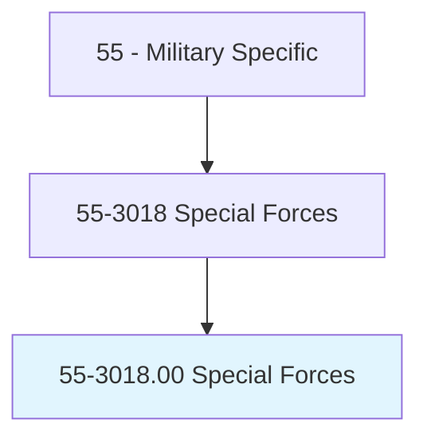
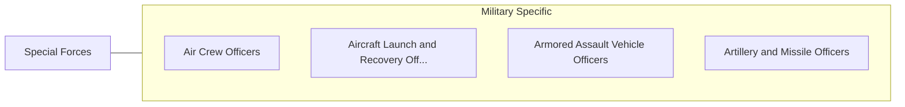

# Special Forces

> Implement unconventional operations by air, land, or sea during combat or peacetime as members of elite teams. These activities include offensive raids, demolitions, reconnaissance, search and rescue, and counterterrorism. In addition to their combat training, special forces members often have specialized training in swimming, diving, parachuting, survival, emergency medicine, and foreign languages. Duties include conducting advanced reconnaissance operations and collecting intelligence information; recruiting, training, and equipping friendly forces; conducting raids and invasions on enemy territories; laying and detonating explosives for demolition targets; locating, identifying, defusing, and disposing of ordnance; and operating and maintaining sophisticated communications equipment.

## Overview

Special Forces is an occupation within the Military Specific category. Implement unconventional operations by air, land, or sea during combat or peacetime as members of elite teams. These activities include offensive raids, demolitions, reconnaissance, search and rescue, and counterterrorism.

## Classification Hierarchy

## Key Statistics

| Metric | Value |
|--------|-------|
| SOC Code | 55-3018.00 |
| Category | [Military Specific](/occupations/Military) |
| Task Count | 0 |
| Source | O*NET |

## Core Tasks

Task data is being compiled for this occupation. See [O*NET 55-3018.00](https://www.onetonline.org/link/summary/55-3018.00) for detailed task information.

## Skills & Competencies

### Technical Skills
- **Military Operations** - Advanced
- **Tactical Planning** - Advanced
- **Leadership** - Advanced

### Soft Skills
- **Communication** - Essential
- **Problem Solving** - Essential
- **Critical Thinking** - Important
- **Teamwork** - Important
- **Adaptability** - Important

## Related Occupations

## Industries

This occupation is found across multiple industries. See [Industries](/industries) for sector-specific employment data.

## Career Progression

---

*Source: O*NET 55-3018.00 - ONETOccupation*
