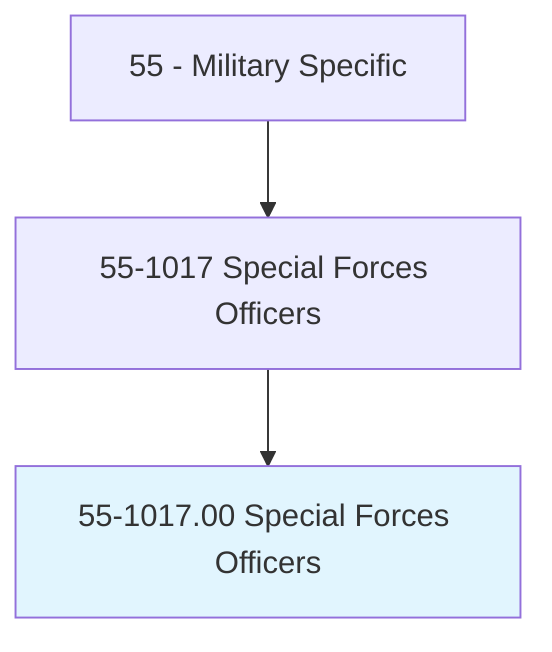
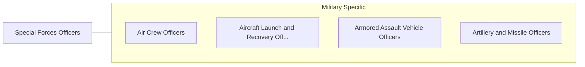

# Special Forces Officers

> Lead elite teams that implement unconventional operations by air, land, or sea during combat or peacetime. These activities include offensive raids, demolitions, reconnaissance, search and rescue, and counterterrorism. In addition to their combat training, special forces officers often have specialized training in swimming, diving, parachuting, survival, emergency medicine, and foreign languages. Duties include directing advanced reconnaissance operations and evaluating intelligence information; recruiting, training, and equipping friendly forces; leading raids and invasions on enemy territories; training personnel to implement individual missions and contingency plans; performing strategic and tactical planning for politically sensitive missions; and operating sophisticated communications equipment.

## Overview

Special Forces Officers is an occupation within the Military Specific category. Lead elite teams that implement unconventional operations by air, land, or sea during combat or peacetime. These activities include offensive raids, demolitions, reconnaissance, search and rescue, and counterterrorism.

## Classification Hierarchy

## Key Statistics

| Metric | Value |
|--------|-------|
| SOC Code | 55-1017.00 |
| Category | [Military Specific](/occupations/Military) |
| Task Count | 0 |
| Source | O*NET |

## Core Tasks

Task data is being compiled for this occupation. See [O*NET 55-1017.00](https://www.onetonline.org/link/summary/55-1017.00) for detailed task information.

## Skills & Competencies

### Technical Skills
- **Military Operations** - Advanced
- **Tactical Planning** - Advanced
- **Leadership** - Advanced

### Soft Skills
- **Communication** - Essential
- **Problem Solving** - Essential
- **Critical Thinking** - Important
- **Teamwork** - Important
- **Adaptability** - Important

## Related Occupations

## Industries

This occupation is found across multiple industries. See [Industries](/industries) for sector-specific employment data.

## Career Progression

---

*Source: O*NET 55-1017.00 - ONETOccupation*
