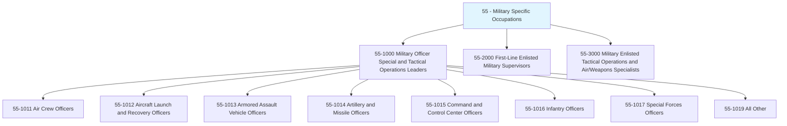
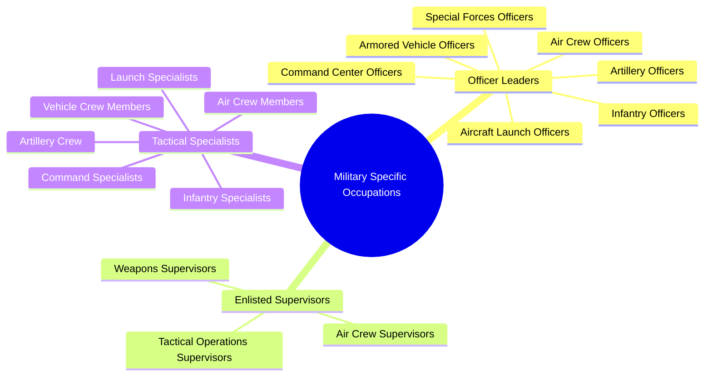
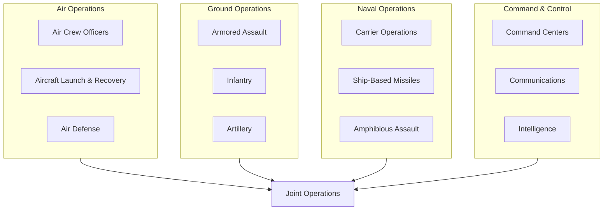
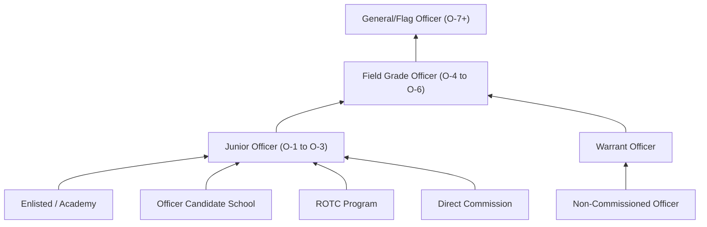
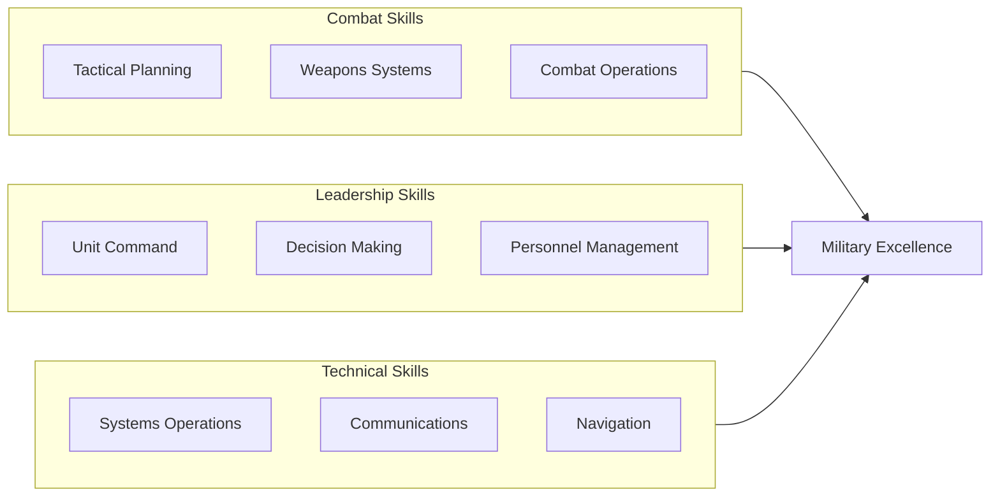

# Military Specific Occupations

> Category 55 - Military specific occupations encompass personnel who serve in combat and tactical operations roles across all branches of the armed forces, requiring specialized training and leadership capabilities.

## Overview

Military Specific Occupations comprise specialized combat and tactical operations roles within the armed forces that have no direct civilian equivalents. These positions require extensive military training, leadership development, and often involve high-stakes decision-making in combat or defense scenarios. Officers in this category lead personnel in air, land, sea, and space operations, managing sophisticated weapons systems, communications networks, and tactical deployments.

## Classification Hierarchy

## Key Statistics

| Metric | Value |
|--------|-------|
| SOC Category Code | 55 |
| Major Groups | 3 |
| Detailed Occupations | 15+ |
| Source | O*NET / DoD |

## Occupations in this Category

### Military Officer Special and Tactical Operations Leaders (55-1000)

| Occupation | Code | Description |
|------------|------|-------------|
| [Air Crew Officers](./AirCrewOfficers.mdx) | 55-1011.00 | Perform and direct in-flight duties for combat, reconnaissance, and rescue missions |
| [Aircraft Launch and Recovery Officers](./AircraftLaunchOfficers.mdx) | 55-1012.00 | Plan and direct carrier-based aircraft launch and recovery operations |
| [Armored Assault Vehicle Officers](./ArmoredAssaultVehicleOfficers.mdx) | 55-1013.00 | Direct tank and armored vehicle units in combat situations |
| [Artillery and Missile Officers](./ArtilleryOfficers.mdx) | 55-1014.00 | Manage personnel and weapons operations for artillery and missile systems |
| [Command and Control Center Officers](./CommandCenterOfficers.mdx) | 55-1015.00 | Manage communications, detection, and weapons systems for operations control |
| Infantry Officers | 55-1016.00 | Direct and lead infantry units in ground combat operations |
| Special Forces Officers | 55-1017.00 | Lead elite teams implementing unconventional operations |

### First-Line Enlisted Military Supervisors (55-2000)

| Occupation | Code | Description |
|------------|------|-------------|
| First-Line Supervisors of Air Crew Members | 55-2011.00 | Supervise and coordinate activities of air crew members |
| First-Line Supervisors of Weapons Specialists | 55-2012.00 | Supervise weapons specialists and crew members |
| First-Line Supervisors of Tactical Operations Specialists | 55-2013.00 | Supervise tactical operations specialists |

### Military Enlisted Tactical Operations Specialists (55-3000)

| Occupation | Code | Description |
|------------|------|-------------|
| Air Crew Members | 55-3011.00 | Perform in-flight duties for mission completion |
| Aircraft Launch and Recovery Specialists | 55-3012.00 | Operate catapults, arresting gear, and launch systems |
| Armored Assault Vehicle Crew Members | 55-3013.00 | Operate tanks and armored vehicles in combat |
| Artillery and Missile Crew Members | 55-3014.00 | Target, fire, and maintain artillery and missile weapons |
| Command and Control Center Specialists | 55-3015.00 | Operate communications and weapons systems |

## Category Overview Diagram

## Core Military Domains

## Career Pathways

## Military Branches

These occupations exist across all major military branches:

- **Army** - Ground combat, armored units, field artillery
- **Navy** - Carrier operations, naval warfare, ship-based systems
- **Air Force** - Air operations, missile systems, space operations
- **Marine Corps** - Amphibious assault, combined arms operations
- **Space Force** - Space operations, satellite systems

## Skills Common to Military Occupations

### Leadership Competencies

## Training Requirements

| Requirement | Details |
|-------------|---------|
| Entry Pathway | Military Academy, ROTC, OCS, Direct Commission |
| Basic Training | Officer Basic Course (branch-specific) |
| Advanced Training | Specialty schools, warfare qualifications |
| Ongoing Development | Professional Military Education (PME) |

## Civilian Transition Opportunities

Military officers in these roles often transition to civilian careers in:

- [Management](/occupations/Management/index) - Leadership and operations management roles
- [Transportation and Material Moving](/occupations/Transportation/index) - Logistics and aviation
- [Protective Service](/occupations/ProtectiveService) - Law enforcement and security
- [Computer and Mathematical](/occupations/Technology/index) - Defense technology and cybersecurity
- Defense Contractors - Weapons systems and military technology

## Related Categories

- [Protective Service](/occupations/ProtectiveService) - Category 33
- [Transportation and Material Moving](/occupations/Transportation/index) - Category 53
- [Management](/occupations/Management/index) - Category 11
- [Architecture and Engineering](/occupations/Engineering) - Category 17

---

*Source: O*NET / Department of Defense - SOC Category 55*
