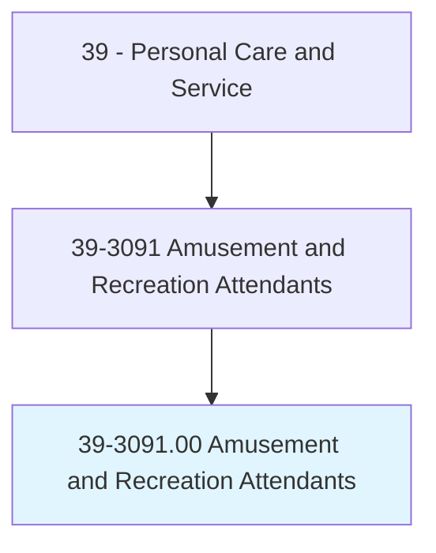
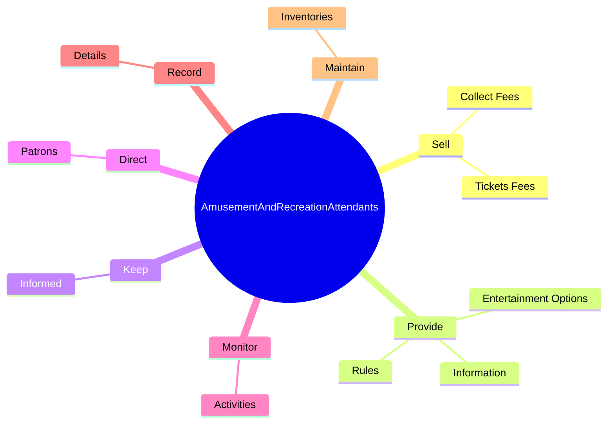
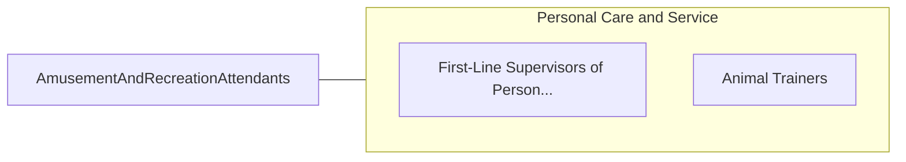

# Amusement and Recreation Attendants

> Perform a variety of attending duties at amusement or recreation facility. May schedule use of recreation facilities, maintain and provide equipment to participants of sporting events or recreational pursuits, or operate amusement concessions and rides.

## Overview

Amusement and Recreation Attendants is an occupation within the Personal Care and Service category. Perform a variety of attending duties at amusement or recreation facility. 

## Classification Hierarchy

## Key Statistics

| Metric | Value |
|--------|-------|
| SOC Code | 39-3091.00 |
| Category | [Personal Care and Service](/occupations/PersonalService/index) |
| Task Count | 83 |
| Source | O*NET |

## Core Tasks

### sell.TicketsFees

Amusement and Recreation Attendants sell tickets fees as part of their core responsibilities.

**Actions:**
- `sell.TicketsFees.from.Customers`
- `sell.CollectFees.from.Customers`

### provide.Information

Amusement and Recreation Attendants provide information as part of their core responsibilities.

**Actions:**
- `provide.Information.about.Facilities`
- `provide.EntertainmentOptions`
- `provide.Rules`

### keep.Informed

Amusement and Recreation Attendants keep informed as part of their core responsibilities.

**Actions:**
- `keep.Informed.of.ShutDownEvacuationProcedures`
- `keep.Informed.of.EmergencyEvacuationProcedures`

## Skills & Competencies

### Technical Skills
- **Customer Service** - Advanced
- **Personal Care** - Advanced
- **Service Delivery** - Advanced

### Soft Skills
- **Communication** - Essential
- **Problem Solving** - Essential
- **Critical Thinking** - Important
- **Teamwork** - Important
- **Adaptability** - Important

## Related Occupations

## Industries

This occupation is found across multiple industries. See [Industries](/industries) for sector-specific employment data.

## Career Progression

---

*Source: O*NET 39-3091.00 - ONETOccupation*
