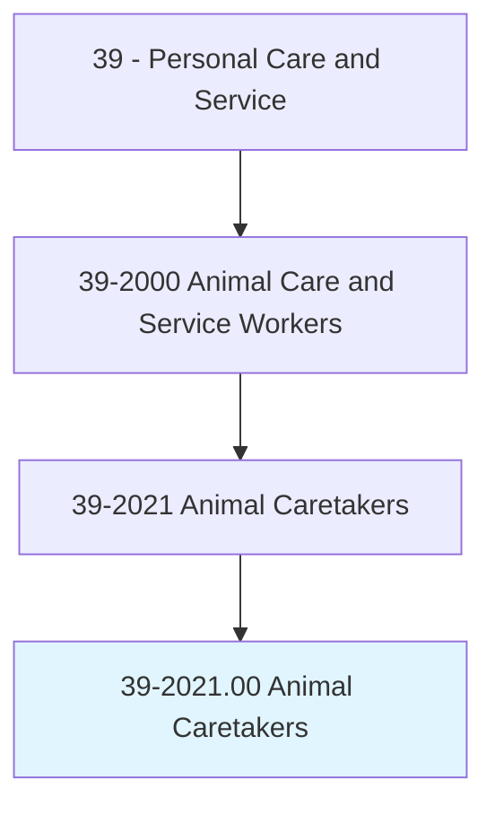
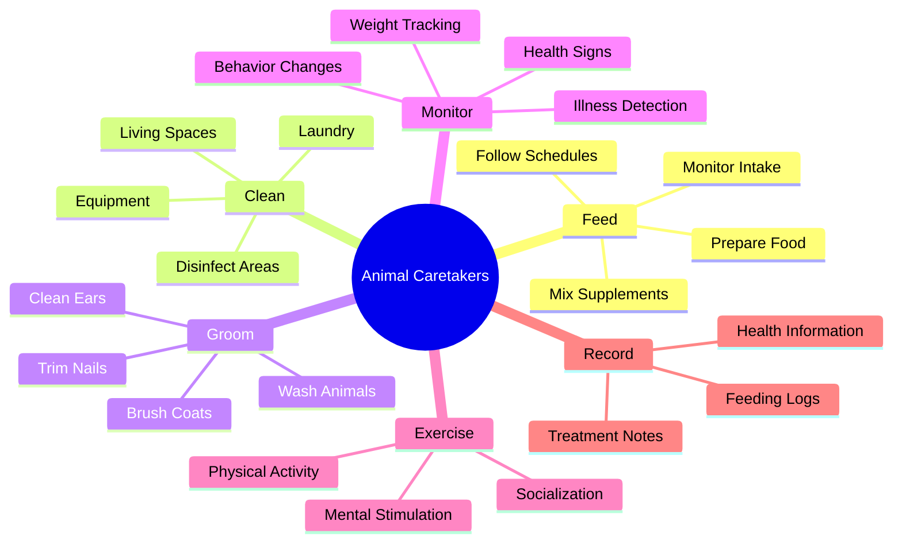
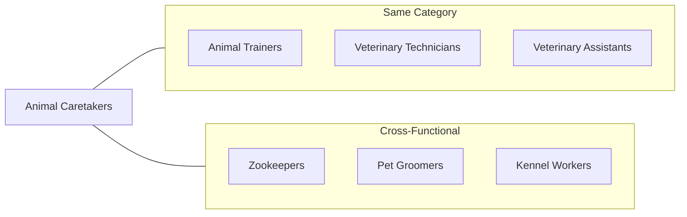
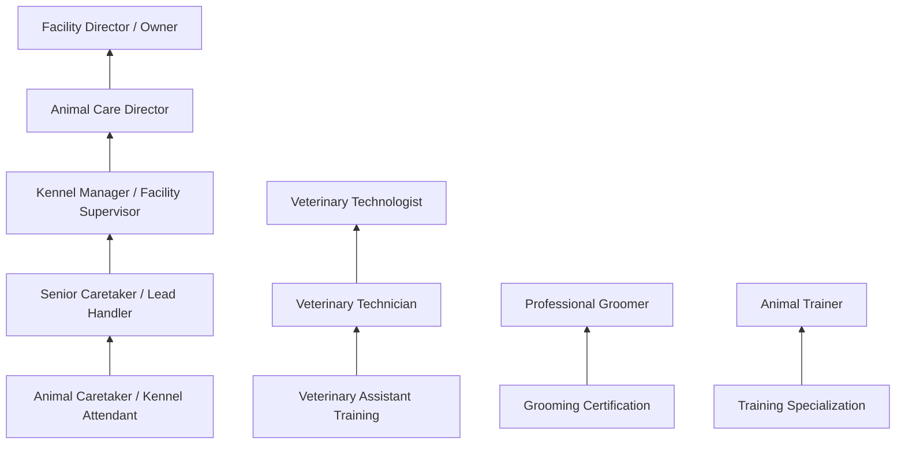

# Animal Caretakers

> Feed, water, groom, bathe, exercise, or otherwise provide care to promote and maintain the well-being of pets and other animals that are not raised for consumption, such as dogs, cats, race horses, ornamental fish, zoo animals, or mice.

## Overview

Animal Caretakers provide essential daily care for animals in various settings including veterinary clinics, kennels, pet stores, animal shelters, zoos, aquariums, and research facilities. They feed and water animals, clean living spaces, monitor health conditions, administer medications, groom pets, and exercise animals to maintain their physical and mental well-being. These workers form the backbone of animal care operations, often serving as the first line of defense in detecting health issues and ensuring animals receive proper attention and care.

## Classification Hierarchy



## Key Statistics

| Metric | Value |
|--------|-------|
| SOC Code | 39-2021.00 |
| Job Zone | 2 (Some Preparation) |
| Category | [Personal Care and Service](/occupations/PersonalService/index) |
| Core Tasks | 20+ |
| Source | O*NET |

## Core Tasks



### feed.Animals

Animal Caretakers provide proper nutrition according to species-specific requirements and schedules.

**Actions:**
- `feed.Animals.according.to.Schedules` - Provide meals at appropriate times
- `feed.Animals.according.to.FeedingInstructions` - Follow dietary specifications
- `water.Animals.according.to.Schedules` - Ensure adequate hydration
- `mix.Food.to.Instructions` - Prepare specialized diets
- `mix.Medications.to.Prescriptions` - Add medications to food as directed
- `mix.FoodSupplements.according.to.KnowledgeOfAnimalSpecies` - Provide appropriate nutritional supplements

### clean.Facilities

Caretakers maintain sanitary conditions for animal health and comfort.

**Actions:**
- `do.FacilityLaundry` - Clean bedding and towels
- `do.Clean` - Maintain clean living spaces
- `do.DisinfectAnimalQuarters` - Sanitize enclosures
- `maintain.Kennels.to.control.SpreadOfDisease` - Prevent disease transmission
- `maintain.AnimalHoldingAreas.to.control.SpreadOfDisease` - Keep holding areas sanitary
- `clean.SurgicalEquipment` - Sterilize medical tools
- `disinfect.SurgicalEquipment` - Ensure proper sanitation

### groom.Animals

Caretakers perform grooming services to maintain animal hygiene and appearance.

**Actions:**
- `perform.AnimalGroomingDuties` - Complete regular grooming tasks
- `perform.Washing` - Bathe animals as needed
- `perform.Brushing` - Maintain coat health
- `perform.Clipping` - Trim fur and hair
- `perform.TrimmingCoats` - Style and maintain coats
- `perform.CuttingNails` - Trim nails safely
- `perform.CleaningEars` - Maintain ear hygiene

### examine.Animals

Caretakers observe and monitor animal health to detect problems early.

**Actions:**
- `examine.Animals.to.detect.SignsOfIllness` - Watch for disease symptoms
- `examine.Animals.to.Disease` - Identify health issues
- `examine.Animals.to.Injury` - Detect physical injuries
- `observe.Animals.to.detect.SignsOfIllness` - Monitor for health changes
- `provide.Treatment.to.SickAnimals` - Administer basic care
- `provide.Treatment.to.InjuredAnimals` - Provide first aid
- `provide.Treatment.to.contact.VeterinariansToSecureTreatment` - Escalate to veterinary staff

### exercise.Animals

Caretakers ensure animals receive adequate physical activity and mental stimulation.

**Actions:**
- `exercise.Animals.to.maintain.PhysicalHealth` - Promote physical fitness
- `exercise.Animals.to.MentalHealth` - Support psychological well-being

### record.AnimalInformation

Caretakers document animal care activities and health observations.

**Actions:**
- `collect.AnimalInformation` - Gather relevant data
- `record.AnimalInformation` - Document care activities
- `collect.Weight` - Track animal weight
- `record.PhysicalCondition` - Document health status
- `record.TreatmentsReceived` - Log medical treatments
- `record.MedicationsGiven` - Track medication administration
- `collect.FoodIntake` - Monitor eating patterns

### advise.PetOwners

Caretakers educate pet owners on proper animal care.

**Actions:**
- `advise.PetOwners.on.How.to.care.ForPetsHealth` - Provide care guidance
- `answer.Telephones` - Handle client calls
- `answer.ScheduleAppointments` - Book services

## Supplemental Tasks

### transfer.Animals

Caretakers move animals between locations for various purposes.

**Actions:**
- `transfer.Animals.between.Enclosures.to.facilitate.Breeding` - Support breeding programs
- `transfer.Animals.between.Enclosures.to.Birthing` - Prepare for births
- `transfer.Animals.between.Enclosures.to.Shipping` - Arrange transport

### maintain.Equipment

Caretakers keep animal care equipment in working order.

**Actions:**
- `install.AnimalCareFacilityEquipment` - Set up equipment
- `maintain.AnimalCareFacilityEquipment` - Keep equipment functional
- `repair.AnimalCareFacilityEquipment` - Fix broken equipment
- `adjust.Controls.to.regulate.SpecifiedTemperatureOfAnimalQuarters` - Control environment

### inoculate.Animals

Caretakers may administer vaccinations under supervision.

**Actions:**
- `anesthetize.Animals.to.Instructions` - Assist with sedation
- `inoculate.Animals.to.Instructions` - Administer vaccines as directed

## Skills & Competencies

### Technical Skills
- **Animal Handling** - Advanced
- **Feeding and Nutrition** - Intermediate
- **Grooming Techniques** - Intermediate
- **Sanitation Procedures** - Advanced
- **Health Monitoring** - Intermediate
- **First Aid** - Basic
- **Record Keeping** - Basic

### Soft Skills
- **Patience** - Critical
- **Observation** - Essential
- **Physical Stamina** - Essential
- **Compassion** - Critical
- **Attention to Detail** - Essential
- **Communication** - Important
- **Reliability** - Critical

## Related Occupations



## Industries

- [Other Services (Pet Care)](/industries/OtherServices) - High Employment
- [Veterinary Services](/industries/VeterinaryServices) - High Employment
- Zoos and Botanical Gardens - Moderate Employment
- Animal Shelters - Moderate Employment
- [Pet Stores and Supplies](/industries/Retail/index) - Moderate Employment
- [Scientific Research](/industries/Research) - Moderate Employment

## Industry Variations

### Veterinary Clinics and Hospitals
Focus on medical support, surgical assistance, patient monitoring, and medication administration. Work closely with veterinarians and technicians.

### Kennels and Boarding Facilities
Emphasis on daily care, exercise, feeding, and customer service. Managing multiple animals in boarding situations.

### Animal Shelters and Rescue Organizations
Care for abandoned and surrendered animals, support adoption processes, and maintain animal welfare in high-volume environments.

### Zoos and Aquariums
Specialized care for exotic species, habitat maintenance, enrichment activities, and public education support.

### Pet Grooming Salons
Primary focus on grooming services including bathing, styling, nail care, and maintaining animal appearance.

### Research Facilities
Care for laboratory animals, maintain strict protocols, document observations, and support research activities.

### Stables and Equine Facilities
Specialized care for horses including feeding, grooming, exercise, stall maintenance, and tack care.

## Career Progression



## Education & Training

| Requirement | Details |
|-------------|---------|
| Typical Education | High school diploma or equivalent |
| Work Experience | None to less than 1 year for entry-level positions |
| On-the-Job Training | Short-term (1-3 months) |
| Common Certifications | Pet First Aid, Fear Free Certification, Species-specific handling |

## Physical Requirements

| Requirement | Description |
|-------------|-------------|
| Lifting | Ability to lift 50+ pounds regularly |
| Standing | Extended periods of standing and walking |
| Bending | Frequent bending, kneeling, and reaching |
| Exposure | Work with animals, cleaning chemicals, outdoor conditions |
| Schedule | May include weekends, holidays, and emergency on-call |

## Departments

This occupation typically works in:
- Animal Care
- Kennel Operations
- Veterinary Support
- Exhibit Operations

## GraphDL Semantic Structure

```graphdl
Namespace: occupations.org.ai
Entity: AnimalCaretakers

Relationships:
- feeds.Animals
- grooms.Animals
- cleans.AnimalFacilities
- monitors.AnimalHealth
- exercises.Animals
- records.AnimalInformation
- reportsTo.FacilitySupervisor
- assistsWith.VeterinaryCare
- advises.PetOwners
```

---

*Source: O*NET 39-2021.00 - ONETOccupation*
