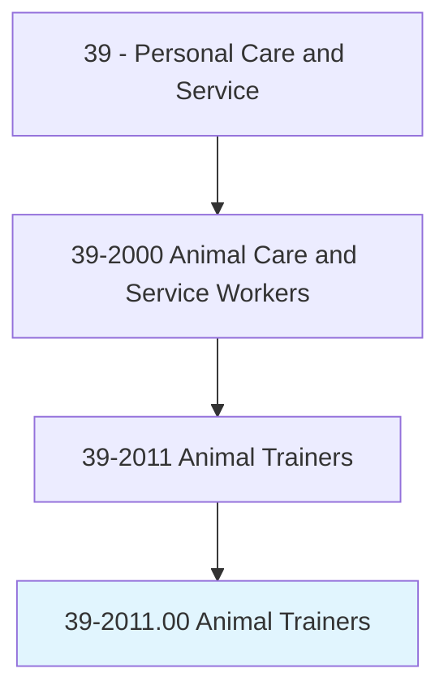
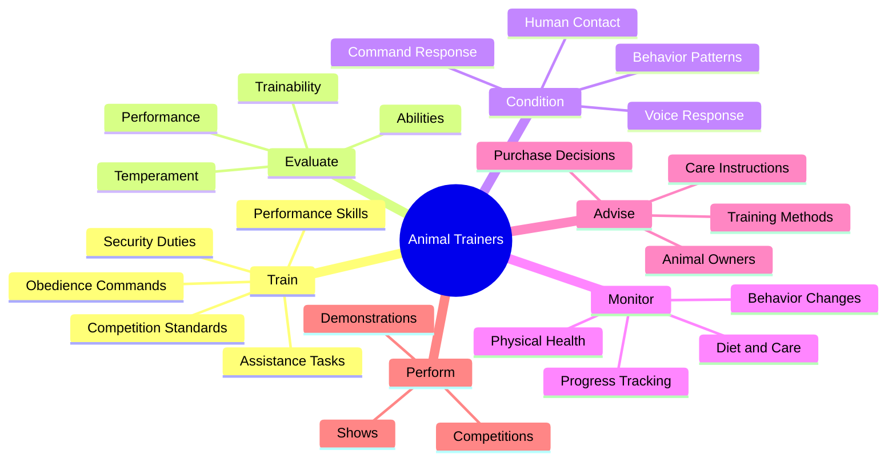
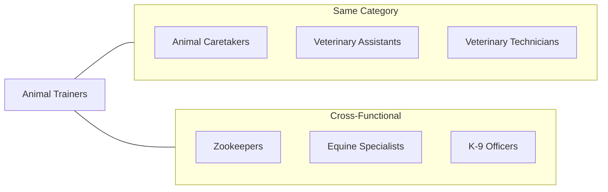
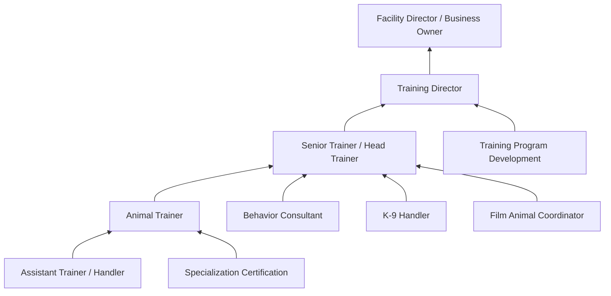

# Animal Trainers

> Train animals for riding, harness, security, performance, or obedience, or for assisting persons with disabilities. Accustom animals to human voice and contact, and condition animals to respond to commands. Train animals according to prescribed standards for show or competition. May train animals to carry pack loads or work as part of pack team.

## Overview

Animal Trainers work with animals to modify behavior and teach specific skills for various purposes including performance, competition, security, assistance, and companionship. They use knowledge of animal behavior, learning theory, and positive reinforcement techniques to condition animals to respond to commands, perform tricks, assist people with disabilities, or serve in security and detection roles. This occupation requires patience, consistency, deep understanding of animal psychology, and the ability to communicate training methods to animal owners.

## Classification Hierarchy



## Key Statistics

| Metric | Value |
|--------|-------|
| SOC Code | 39-2011.00 |
| Job Zone | 3 (Medium Preparation) |
| Category | [Personal Care and Service](/occupations/PersonalService) |
| Core Tasks | 15+ |
| Source | O*NET |

## Core Tasks



### conduct.TrainingPrograms

Animal Trainers design and implement training programs to develop specific animal behaviors.

**Actions:**
- `conduct.TrainingPrograms.to.develop.DesiredAnimalBehaviorsForCompetition` - Train for competition standards
- `conduct.TrainingPrograms.to.maintain.DesiredAnimalBehaviorsForCompetition` - Reinforce learned behaviors
- `conduct.TrainingPrograms.to.Entertainment` - Prepare animals for performance
- `conduct.TrainingPrograms.to.Obedience` - Teach basic commands and manners
- `conduct.TrainingPrograms.to.Security` - Train for protection and detection work
- `conduct.TrainingPrograms.to.Riding` - Prepare animals for riding activities

### talk.Interact.withAnimals

Trainers familiarize animals with human interaction through consistent communication.

**Actions:**
- `talk.Interact.with.Animals.to.familiarize.ThemToHumanVoices` - Acclimate to human speech
- `talk.Interact.with.Contact` - Build trust through physical interaction

### evaluate.Animals

Trainers assess animals to determine training potential and appropriate methods.

**Actions:**
- `evaluate.Animals.to.determine.Temperaments` - Assess personality and disposition
- `evaluate.Animals.to.Abilities` - Identify natural aptitudes
- `evaluate.Animals.to.AptitudeForTraining` - Gauge learning potential
- `evaluate.Animals.for.Trainability.to.Perform` - Assess performance capability
- `evaluate.Animals.for.Ability.to.Perform` - Determine skill level

### cue.Animals

Trainers direct animal behavior during performances and practice sessions.

**Actions:**
- `cue.Animals.during.Performances` - Signal behaviors during shows
- `signal.Animals.during.Performances` - Direct performance actions

### observe.AnimalsHealth

Trainers monitor animal wellbeing to ensure health and readiness for training.

**Actions:**
- `observe.AnimalsPhysicalConditions.to.detect.IllnessConditionsRequiringMedicalCare` - Watch for health issues
- `observe.AnimalsPhysicalConditions.to.UnhealthyConditionsRequiringMedicalCare` - Identify problems requiring veterinary attention

### feed.Animals

Trainers provide daily care including feeding and exercise.

**Actions:**
- `feed.Animals` - Provide proper nutrition
- `exercise.Animals` - Maintain physical fitness
- `feed.ProvideOtherGeneralCare` - Complete comprehensive care

### keep.Records

Trainers document animal progress, health, and training activities.

**Actions:**
- `keep.RecordsDocumentingAnimalHealth` - Track health status
- `keep.Diet` - Monitor nutritional intake
- `keep.Behavior` - Document behavioral progress

### administer.Medications

Trainers may provide prescribed medications to animals in their care.

**Actions:**
- `administer.PrescribedMedications.to.Animals` - Give medications as directed

### advise.AnimalOwners

Trainers provide guidance to owners on animal selection and care.

**Actions:**
- `advise.AnimalOwners.regarding.Purchase.of.SpecificAnimals` - Guide purchase decisions

## Specialized Training Tasks

### train.HorsesEquines

Trainers prepare horses for various disciplines.

**Actions:**
- `train.HorsesEquines.for.Riding` - Prepare for mounted activities
- `train.HorsesEquines.for.Harness` - Train for driving
- `train.HorsesEquines.for.Show` - Prepare for exhibitions
- `train.HorsesEquines.for.Racing` - Condition for competitive racing
- `train.HorsesEquines.for.UsingKnowledge.of.BreedCharacteristics` - Apply breed-specific methods
- `retrain.Horses.to.break.BadHabits` - Correct undesirable behaviors

### train.Dogs

Trainers work with dogs for various specialized purposes.

**Actions:**
- `train.Dogs.in.HumanAssistanceProtectionDuties` - Prepare service and assistance dogs
- `train.Dogs.in.PropertyProtectionDuties` - Train security and guard dogs

### organize.AnimalShows

Trainers may coordinate and present animal performances.

**Actions:**
- `organize.AnimalShows` - Plan and arrange shows
- `conduct.AnimalShows` - Lead performances and demonstrations

## Skills & Competencies

### Technical Skills
- **Animal Behavior Science** - Expert
- **Training Techniques** - Expert
- **Positive Reinforcement Methods** - Expert
- **Species-Specific Knowledge** - Advanced
- **Safety Protocols** - Advanced
- **Health Assessment** - Intermediate
- **Performance Choreography** - Intermediate

### Soft Skills
- **Patience** - Critical
- **Consistency** - Critical
- **Observation** - Essential
- **Communication** - Essential
- **Problem Solving** - Essential
- **Physical Fitness** - Important
- **Empathy** - Important

## Related Occupations



## Industries

- [Other Services (Pet Training)](/industries/OtherServices) - High Employment
- [Spectator Sports (Racing)](/industries/SpectatorSports) - Moderate Employment
- [Arts, Entertainment, and Recreation](/industries/ArtsEntertainment) - Moderate Employment
- [Agriculture (Equine)](/industries/Agriculture) - Moderate Employment
- [Government (Law Enforcement)](/industries/Government) - Moderate Employment
- [Healthcare (Therapy Animals)](/industries/Healthcare) - Growing Employment

## Industry Variations

### Dog Obedience and Behavior Training
Focus on pet behavior modification, basic obedience, and addressing problem behaviors. Work directly with pet owners on training techniques.

### Service and Assistance Animal Training
Specialized training for guide dogs, hearing dogs, mobility assistance animals, and psychiatric service animals. Rigorous standards and certification requirements.

### Horse Training
Preparation for riding, racing, show competition, or therapeutic purposes. Requires extensive equine knowledge and handling skills.

### Entertainment and Performance
Training animals for film, television, live shows, and public performances. Focus on reliability, safety, and precise command response.

### Security and Detection
Training dogs for police work, military service, border patrol, or private security. Emphasis on detection, apprehension, and handler protection.

### Marine Mammal Training
Specialized work with dolphins, sea lions, and other marine animals in aquariums and marine parks. Requires unique handling skills and conditioning methods.

### Exotic Animal Training
Work with wild or unusual species in zoos, sanctuaries, or entertainment venues. High emphasis on safety and species-specific behavior knowledge.

## Career Progression



## Education & Training

| Requirement | Details |
|-------------|---------|
| Typical Education | High school diploma; some college or vocational training preferred |
| Work Experience | 2-4 years working with animals |
| On-the-Job Training | Moderate to Long-term apprenticeship with experienced trainers |
| Common Certifications | CPDT-KA, CCPDT, Species-specific certifications |

## Certification Options

| Certification | Organization | Focus Area |
|--------------|--------------|------------|
| CPDT-KA | CCPDT | Dog training professional |
| CPDT-KSA | CCPDT | Dog training knowledge and skills |
| KPA CTP | Karen Pryor Academy | Clicker training certification |
| IAABC | IAABC | Animal behavior consulting |
| CAAB | ABS | Certified applied animal behaviorist |

## Specialized Requirements

### Service Animal Training
- Understanding of ADA requirements
- Knowledge of specific disability assistance needs
- Public access training protocols
- Extensive socialization and proofing

### Law Enforcement / Security
- Law enforcement agency partnerships
- Detection training certification
- Handler training coordination
- Ongoing proficiency testing

### Equine Training
- Species-specific expertise
- Discipline certification (dressage, jumping, racing)
- Safety protocols for large animals
- Facility and equipment knowledge

## Departments

This occupation typically works in:
- [Training Programs](/departments/TrainingPrograms)
- [Animal Services](/departments/AnimalServices)
- [Performance Operations](/departments/PerformanceOperations)
- [Behavioral Services](/departments/BehavioralServices)

## GraphDL Semantic Structure

```
Namespace: occupations.org.ai
Entity: AnimalTrainers

Relationships:
- trains.Animals.for.Obedience
- trains.Animals.for.Performance
- trains.Animals.for.Security
- trains.Animals.for.Assistance
- evaluates.AnimalBehavior
- conditions.AnimalResponses
- monitors.AnimalHealth
- advises.AnimalOwners
- conducts.TrainingPrograms
- demonstrates.TrainingTechniques
```

---

*Source: O*NET 39-2011.00 - ONETOccupation*
