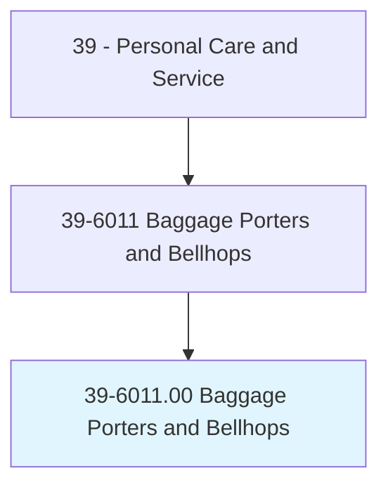
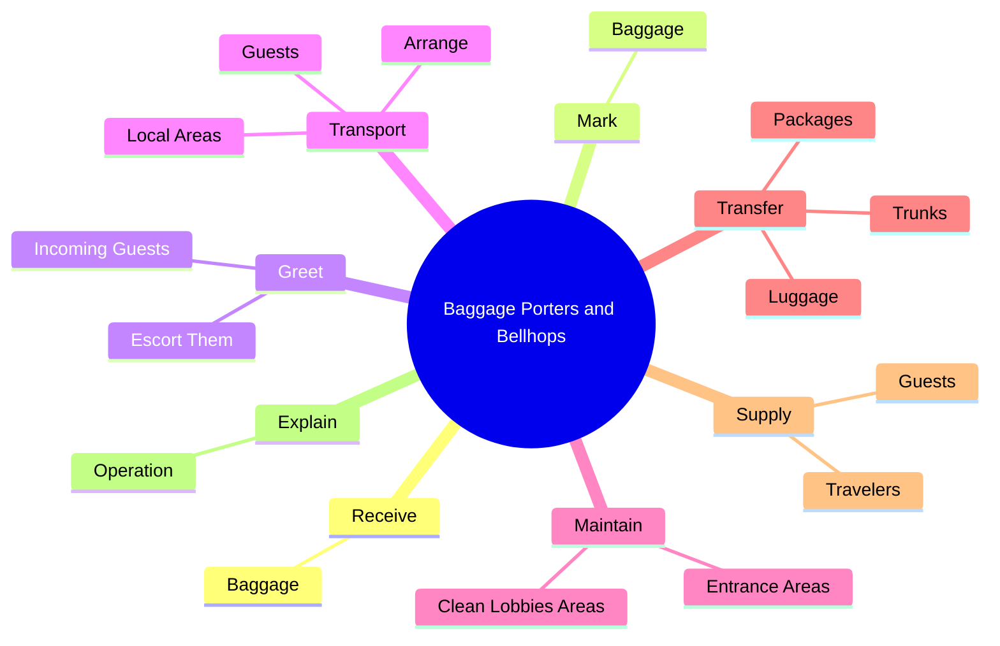
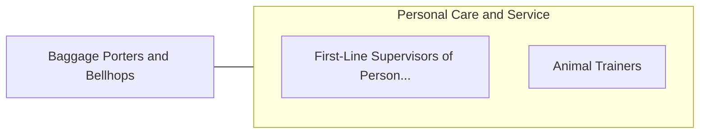

# Baggage Porters and Bellhops

> Handle baggage for travelers at transportation terminals or for guests at hotels or similar establishments.

## Overview

Baggage Porters and Bellhops is classified under Personal Care and Service (SOC 39). Handle baggage for travelers at transportation terminals or for guests at hotels or similar establishments.

## Classification Hierarchy

## Key Statistics

| Metric | Value |
|--------|-------|
| SOC Code | 39-6011.00 |
| Category | [Personal Care and Service](/occupations/PersonalService/index) |
| Task Count | 70 |
| Source | O*NET |

## Core Tasks

### receive.Baggage

Baggage Porters and Bellhops receive baggage as part of their core responsibilities.

**Actions:**
- `receive.Baggage.by.CompletingClaimChecks`
- `receive.Baggage.by.AttachingClaimChecks`

### mark.Baggage

Baggage Porters and Bellhops mark baggage as part of their core responsibilities.

**Actions:**
- `mark.Baggage.by.CompletingClaimChecks`
- `mark.Baggage.by.AttachingClaimChecks`

### greet.IncomingGuests

Baggage Porters and Bellhops greet incoming guests as part of their core responsibilities.

**Actions:**
- `greet.IncomingGuests.to.Rooms`
- `greet.EscortThem.to.Rooms`

## Skills & Competencies

### Technical Skills
- **Customer Service** - Advanced
- **Personal Care** - Advanced
- **Service Delivery** - Advanced

### Soft Skills
- **Communication** - Essential
- **Problem Solving** - Essential
- **Critical Thinking** - Important
- **Teamwork** - Important
- **Adaptability** - Important

## Related Occupations

## Industries

This occupation is found across multiple industries. See [Industries](/industries) for sector-specific employment data.

## Career Progression

---

*Source: O*NET 39-6011.00 - ONETOccupation*
