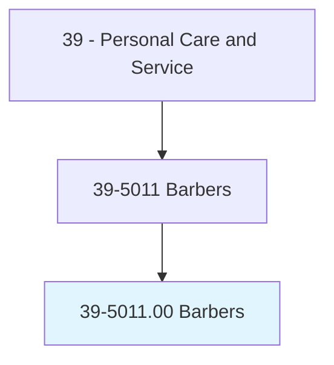
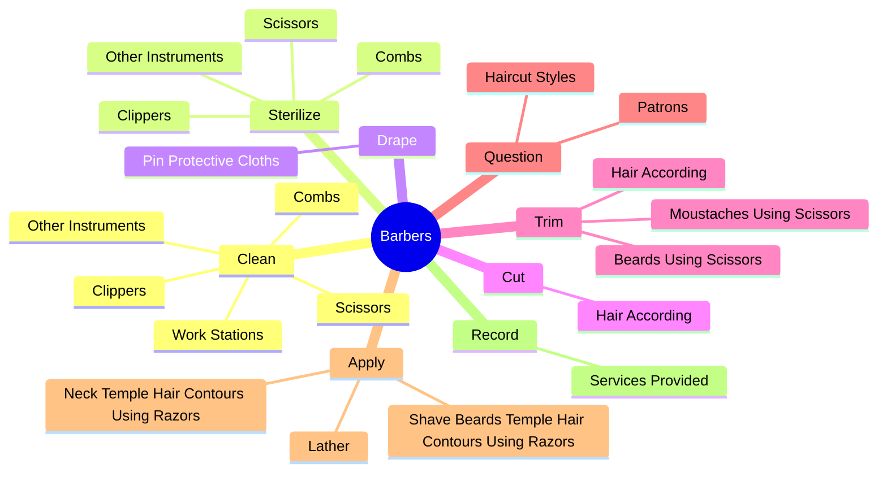
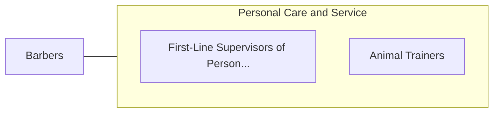

# Barbers

> Provide barbering services, such as cutting, trimming, shampooing, and styling hair; trimming beards; or giving shaves.

## Overview

Barbers is classified under Personal Care and Service (SOC 39). Provide barbering services, such as cutting, trimming, shampooing, and styling hair; trimming beards; or giving shaves.

## Classification Hierarchy

## Key Statistics

| Metric | Value |
|--------|-------|
| SOC Code | 39-5011.00 |
| Category | [Personal Care and Service](/occupations/PersonalService/index) |
| Task Count | 62 |
| Source | O*NET |

## Core Tasks

### clean.Scissors

Barbers clean scissors as part of their core responsibilities.

**Actions:**
- `clean.Scissors`
- `clean.Combs`
- `clean.Clippers`
- `clean.OtherInstruments`

### sterilize.Scissors

Barbers sterilize scissors as part of their core responsibilities.

**Actions:**
- `sterilize.Scissors`
- `sterilize.Combs`
- `sterilize.Clippers`
- `sterilize.OtherInstruments`

### drape.PinProtectiveCloths

Barbers drape pin protective cloths as part of their core responsibilities.

**Actions:**
- `drape.PinProtectiveCloths.around.CustomersShoulders`

## Skills & Competencies

### Technical Skills
- **Customer Service** - Advanced
- **Personal Care** - Advanced
- **Service Delivery** - Advanced

### Soft Skills
- **Communication** - Essential
- **Problem Solving** - Essential
- **Critical Thinking** - Important
- **Teamwork** - Important
- **Adaptability** - Important

## Related Occupations

## Industries

This occupation is found across multiple industries. See [Industries](/industries) for sector-specific employment data.

## Career Progression

---

*Source: O*NET 39-5011.00 - ONETOccupation*
