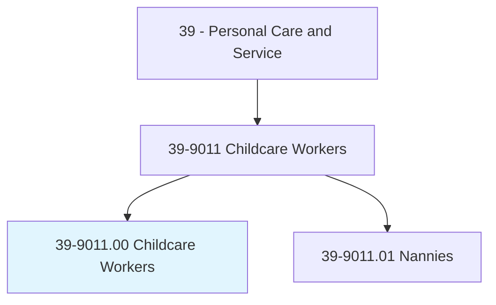
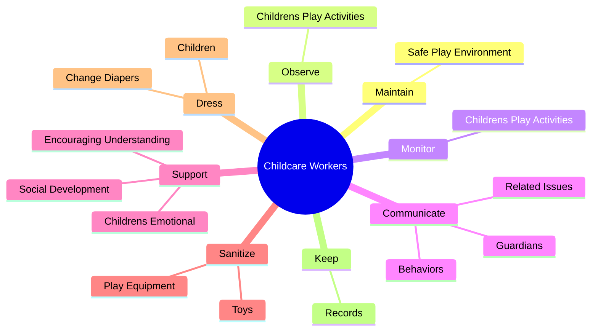
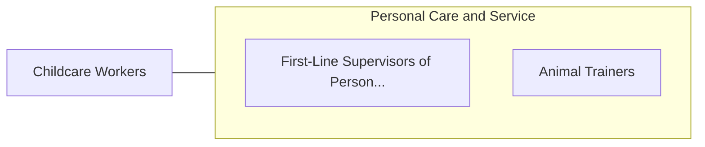

# Childcare Workers

> Attend to children at schools, businesses, private households, and childcare institutions. Perform a variety of tasks, such as dressing, feeding, bathing, and overseeing play.

## Overview

Childcare Workers is an occupation within the Personal Care and Service category. Attend to children at schools, businesses, private households, and childcare institutions. 

## Classification Hierarchy

## Key Statistics

| Metric | Value |
|--------|-------|
| SOC Code | 39-9011.00 |
| Category | [Personal Care and Service](/occupations/PersonalService/index) |
| Task Count | 78 |
| Source | O*NET |

## Core Tasks

### maintain.SafePlayEnvironment

Childcare Workers maintain safe play environment as part of their core responsibilities.

**Actions:**
- `maintain.SafePlayEnvironment`

### observe.ChildrensPlayActivities

Childcare Workers observe childrens play activities as part of their core responsibilities.

**Actions:**
- `observe.ChildrensPlayActivities`

### monitor.ChildrensPlayActivities

Childcare Workers monitor childrens play activities as part of their core responsibilities.

**Actions:**
- `monitor.ChildrensPlayActivities`

## Skills & Competencies

### Technical Skills
- **Customer Service** - Advanced
- **Personal Care** - Advanced
- **Service Delivery** - Advanced

### Soft Skills
- **Communication** - Essential
- **Problem Solving** - Essential
- **Critical Thinking** - Important
- **Teamwork** - Important
- **Adaptability** - Important

## Related Occupations

## Industries

This occupation is found across multiple industries. See [Industries](/industries) for sector-specific employment data.

## Career Progression

---

*Source: O*NET 39-9011.00 - ONETOccupation*
