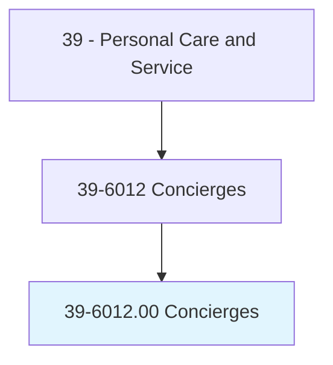
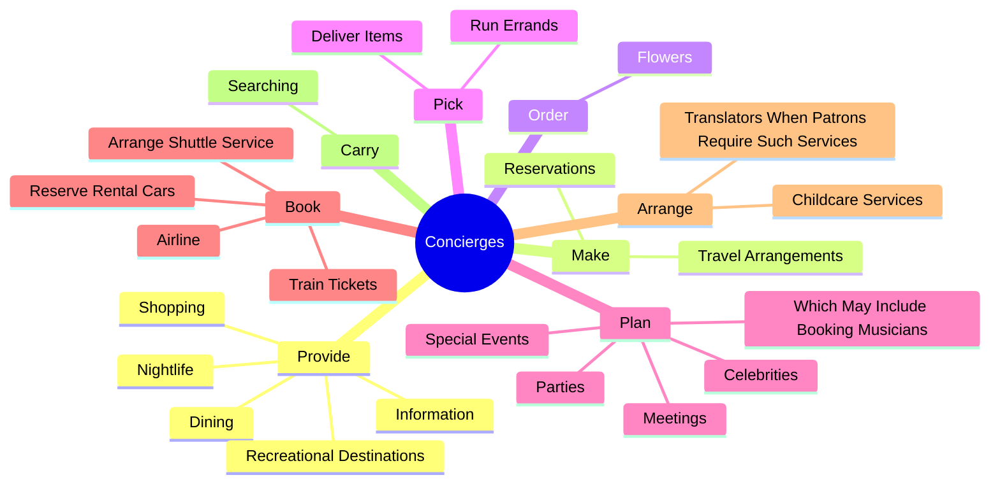
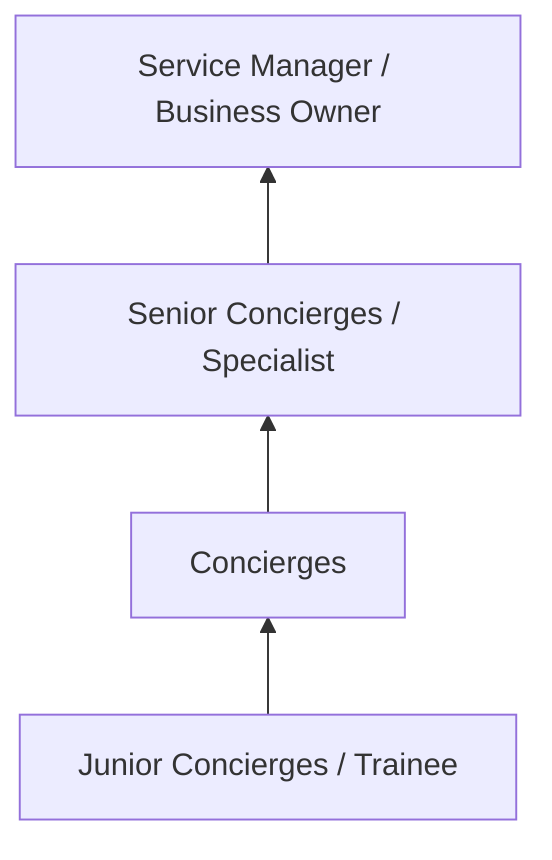
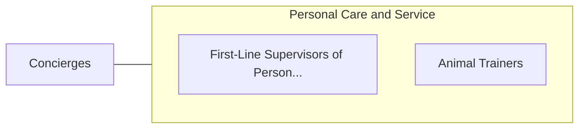

# Concierges

> Assist patrons at hotel, apartment, or office building with personal services. May take messages; arrange or give advice on transportation, business services, or entertainment; or monitor guest requests for housekeeping and maintenance.

## Overview

Concierges professionals assist patrons at hotel, apartment, or office building with personal services. This occupation falls within the Personal Care and Service category and requires a combination of specialized knowledge, technical skills, and practical experience.

These professionals work across diverse settings and organizational contexts, applying their expertise to meet the demands of their field. They must stay current with industry standards, emerging practices, and regulatory requirements that affect their work. The role demands both independent judgment and collaborative skills, as practitioners regularly interact with colleagues, stakeholders, and the public.

As the field continues to evolve, Concierges professionals increasingly leverage technology and data-driven approaches to enhance their effectiveness. Career opportunities span the public and private sectors, with demand influenced by economic conditions, demographic shifts, and technological advancement.

## Classification Hierarchy



## Key Statistics

| Metric | Value |
|--------|-------|
| SOC Code | 39-6012.00 |
| Job Zone | N/A |
| Category | [Personal Care and Service](/occupations/PersonalService/index) |
| Core Tasks | 46+ |
| Salary Range | $25,000 - $60,000 |
| Median Salary | $35,000 |
| Growth Outlook | 8% (Faster than average) |
| Source | O*NET |

## Core Tasks



### provide.Information

Concierges provide information as part of their core responsibilities.

**Actions:**
- `provide.Information.about.LocalFeatures` - Provide information about local features, such as shopping, dining, nightlife...
- `provide.Shopping` - Provide information about local features, such as shopping, dining, nightlife...
- `provide.Dining` - Provide information about local features, such as shopping, dining, nightlife...
- `provide.Nightlife` - Provide information about local features, such as shopping, dining, nightlife...
- `provide.RecreationalDestinations` - Provide information about local features, such as shopping, dining, nightlife...

### make.Reservations

Concierges make reservations as part of their core responsibilities.

**Actions:**
- `make.Reservations.for.Patrons` - Make reservations for patrons, such as for dinner, spa treatments, or golf te...
- `make.Reservations.for.ForDinner` - Make reservations for patrons, such as for dinner, spa treatments, or golf te...
- `make.Reservations.for.SpaTreatments` - Make reservations for patrons, such as for dinner, spa treatments, or golf te...
- `make.Reservations.for.GolfTeeTimes` - Make reservations for patrons, such as for dinner, spa treatments, or golf te...
- `make.Reservations.for.ObtainTicketsToSpecialEvents` - Make reservations for patrons, such as for dinner, spa treatments, or golf te...

### plan.SpecialEvents

Concierges plan special events as part of their core responsibilities.

**Actions:**
- `plan.SpecialEvents` - Plan special events, parties, or meetings, which may include booking musician...
- `plan.Parties` - Plan special events, parties, or meetings, which may include booking musician...
- `plan.Meetings` - Plan special events, parties, or meetings, which may include booking musician...
- `plan.WhichMayIncludeBookingMusicians` - Plan special events, parties, or meetings, which may include booking musician...
- `plan.Celebrities` - Plan special events, parties, or meetings, which may include booking musician...

### book.Airline

Concierges book airline as part of their core responsibilities.

**Actions:**
- `book.Airline.for.Guests` - Book airline or train tickets, reserve rental cars, or arrange shuttle servic...
- `book.TrainTickets.for.Guests` - Book airline or train tickets, reserve rental cars, or arrange shuttle servic...
- `book.ReserveRentalCars.for.Guests` - Book airline or train tickets, reserve rental cars, or arrange shuttle servic...
- `book.ArrangeShuttleService.for.Guests` - Book airline or train tickets, reserve rental cars, or arrange shuttle servic...


## Skills & Competencies

### Technical Skills
- **Service Delivery** - Advanced
- **Customer Relations** - Advanced
- **Scheduling and Planning** - Proficient
- **Safety and Hygiene** - Proficient
- **Specialty Skills** - Proficient
- **Point-of-Sale Systems** - Proficient

### Soft Skills
- **Customer Service** - Critical
- **Communication** - Critical
- **Patience** - Essential
- **Adaptability** - Essential
- **Interpersonal Skills** - Essential

## Education & Certifications

| Requirement | Details |
|-------------|---------|
| Typical Education | High school diploma to post-secondary certificate |
| Work Experience | 0-2 years service experience |
| On-the-Job Training | Short to moderate - customer service and specialty skills |
| Certifications | State licensure for cosmetology, massage, etc. |

## Career Progression



## Industry Variations

### Hospitality and Leisure
Service delivery in hotels, resorts, and entertainment venues. Concierges professionals focus on guest satisfaction and experience.

### Health and Wellness
Personal services supporting physical and mental well-being. Emphasis on client relationships and customized service.

### Retail and Consumer Services
Direct consumer-facing service delivery. Focus on customer experience and repeat business.

### Self-Employment
Independent service provision with entrepreneurial responsibilities including marketing, scheduling, and business management.

## Technology & Tools

- **Scheduling and booking software**
- **Point-of-sale systems**
- **Customer relationship management (CRM)**
- **Specialty service equipment**
- **Social media marketing tools**

## Related Occupations



## Industries

- [Personal and Laundry Services](/industries/PersonalServices) - High Employment
- Amusement and Recreation - High Employment
- [Accommodation](/industries/Accommodation) - Moderate Employment
- [Fitness and Wellness](/industries/Fitness) - Growing Employment

## Departments

This occupation typically works in:
- Guest Services
- Client Relations
- [Operations](/departments/Operations/index)

## GraphDL Semantic Structure

```graphdl
Concierges perform:
- provide.Information.about.LocalFeatures
- provide.Shopping
- provide.Dining
- provide.Nightlife
- provide.RecreationalDestinations
- make.Reservations.for.Patrons
```

---

*Source: O*NET 39-6012.00 - ONETOccupation*
