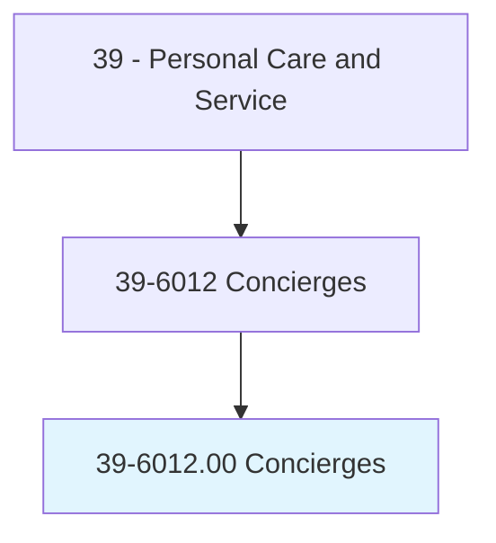
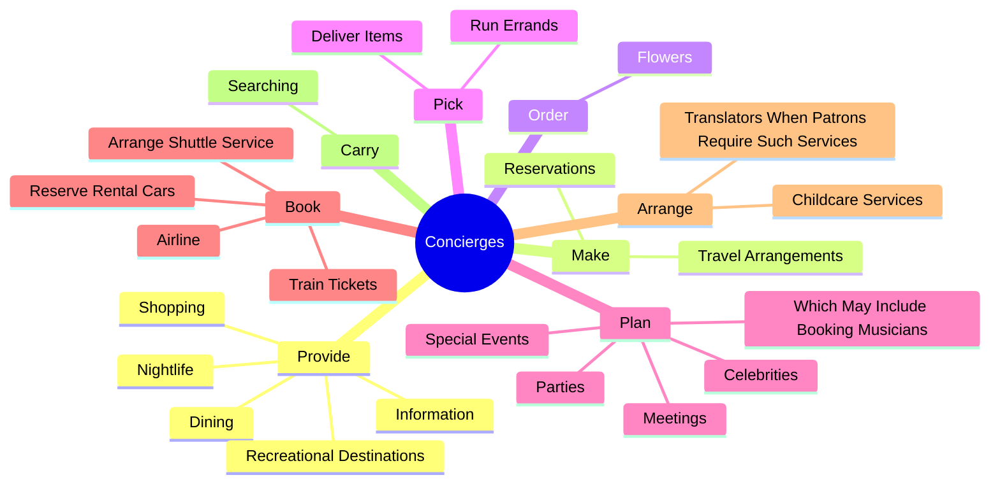
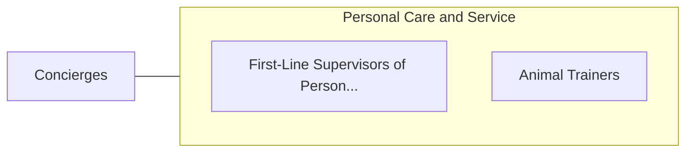

# Concierges

> Assist patrons at hotel, apartment, or office building with personal services. May take messages; arrange or give advice on transportation, business services, or entertainment; or monitor guest requests for housekeeping and maintenance.

## Overview

Concierges is an occupation within the Personal Care and Service category. Assist patrons at hotel, apartment, or office building with personal services. 

## Classification Hierarchy

## Key Statistics

| Metric | Value |
|--------|-------|
| SOC Code | 39-6012.00 |
| Category | [Personal Care and Service](/occupations/PersonalService/index) |
| Task Count | 46 |
| Source | O*NET |

## Core Tasks

### provide.Information

Concierges provide information as part of their core responsibilities.

**Actions:**
- `provide.Information.about.LocalFeatures`
- `provide.Shopping`
- `provide.Dining`
- `provide.Nightlife`

### make.Reservations

Concierges make reservations as part of their core responsibilities.

**Actions:**
- `make.Reservations.for.Patrons`
- `make.Reservations.for.ForDinner`
- `make.Reservations.for.SpaTreatments`
- `make.Reservations.for.GolfTeeTimes`

### order.Flowers

Concierges order flowers as part of their core responsibilities.

**Actions:**
- `order.Flowers.for.Guests`

## Skills & Competencies

### Technical Skills
- **Customer Service** - Advanced
- **Personal Care** - Advanced
- **Service Delivery** - Advanced

### Soft Skills
- **Communication** - Essential
- **Problem Solving** - Essential
- **Critical Thinking** - Important
- **Teamwork** - Important
- **Adaptability** - Important

## Related Occupations

## Industries

This occupation is found across multiple industries. See [Industries](/industries) for sector-specific employment data.

## Career Progression

---

*Source: O*NET 39-6012.00 - ONETOccupation*
