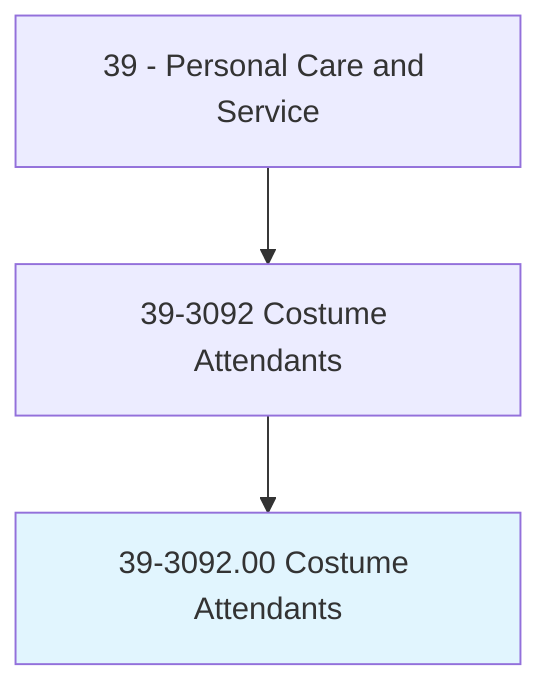
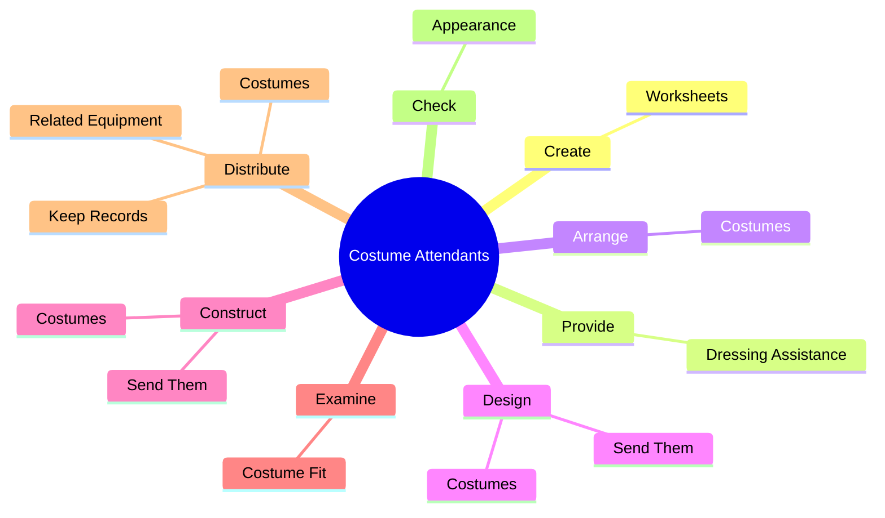
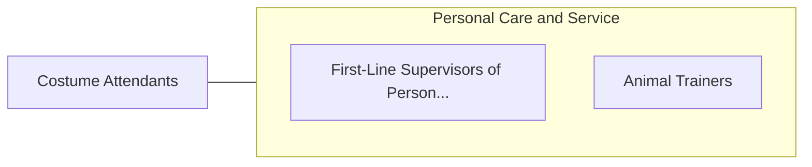

# Costume Attendants

> Select, fit, and take care of costumes for cast members, and aid entertainers. May assist with multiple costume changes during performances.

## Overview

Costume Attendants is an occupation within the Personal Care and Service category. Select, fit, and take care of costumes for cast members, and aid entertainers. 

## Classification Hierarchy

## Key Statistics

| Metric | Value |
|--------|-------|
| SOC Code | 39-3092.00 |
| Category | [Personal Care and Service](/occupations/PersonalService) |
| Task Count | 85 |
| Source | O*NET |

## Core Tasks

### create.Worksheets

Costume Attendants create worksheets as part of their core responsibilities.

**Actions:**
- `create.Worksheets.for.DressingLists`
- `create.Worksheets.for.ShowNotes`
- `create.Worksheets.for.CostumeChecks`

### provide.DressingAssistance

Costume Attendants provide dressing assistance as part of their core responsibilities.

**Actions:**
- `provide.DressingAssistance.to.CastMembers`
- `provide.DressingAssistance.to.assign.CastDressersToAssistSpecificCastMembersWithCostumeChanges`

### arrange.Costumes

Costume Attendants arrange costumes as part of their core responsibilities.

**Actions:**
- `arrange.Costumes.in.OrderOfUse.to.facilitate.QuickChangeProceduresForPerformances`

## Skills & Competencies

### Technical Skills
- **Customer Service** - Advanced
- **Personal Care** - Advanced
- **Service Delivery** - Advanced

### Soft Skills
- **Communication** - Essential
- **Problem Solving** - Essential
- **Critical Thinking** - Important
- **Teamwork** - Important
- **Adaptability** - Important

## Related Occupations

## Industries

This occupation is found across multiple industries. See [Industries](/industries) for sector-specific employment data.

## Career Progression

---

*Source: O*NET 39-3092.00 - ONETOccupation*
