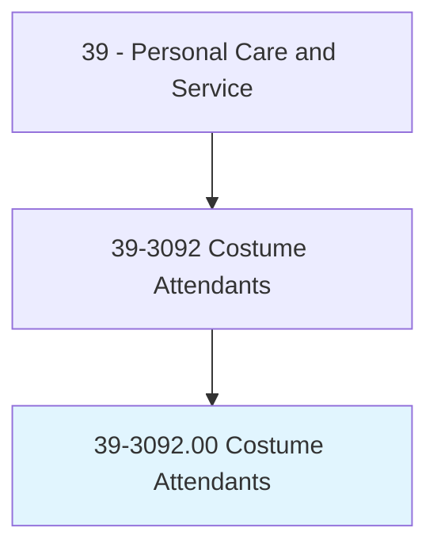
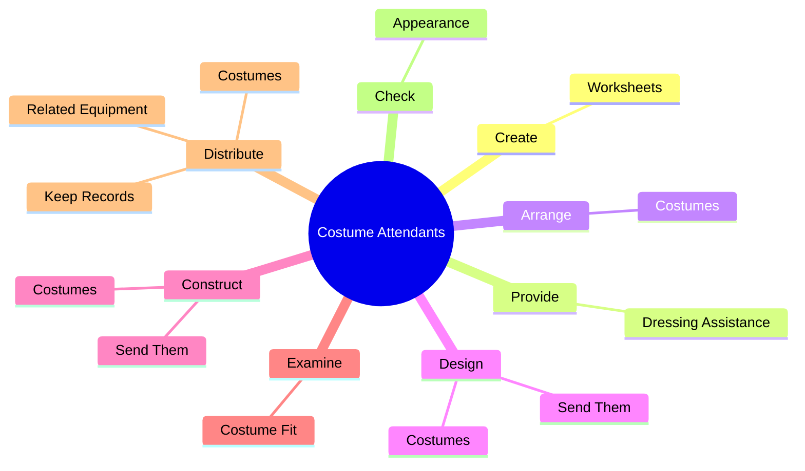
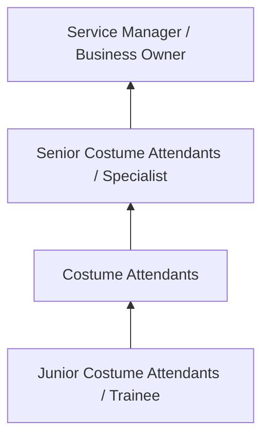
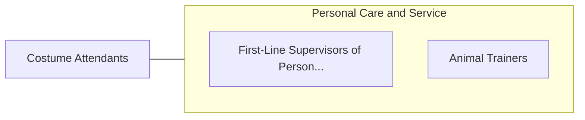

# Costume Attendants

> Select, fit, and take care of costumes for cast members, and aid entertainers. May assist with multiple costume changes during performances.

## Overview

Costume Attendants professionals select, fit, and take care of costumes for cast members, and aid entertainers. This occupation falls within the Personal Care and Service category and requires a combination of specialized knowledge, technical skills, and practical experience.

These professionals work across diverse settings and organizational contexts, applying their expertise to meet the demands of their field. They must stay current with industry standards, emerging practices, and regulatory requirements that affect their work. The role demands both independent judgment and collaborative skills, as practitioners regularly interact with colleagues, stakeholders, and the public.

As the field continues to evolve, Costume Attendants professionals increasingly leverage technology and data-driven approaches to enhance their effectiveness. Career opportunities span the public and private sectors, with demand influenced by economic conditions, demographic shifts, and technological advancement.

## Classification Hierarchy



## Key Statistics

| Metric | Value |
|--------|-------|
| SOC Code | 39-3092.00 |
| Job Zone | N/A |
| Category | [Personal Care and Service](/occupations/PersonalService/index) |
| Core Tasks | 85+ |
| Salary Range | $25,000 - $60,000 |
| Median Salary | $35,000 |
| Growth Outlook | 8% (Faster than average) |
| Source | O*NET |

## Core Tasks



### provide.DressingAssistance

Costume Attendants provide dressing assistance as part of their core responsibilities.

**Actions:**
- `provide.DressingAssistance.to.CastMembers` - Provide dressing assistance to cast members or assign cast dressers to assist...
- `provide.DressingAssistance.to.assign.CastDressersToAssistSpecificCastMembersWithCostumeChanges` - Provide dressing assistance to cast members or assign cast dressers to assist...
- `provide.Managers.with.BudgetRecommendations.related.to.Costumes` - Provide managers with budget recommendations and take responsibility for budg...
- `provide.Managers.with.BudgetRecommendations.related.to.Storage` - Provide managers with budget recommendations and take responsibility for budg...
- `provide.Managers.with.BudgetRecommendationsRelatedToMakeupNeeds` - Provide managers with budget recommendations and take responsibility for budg...

### design.Costumes

Costume Attendants design costumes as part of their core responsibilities.

**Actions:**
- `design.Costumes.to.tailors.ForConstruction` - Design or construct costumes or send them to tailors for construction, major ...
- `design.Costumes.to.Maj` - Design or construct costumes or send them to tailors for construction, major ...
- `design.Costumes.to.repairs` - Design or construct costumes or send them to tailors for construction, major ...
- `design.Costumes.to.Alterations` - Design or construct costumes or send them to tailors for construction, major ...
- `design.SendThem.to.tailors.ForConstruction` - Design or construct costumes or send them to tailors for construction, major ...

### construct.Costumes

Costume Attendants construct costumes as part of their core responsibilities.

**Actions:**
- `construct.Costumes.to.tailors.ForConstruction` - Design or construct costumes or send them to tailors for construction, major ...
- `construct.Costumes.to.Maj` - Design or construct costumes or send them to tailors for construction, major ...
- `construct.Costumes.to.repairs` - Design or construct costumes or send them to tailors for construction, major ...
- `construct.Costumes.to.Alterations` - Design or construct costumes or send them to tailors for construction, major ...
- `construct.SendThem.to.tailors.ForConstruction` - Design or construct costumes or send them to tailors for construction, major ...

### review.ScriptsProductionInformation

Costume Attendants review scripts production information as part of their core responsibilities.

**Actions:**
- `review.ScriptsProductionInformation.to.determine.StorysLocale` - Review scripts or other production information to determine a story's locale ...
- `review.ScriptsProductionInformation.to.Period` - Review scripts or other production information to determine a story's locale ...
- `review.ScriptsProductionInformation.to.AsWellAsNumberOfCharacters` - Review scripts or other production information to determine a story's locale ...
- `review.ScriptsProductionInformation.to.RequiredCostumes` - Review scripts or other production information to determine a story's locale ...
- `review.OtherProductionInformation.to.determine.StorysLocale` - Review scripts or other production information to determine a story's locale ...


## Skills & Competencies

### Technical Skills
- **Service Delivery** - Advanced
- **Customer Relations** - Advanced
- **Scheduling and Planning** - Proficient
- **Safety and Hygiene** - Proficient
- **Specialty Skills** - Proficient
- **Point-of-Sale Systems** - Proficient

### Soft Skills
- **Customer Service** - Critical
- **Communication** - Critical
- **Patience** - Essential
- **Adaptability** - Essential
- **Interpersonal Skills** - Essential

## Education & Certifications

| Requirement | Details |
|-------------|---------|
| Typical Education | High school diploma to post-secondary certificate |
| Work Experience | 0-2 years service experience |
| On-the-Job Training | Short to moderate - customer service and specialty skills |
| Certifications | State licensure for cosmetology, massage, etc. |

## Career Progression



## Industry Variations

### Hospitality and Leisure
Service delivery in hotels, resorts, and entertainment venues. Costume Attendants professionals focus on guest satisfaction and experience.

### Health and Wellness
Personal services supporting physical and mental well-being. Emphasis on client relationships and customized service.

### Retail and Consumer Services
Direct consumer-facing service delivery. Focus on customer experience and repeat business.

### Self-Employment
Independent service provision with entrepreneurial responsibilities including marketing, scheduling, and business management.

## Technology & Tools

- **Scheduling and booking software**
- **Point-of-sale systems**
- **Customer relationship management (CRM)**
- **Specialty service equipment**
- **Social media marketing tools**

## Related Occupations



## Industries

- [Personal and Laundry Services](/industries/PersonalServices) - High Employment
- [Amusement and Recreation](/industries/Recreation) - High Employment
- [Accommodation](/industries/Accommodation) - Moderate Employment
- [Fitness and Wellness](/industries/Fitness) - Growing Employment

## Departments

This occupation typically works in:
- [Guest Services](/departments/GuestServices)
- [Client Relations](/departments/ClientRelations)
- [Operations](/departments/Operations/index)

## GraphDL Semantic Structure

```
Costume Attendants perform:
- create.Worksheets.for.DressingLists
- create.Worksheets.for.ShowNotes
- create.Worksheets.for.CostumeChecks
- provide.DressingAssistance.to.CastMembers
- provide.DressingAssistance.to.assign.CastDressersToAssistSpecificCastMembersWithCostumeChanges
- arrange.Costumes.in.OrderOfUse.to.facilitate.QuickChangeProceduresForPerformances
```

---

*Source: O*NET 39-3092.00 - ONETOccupation*
