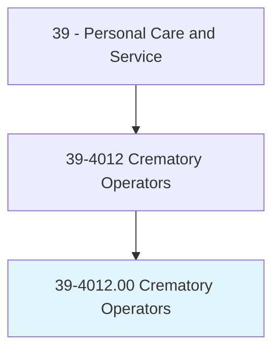
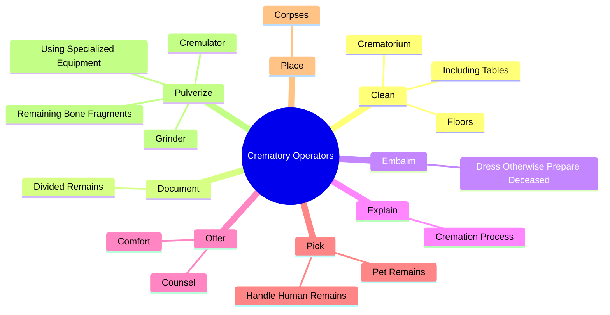
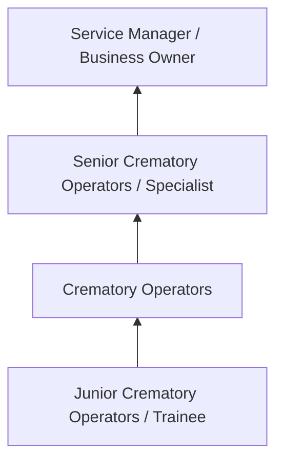
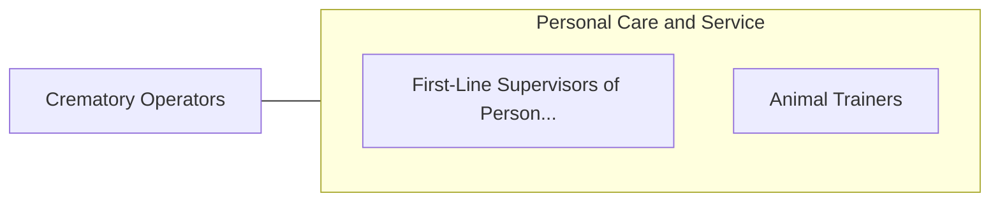

# Crematory Operators

> Operate crematory equipment to reduce human or animal remains to bone fragments in accordance with state and local regulations. Duties may include preparing the body for cremation and performing general maintenance on crematory equipment. May use traditional flame-based cremation, calcination, or alkaline hydrolysis.

## Overview

Crematory Operators professionals operate crematory equipment to reduce human or animal remains to bone fragments in accordance with state and local regulations. This occupation falls within the Personal Care and Service category and requires a combination of specialized knowledge, technical skills, and practical experience.

These professionals work across diverse settings and organizational contexts, applying their expertise to meet the demands of their field. They must stay current with industry standards, emerging practices, and regulatory requirements that affect their work. The role demands both independent judgment and collaborative skills, as practitioners regularly interact with colleagues, stakeholders, and the public.

As the field continues to evolve, Crematory Operators professionals increasingly leverage technology and data-driven approaches to enhance their effectiveness. Career opportunities span the public and private sectors, with demand influenced by economic conditions, demographic shifts, and technological advancement.

## Classification Hierarchy



## Key Statistics

| Metric | Value |
|--------|-------|
| SOC Code | 39-4012.00 |
| Job Zone | N/A |
| Category | [Personal Care and Service](/occupations/PersonalService/index) |
| Core Tasks | 32+ |
| Salary Range | $25,000 - $60,000 |
| Median Salary | $35,000 |
| Growth Outlook | 8% (Faster than average) |
| Source | O*NET |

## Core Tasks



### offer.Counsel

Crematory Operators offer counsel as part of their core responsibilities.

**Actions:**
- `offer.Counsel.to.BereavedFamilies` - Offer counsel and comfort to bereaved families or friends.
- `offer.Counsel.to.Friends` - Offer counsel and comfort to bereaved families or friends.
- `offer.Comfort.to.BereavedFamilies` - Offer counsel and comfort to bereaved families or friends.
- `offer.Comfort.to.Friends` - Offer counsel and comfort to bereaved families or friends.

### pulverize.RemainingBoneFragments

Crematory Operators pulverize remaining bone fragments as part of their core responsibilities.

**Actions:**
- `pulverize.RemainingBoneFragments.into.SmallerPieces` - Pulverize remaining bone fragments into smaller pieces, using specialized equ...
- `pulverize.UsingSpecializedEquipment` - Pulverize remaining bone fragments into smaller pieces, using specialized equ...
- `pulverize.Cremulator` - Pulverize remaining bone fragments into smaller pieces, using specialized equ...
- `pulverize.Grinder` - Pulverize remaining bone fragments into smaller pieces, using specialized equ...

### transport.Deceased

Crematory Operators transport deceased as part of their core responsibilities.

**Actions:**
- `transport.Deceased.to.FuneralHomeUsingVan` - Transport the deceased to a funeral home or crematory using a van, hearse, or...
- `transport.Deceased.to.CrematoryUsingVan` - Transport the deceased to a funeral home or crematory using a van, hearse, or...
- `transport.Deceased.to.Hearse` - Transport the deceased to a funeral home or crematory using a van, hearse, or...
- `transport.Deceased.to.OtherVehicle` - Transport the deceased to a funeral home or crematory using a van, hearse, or...

### clean.Crematorium

Crematory Operators clean crematorium as part of their core responsibilities.

**Actions:**
- `clean.Crematorium` - Clean the crematorium, including tables, floors, and equipment.
- `clean.IncludingTables` - Clean the crematorium, including tables, floors, and equipment.
- `clean.Floors` - Clean the crematorium, including tables, floors, and equipment.


## Skills & Competencies

### Technical Skills
- **Service Delivery** - Advanced
- **Customer Relations** - Advanced
- **Scheduling and Planning** - Proficient
- **Safety and Hygiene** - Proficient
- **Specialty Skills** - Proficient
- **Point-of-Sale Systems** - Proficient

### Soft Skills
- **Customer Service** - Critical
- **Communication** - Critical
- **Patience** - Essential
- **Adaptability** - Essential
- **Interpersonal Skills** - Essential

## Education & Certifications

| Requirement | Details |
|-------------|---------|
| Typical Education | High school diploma to post-secondary certificate |
| Work Experience | 0-2 years service experience |
| On-the-Job Training | Short to moderate - customer service and specialty skills |
| Certifications | State licensure for cosmetology, massage, etc. |

## Career Progression



## Industry Variations

### Hospitality and Leisure
Service delivery in hotels, resorts, and entertainment venues. Crematory Operators professionals focus on guest satisfaction and experience.

### Health and Wellness
Personal services supporting physical and mental well-being. Emphasis on client relationships and customized service.

### Retail and Consumer Services
Direct consumer-facing service delivery. Focus on customer experience and repeat business.

### Self-Employment
Independent service provision with entrepreneurial responsibilities including marketing, scheduling, and business management.

## Technology & Tools

- **Scheduling and booking software**
- **Point-of-sale systems**
- **Customer relationship management (CRM)**
- **Specialty service equipment**
- **Social media marketing tools**

## Related Occupations



## Industries

- [Personal and Laundry Services](/industries/PersonalServices) - High Employment
- [Amusement and Recreation](/industries/Recreation) - High Employment
- [Accommodation](/industries/Accommodation) - Moderate Employment
- [Fitness and Wellness](/industries/Fitness) - Growing Employment

## Departments

This occupation typically works in:
- [Guest Services](/departments/GuestServices)
- [Client Relations](/departments/ClientRelations)
- [Operations](/departments/Operations/index)

## GraphDL Semantic Structure

```
Crematory Operators perform:
- clean.Crematorium
- clean.IncludingTables
- clean.Floors
- document.DividedRemains.to.ensure.PartsAreNotMisplaced
- embalm.DressOtherwisePrepareDeceased.for.Viewing
- explain.CremationProcess.to.FamilyOfDeceased
```

---

*Source: O*NET 39-4012.00 - ONETOccupation*
