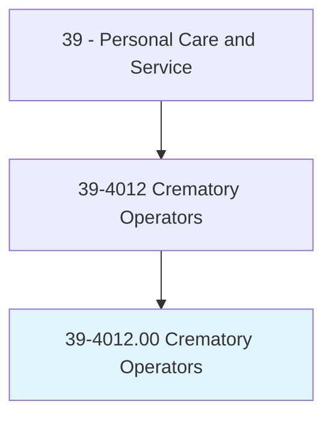
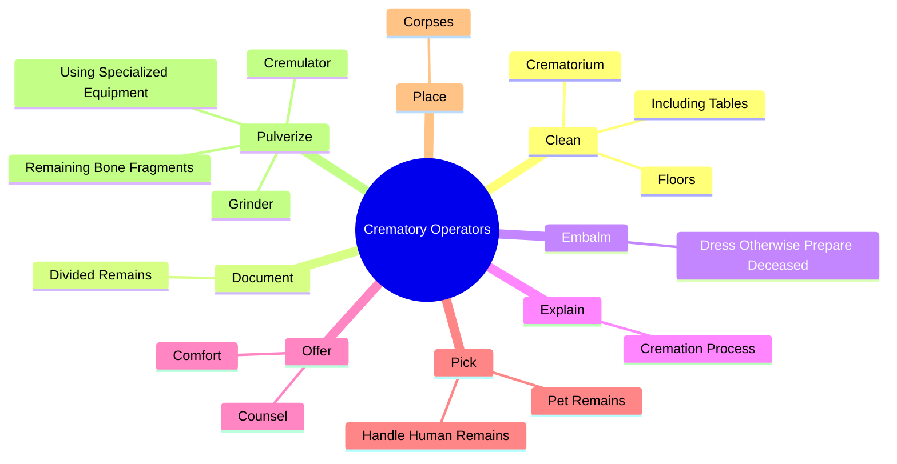
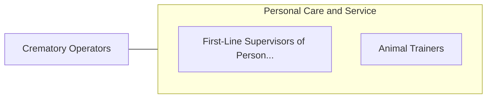

# Crematory Operators

> Operate crematory equipment to reduce human or animal remains to bone fragments in accordance with state and local regulations. Duties may include preparing the body for cremation and performing general maintenance on crematory equipment. May use traditional flame-based cremation, calcination, or alkaline hydrolysis.

## Overview

Crematory Operators is an occupation within the Personal Care and Service category. Operate crematory equipment to reduce human or animal remains to bone fragments in accordance with state and local regulations. Duties may include preparing the body for cremation and performing general maintenance on crematory equipment.

## Classification Hierarchy

## Key Statistics

| Metric | Value |
|--------|-------|
| SOC Code | 39-4012.00 |
| Category | [Personal Care and Service](/occupations/PersonalService) |
| Task Count | 32 |
| Source | O*NET |

## Core Tasks

### clean.Crematorium

Crematory Operators clean crematorium as part of their core responsibilities.

**Actions:**
- `clean.Crematorium`
- `clean.IncludingTables`
- `clean.Floors`

### document.DividedRemains

Crematory Operators document divided remains as part of their core responsibilities.

**Actions:**
- `document.DividedRemains.to.ensure.PartsAreNotMisplaced`

### embalm.DressOtherwisePrepareDeceased

Crematory Operators embalm dress otherwise prepare deceased as part of their core responsibilities.

**Actions:**
- `embalm.DressOtherwisePrepareDeceased.for.Viewing`

## Skills & Competencies

### Technical Skills
- **Customer Service** - Advanced
- **Personal Care** - Advanced
- **Service Delivery** - Advanced

### Soft Skills
- **Communication** - Essential
- **Problem Solving** - Essential
- **Critical Thinking** - Important
- **Teamwork** - Important
- **Adaptability** - Important

## Related Occupations

## Industries

This occupation is found across multiple industries. See [Industries](/industries) for sector-specific employment data.

## Career Progression

---

*Source: O*NET 39-4012.00 - ONETOccupation*
