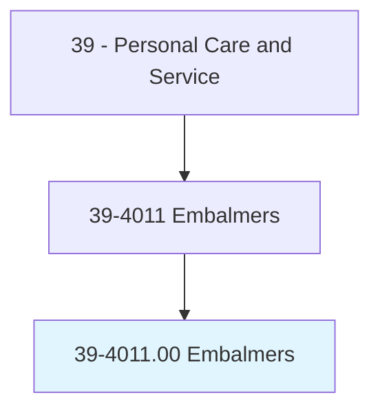
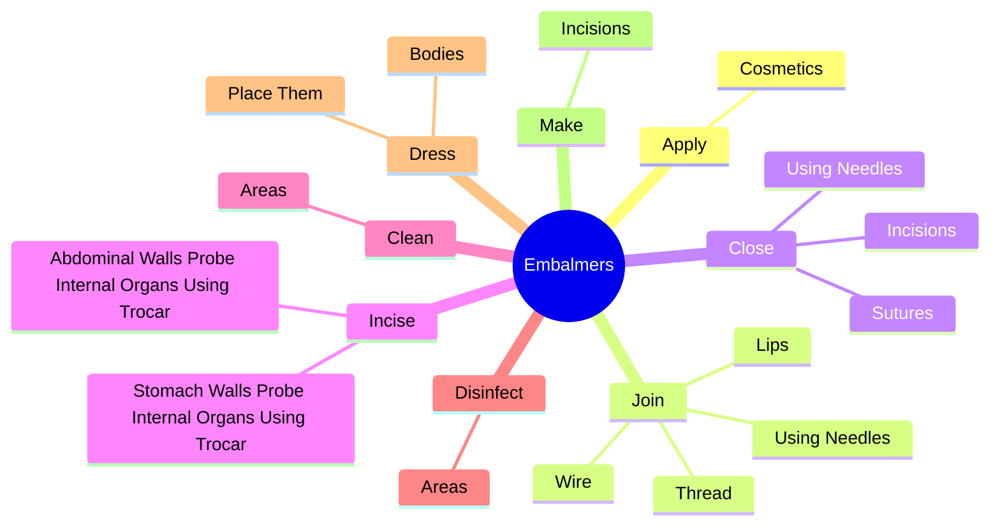
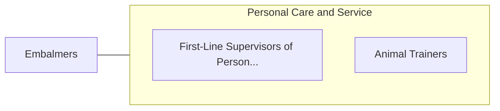

# Embalmers

> Prepare bodies for interment in conformity with legal requirements.

## Overview

Embalmers is classified under Personal Care and Service (SOC 39). Prepare bodies for interment in conformity with legal requirements.

## Classification Hierarchy

## Key Statistics

| Metric | Value |
|--------|-------|
| SOC Code | 39-4011.00 |
| Category | [Personal Care and Service](/occupations/PersonalService) |
| Task Count | 98 |
| Source | O*NET |

## Core Tasks

### apply.Cosmetics

Embalmers apply cosmetics as part of their core responsibilities.

**Actions:**
- `apply.Cosmetics.to.ImpartLifelikeAppearanceToDeceased`

### join.Lips

Embalmers join lips as part of their core responsibilities.

**Actions:**
- `join.Lips`
- `join.UsingNeedles`
- `join.Thread`
- `join.Wire`

### close.Incisions

Embalmers close incisions as part of their core responsibilities.

**Actions:**
- `close.Incisions`
- `close.UsingNeedles`
- `close.Sutures`

## Skills & Competencies

### Technical Skills
- **Customer Service** - Advanced
- **Personal Care** - Advanced
- **Service Delivery** - Advanced

### Soft Skills
- **Communication** - Essential
- **Problem Solving** - Essential
- **Critical Thinking** - Important
- **Teamwork** - Important
- **Adaptability** - Important

## Related Occupations

## Industries

This occupation is found across multiple industries. See [Industries](/industries) for sector-specific employment data.

## Career Progression

---

*Source: O*NET 39-4011.00 - ONETOccupation*
