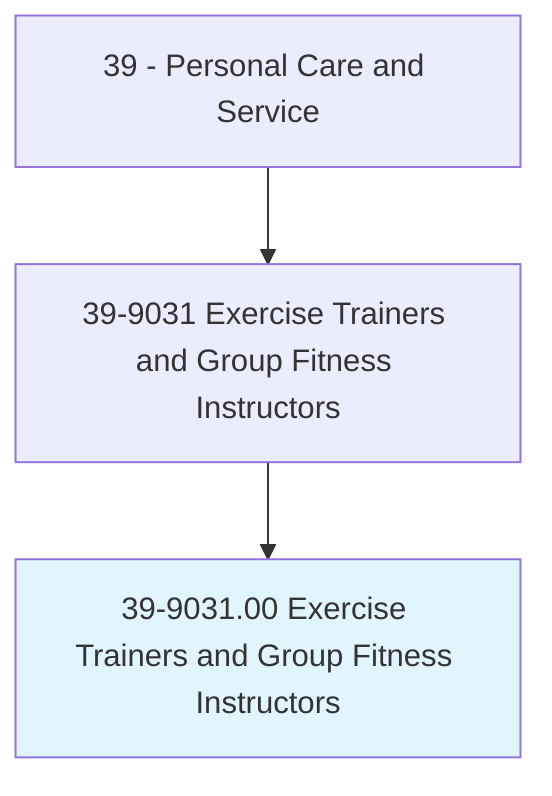
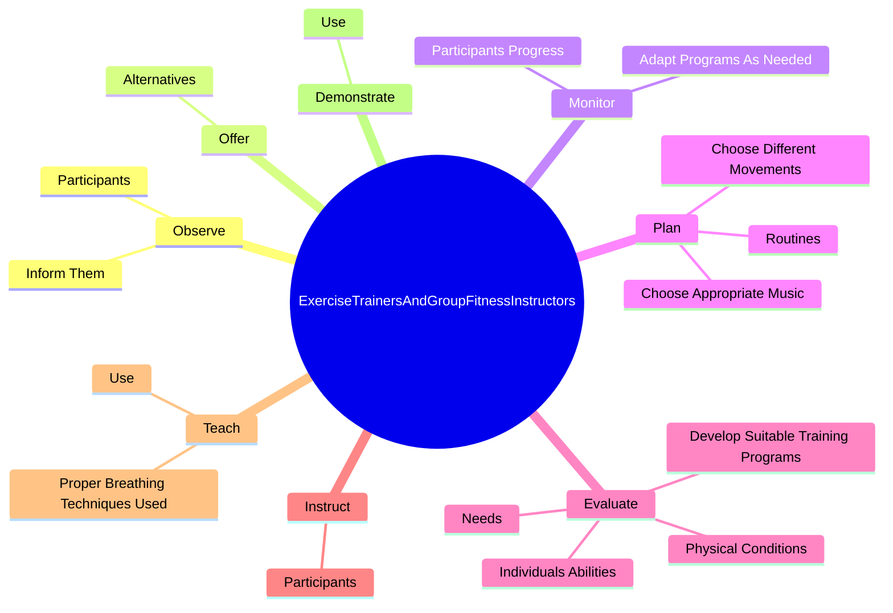
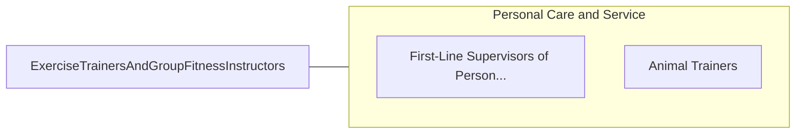

# Exercise Trainers and Group Fitness Instructors

> Instruct or coach groups or individuals in exercise activities for the primary purpose of personal fitness. Demonstrate techniques and form, observe participants, and explain to them corrective measures necessary to improve their skills. Develop and implement individualized approaches to exercise.

## Overview

Exercise Trainers and Group Fitness Instructors is an occupation within the Personal Care and Service category. Instruct or coach groups or individuals in exercise activities for the primary purpose of personal fitness. Demonstrate techniques and form, observe participants, and explain to them corrective measures necessary to improve their skills.

## Classification Hierarchy

## Key Statistics

| Metric | Value |
|--------|-------|
| SOC Code | 39-9031.00 |
| Category | [Personal Care and Service](/occupations/PersonalService/index) |
| Task Count | 71 |
| Source | O*NET |

## Core Tasks

### observe.Participants

Exercise Trainers and Group Fitness Instructors observe participants as part of their core responsibilities.

**Actions:**
- `observe.Participants.of.CorrectiveMeasuresNecessary.for.SkillImprovement`
- `observe.InformThem.of.CorrectiveMeasuresNecessary.for.SkillImprovement`

### offer.Alternatives

Exercise Trainers and Group Fitness Instructors offer alternatives as part of their core responsibilities.

**Actions:**
- `offer.Alternatives.during.Classes.to.accommodate.DifferentLevelsOfFitness`

### monitor.ParticipantsProgress

Exercise Trainers and Group Fitness Instructors monitor participants progress as part of their core responsibilities.

**Actions:**
- `monitor.ParticipantsProgress`
- `monitor.AdaptProgramsAsNeeded`

## Skills & Competencies

### Technical Skills
- **Customer Service** - Advanced
- **Personal Care** - Advanced
- **Service Delivery** - Advanced

### Soft Skills
- **Communication** - Essential
- **Problem Solving** - Essential
- **Critical Thinking** - Important
- **Teamwork** - Important
- **Adaptability** - Important

## Related Occupations

## Industries

This occupation is found across multiple industries. See [Industries](/industries) for sector-specific employment data.

## Career Progression

---

*Source: O*NET 39-9031.00 - ONETOccupation*
