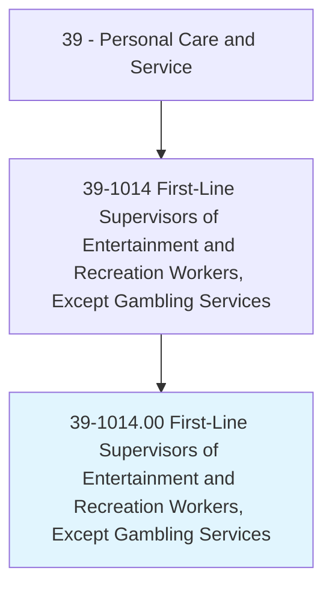
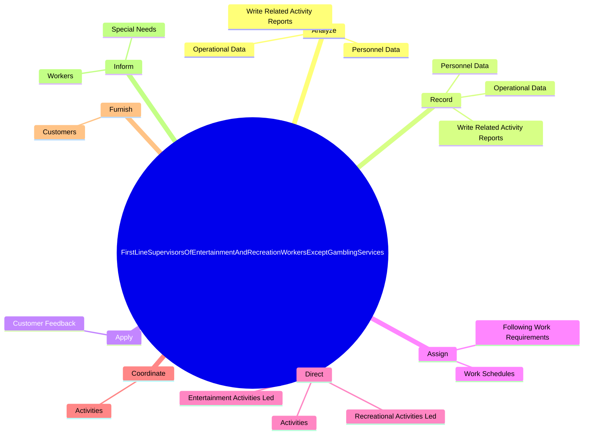
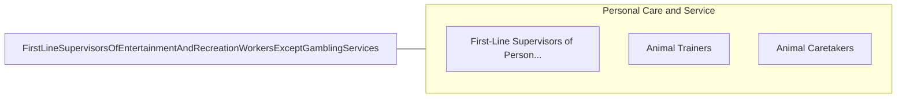

# First-Line Supervisors of Entertainment and Recreation Workers, Except Gambling Services

> Directly supervise and coordinate activities of entertainment and recreation related workers.

## Overview

First-Line Supervisors of Entertainment and Recreation Workers, Except Gambling Services is classified under Personal Care and Service (SOC 39). Directly supervise and coordinate activities of entertainment and recreation related workers.

## Classification Hierarchy

## Key Statistics

| Metric | Value |
|--------|-------|
| SOC Code | 39-1014.00 |
| Category | [Personal Care and Service](/occupations/PersonalService) |
| Task Count | 83 |
| Source | O*NET |

## Core Tasks

### analyze.PersonnelData

First-Line Supervisors of Entertainment and Recreation Workers, Except Gambling Services analyze personnel data as part of their core responsibilities.

**Actions:**
- `analyze.PersonnelData`
- `analyze.WriteRelatedActivityReports`
- `analyze.OperationalData`

### record.PersonnelData

First-Line Supervisors of Entertainment and Recreation Workers, Except Gambling Services record personnel data as part of their core responsibilities.

**Actions:**
- `record.PersonnelData`
- `record.WriteRelatedActivityReports`
- `record.OperationalData`

### apply.CustomerFeedback

First-Line Supervisors of Entertainment and Recreation Workers, Except Gambling Services apply customer feedback as part of their core responsibilities.

**Actions:**
- `apply.CustomerFeedback.to.service.ImprovementEfforts`

## Skills & Competencies

### Technical Skills
- **Customer Service** - Advanced
- **Personal Care** - Advanced
- **Service Delivery** - Advanced

### Soft Skills
- **Communication** - Essential
- **Problem Solving** - Essential
- **Critical Thinking** - Important
- **Teamwork** - Important
- **Adaptability** - Important

## Related Occupations

## Industries

This occupation is found across multiple industries. See [Industries](/industries) for sector-specific employment data.

## Career Progression

---

*Source: O*NET 39-1014.00 - ONETOccupation*
