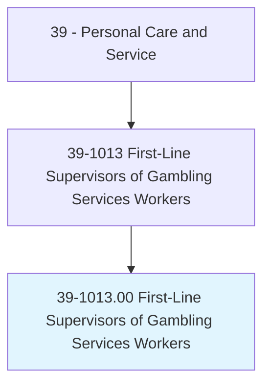
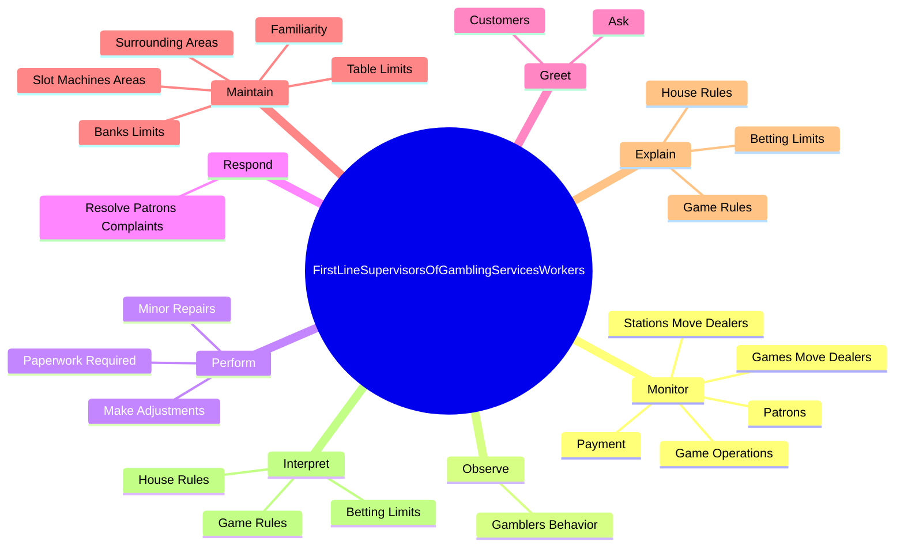
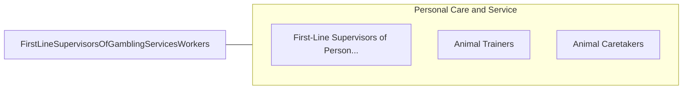

# First-Line Supervisors of Gambling Services Workers

> Directly supervise and coordinate activities of workers in assigned gambling areas. May circulate among tables, observe operations, and ensure that stations and games are covered for each shift. May verify and pay off jackpots. May reset slot machines after payoffs and make repairs or adjustments to slot machines or recommend removal of slot machines for repair. May plan and organize activities and services for guests in hotels/casinos.

## Overview

First-Line Supervisors of Gambling Services Workers is an occupation within the Personal Care and Service category. Directly supervise and coordinate activities of workers in assigned gambling areas. May circulate among tables, observe operations, and ensure that stations and games are covered for each shift.

## Classification Hierarchy

## Key Statistics

| Metric | Value |
|--------|-------|
| SOC Code | 39-1013.00 |
| Category | [Personal Care and Service](/occupations/PersonalService/index) |
| Task Count | 78 |
| Source | O*NET |

## Core Tasks

### monitor.GameOperations

First-Line Supervisors of Gambling Services Workers monitor game operations as part of their core responsibilities.

**Actions:**
- `monitor.GameOperations.to.ensure.HouseRulesAreFollowed`
- `monitor.GameOperations.to.Tribal`
- `monitor.GameOperations.to.State`
- `monitor.GameOperations.to.FederalRegulationsAreAdheredTo`

### observe.GamblersBehavior

First-Line Supervisors of Gambling Services Workers observe gamblers behavior as part of their core responsibilities.

**Actions:**
- `observe.GamblersBehavior.for.Signs.of.Cheating`
- `observe.GamblersBehavior.for.Marking`
- `observe.GamblersBehavior.for.Switching`
- `observe.GamblersBehavior.for.CountingCards`

### perform.PaperworkRequired

First-Line Supervisors of Gambling Services Workers perform paperwork required as part of their core responsibilities.

**Actions:**
- `perform.PaperworkRequired.for.MonetaryTransactions`
- `perform.MinorRepairs.to.SlotMachines`
- `perform.MinorRepairs.to.ResolvingProblems`
- `perform.MinorRepairs.to.machine.Tilts`

## Skills & Competencies

### Technical Skills
- **Customer Service** - Advanced
- **Personal Care** - Advanced
- **Service Delivery** - Advanced

### Soft Skills
- **Communication** - Essential
- **Problem Solving** - Essential
- **Critical Thinking** - Important
- **Teamwork** - Important
- **Adaptability** - Important

## Related Occupations

## Industries

This occupation is found across multiple industries. See [Industries](/industries) for sector-specific employment data.

## Career Progression

---

*Source: O*NET 39-1013.00 - ONETOccupation*
