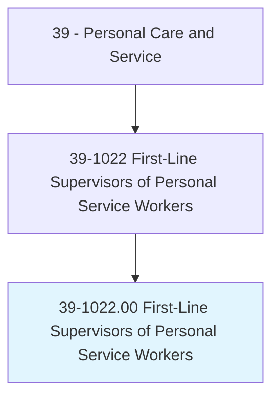
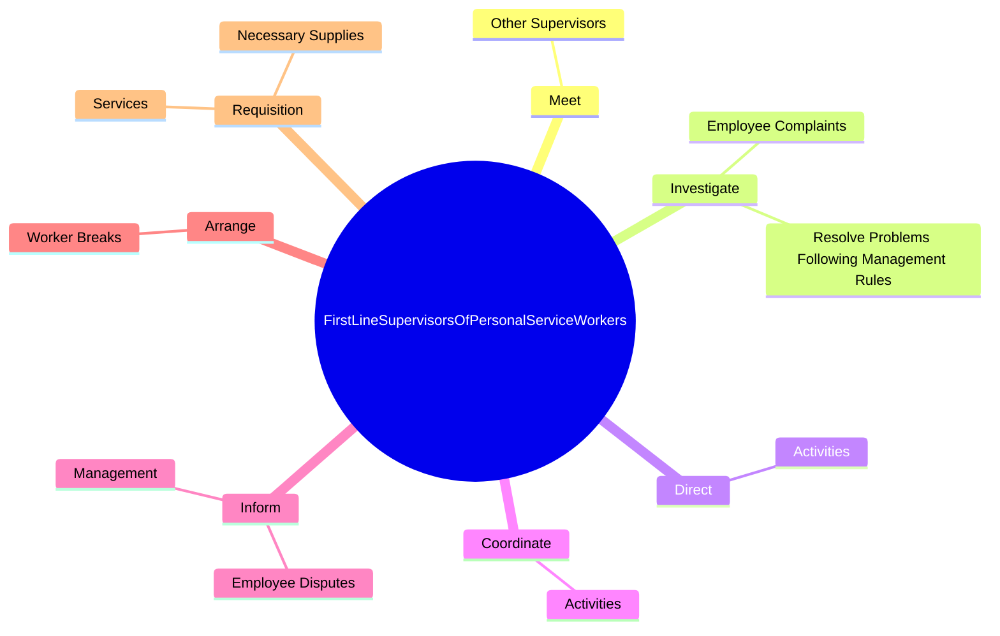
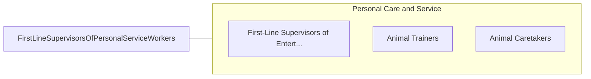

# First-Line Supervisors of Personal Service Workers

> Supervise and coordinate activities of personal service workers.

## Overview

First-Line Supervisors of Personal Service Workers is classified under Personal Care and Service (SOC 39). Supervise and coordinate activities of personal service workers.

## Classification Hierarchy

## Key Statistics

| Metric | Value |
|--------|-------|
| SOC Code | 39-1022.00 |
| Category | [Personal Care and Service](/occupations/PersonalService) |
| Task Count | 16 |
| Source | O*NET |

## Core Tasks

### meet.OtherSupervisors

First-Line Supervisors of Personal Service Workers meet other supervisors as part of their core responsibilities.

**Actions:**
- `meet.OtherSupervisors.to.stay.InformedOfChangesAffectingOperations`

### investigate.EmployeeComplaints

First-Line Supervisors of Personal Service Workers investigate employee complaints as part of their core responsibilities.

**Actions:**
- `investigate.EmployeeComplaints`
- `investigate.ResolveProblemsFollowingManagementRules`

### direct.Activities

First-Line Supervisors of Personal Service Workers direct activities as part of their core responsibilities.

**Actions:**
- `direct.Activities.of.Workers`
- `direct.Activities.of.HotelStaff`
- `direct.Activities.of.HairStylists`

## Skills & Competencies

### Technical Skills
- **Customer Service** - Advanced
- **Personal Care** - Advanced
- **Service Delivery** - Advanced

### Soft Skills
- **Communication** - Essential
- **Problem Solving** - Essential
- **Critical Thinking** - Important
- **Teamwork** - Important
- **Adaptability** - Important

## Related Occupations

## Industries

This occupation is found across multiple industries. See [Industries](/industries) for sector-specific employment data.

## Career Progression

---

*Source: O*NET 39-1022.00 - ONETOccupation*
