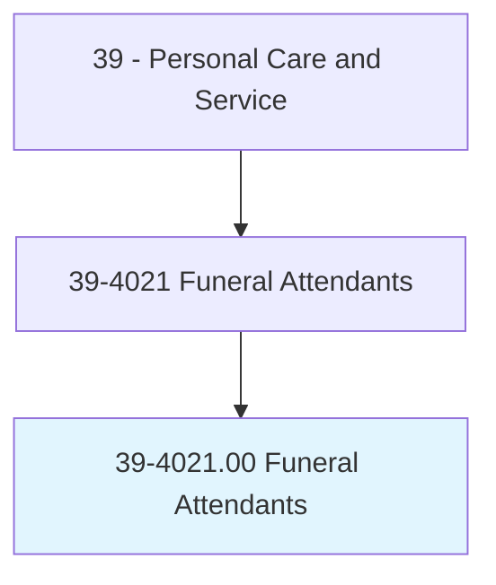
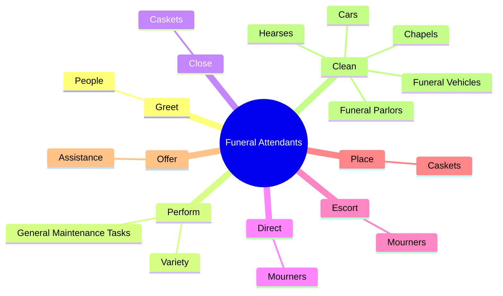
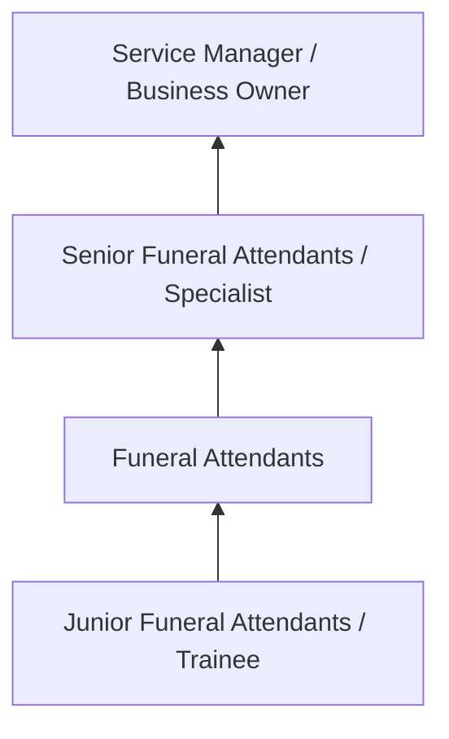
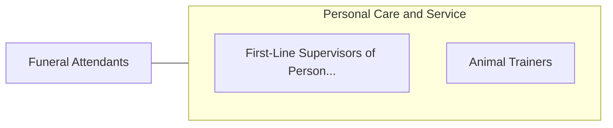

# Funeral Attendants

> Perform a variety of tasks during funeral, such as placing casket in parlor or chapel prior to service, arranging floral offerings or lights around casket, directing or escorting mourners, closing casket, and issuing and storing funeral equipment.

## Overview

Funeral Attendants professionals perform a variety of tasks during funeral, such as placing casket in parlor or chapel prior to service, arranging floral offerings or lights around casket, directing or escorting mourners, closing casket, and issuing and storing funeral equipment.. This occupation falls within the Personal Care and Service category and requires a combination of specialized knowledge, technical skills, and practical experience.

These professionals work across diverse settings and organizational contexts, applying their expertise to meet the demands of their field. They must stay current with industry standards, emerging practices, and regulatory requirements that affect their work. The role demands both independent judgment and collaborative skills, as practitioners regularly interact with colleagues, stakeholders, and the public.

As the field continues to evolve, Funeral Attendants professionals increasingly leverage technology and data-driven approaches to enhance their effectiveness. Career opportunities span the public and private sectors, with demand influenced by economic conditions, demographic shifts, and technological advancement.

## Classification Hierarchy



## Key Statistics

| Metric | Value |
|--------|-------|
| SOC Code | 39-4021.00 |
| Job Zone | N/A |
| Category | [Personal Care and Service](/occupations/PersonalService/index) |
| Core Tasks | 49+ |
| Salary Range | $25,000 - $60,000 |
| Median Salary | $35,000 |
| Growth Outlook | 8% (Faster than average) |
| Source | O*NET |

## Core Tasks



### perform.Variety

Funeral Attendants perform variety as part of their core responsibilities.

**Actions:**
- `perform.Variety.of.TasksDuringFunerals.to.assist.FuneralDirectorsEnsureServicesRunSmoothlyAsPlanned` - Perform a variety of tasks during funerals to assist funeral directors and to...
- `perform.Variety.of.ensure.ServicesRunSmoothlyAsPlanned` - Perform a variety of tasks during funerals to assist funeral directors and to...
- `perform.GeneralMaintenanceTasks.for.FuneralHomes` - Perform general maintenance tasks for funeral homes, such as maintaining equi...
- `perform.GeneralMaintenanceTasks.for.MaintainingEquipment` - Perform general maintenance tasks for funeral homes, such as maintaining equi...
- `perform.GeneralMaintenanceTasks.for.Caring.for.FuneralGrounds` - Perform general maintenance tasks for funeral homes, such as maintaining equi...

### clean.FuneralParlors

Funeral Attendants clean funeral parlors as part of their core responsibilities.

**Actions:**
- `clean.FuneralParlors` - Clean funeral parlors or chapels.
- `clean.Chapels` - Clean funeral parlors or chapels.
- `clean.FuneralVehicles.in.FuneralProcessions` - Clean and drive funeral vehicles, such as cars or hearses, in funeral process...
- `clean.Cars.in.FuneralProcessions` - Clean and drive funeral vehicles, such as cars or hearses, in funeral process...
- `clean.Hearses.in.FuneralProcessions` - Clean and drive funeral vehicles, such as cars or hearses, in funeral process...

### obtain.BurialPermits

Funeral Attendants obtain burial permits as part of their core responsibilities.

**Actions:**
- `obtain.BurialPermits` - Obtain burial permits and register deaths.
- `obtain.RegisterDeaths` - Obtain burial permits and register deaths.
- `obtain.DoctorsSignatures.on.DeathCertificate` - Obtain doctors' signatures on death certificate and complete other paperwork,...
- `obtain.DoctorsSignatures.on.CompleteOtherPaperwork` - Obtain doctors' signatures on death certificate and complete other paperwork,...
- `obtain.DoctorsSignatures.on.InsuranceClaimsForms` - Obtain doctors' signatures on death certificate and complete other paperwork,...

### drive.FuneralVehicles

Funeral Attendants drive funeral vehicles as part of their core responsibilities.

**Actions:**
- `drive.FuneralVehicles.in.FuneralProcessions` - Clean and drive funeral vehicles, such as cars or hearses, in funeral process...
- `drive.Cars.in.FuneralProcessions` - Clean and drive funeral vehicles, such as cars or hearses, in funeral process...
- `drive.Hearses.in.FuneralProcessions` - Clean and drive funeral vehicles, such as cars or hearses, in funeral process...


## Skills & Competencies

### Technical Skills
- **Service Delivery** - Advanced
- **Customer Relations** - Advanced
- **Scheduling and Planning** - Proficient
- **Safety and Hygiene** - Proficient
- **Specialty Skills** - Proficient
- **Point-of-Sale Systems** - Proficient

### Soft Skills
- **Customer Service** - Critical
- **Communication** - Critical
- **Patience** - Essential
- **Adaptability** - Essential
- **Interpersonal Skills** - Essential

## Education & Certifications

| Requirement | Details |
|-------------|---------|
| Typical Education | High school diploma to post-secondary certificate |
| Work Experience | 0-2 years service experience |
| On-the-Job Training | Short to moderate - customer service and specialty skills |
| Certifications | State licensure for cosmetology, massage, etc. |

## Career Progression



## Industry Variations

### Hospitality and Leisure
Service delivery in hotels, resorts, and entertainment venues. Funeral Attendants professionals focus on guest satisfaction and experience.

### Health and Wellness
Personal services supporting physical and mental well-being. Emphasis on client relationships and customized service.

### Retail and Consumer Services
Direct consumer-facing service delivery. Focus on customer experience and repeat business.

### Self-Employment
Independent service provision with entrepreneurial responsibilities including marketing, scheduling, and business management.

## Technology & Tools

- **Scheduling and booking software**
- **Point-of-sale systems**
- **Customer relationship management (CRM)**
- **Specialty service equipment**
- **Social media marketing tools**

## Related Occupations



## Industries

- [Personal and Laundry Services](/industries/PersonalServices) - High Employment
- [Amusement and Recreation](/industries/Recreation) - High Employment
- [Accommodation](/industries/Accommodation) - Moderate Employment
- [Fitness and Wellness](/industries/Fitness) - Growing Employment

## Departments

This occupation typically works in:
- [Guest Services](/departments/GuestServices)
- [Client Relations](/departments/ClientRelations)
- [Operations](/departments/Operations/index)

## GraphDL Semantic Structure

```
Funeral Attendants perform:
- greet.People.at.FuneralHome
- perform.Variety.of.TasksDuringFunerals.to.assist.FuneralDirectorsEnsureServicesRunSmoothlyAsPlanned
- perform.Variety.of.ensure.ServicesRunSmoothlyAsPlanned
- close.Caskets.at.AppropriatePoint.in.Services
- direct.Mourners.to.ParlorsInWhichWakesFuneralsAreBeingHeld
- direct.Mourners.to.ChapelsInWhichWakesFuneralsAreBeingHeld
```

---

*Source: O*NET 39-4021.00 - ONETOccupation*
