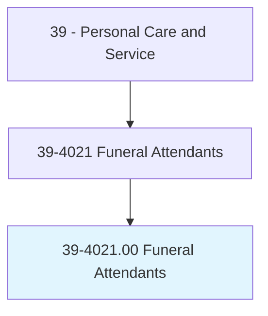
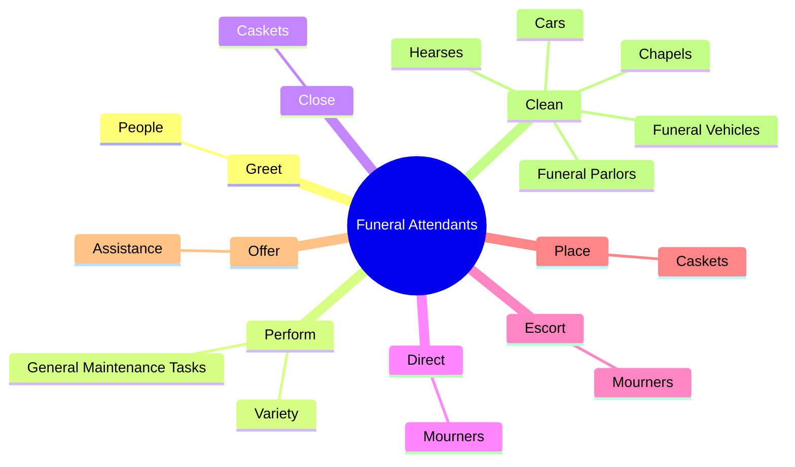
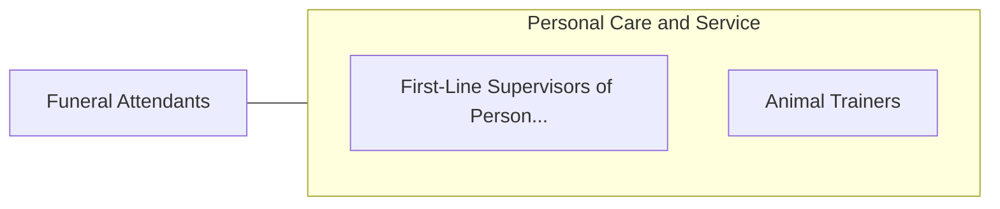

# Funeral Attendants

> Perform a variety of tasks during funeral, such as placing casket in parlor or chapel prior to service, arranging floral offerings or lights around casket, directing or escorting mourners, closing casket, and issuing and storing funeral equipment.

## Overview

Funeral Attendants is classified under Personal Care and Service (SOC 39). Perform a variety of tasks during funeral, such as placing casket in parlor or chapel prior to service, arranging floral offerings or lights around casket, directing or escorting mourners, closing casket, and issuing and storing funeral equipment.

## Classification Hierarchy

## Key Statistics

| Metric | Value |
|--------|-------|
| SOC Code | 39-4021.00 |
| Category | [Personal Care and Service](/occupations/PersonalService/index) |
| Task Count | 49 |
| Source | O*NET |

## Core Tasks

### greet.People

Funeral Attendants greet people as part of their core responsibilities.

**Actions:**
- `greet.People.at.FuneralHome`

### perform.Variety

Funeral Attendants perform variety as part of their core responsibilities.

**Actions:**
- `perform.Variety.of.TasksDuringFunerals.to.assist.FuneralDirectorsEnsureServicesRunSmoothlyAsPlanned`
- `perform.Variety.of.ensure.ServicesRunSmoothlyAsPlanned`
- `perform.GeneralMaintenanceTasks.for.FuneralHomes`
- `perform.GeneralMaintenanceTasks.for.MaintainingEquipment`

### close.Caskets

Funeral Attendants close caskets as part of their core responsibilities.

**Actions:**
- `close.Caskets.at.AppropriatePoint.in.Services`

## Skills & Competencies

### Technical Skills
- **Customer Service** - Advanced
- **Personal Care** - Advanced
- **Service Delivery** - Advanced

### Soft Skills
- **Communication** - Essential
- **Problem Solving** - Essential
- **Critical Thinking** - Important
- **Teamwork** - Important
- **Adaptability** - Important

## Related Occupations

## Industries

This occupation is found across multiple industries. See [Industries](/industries) for sector-specific employment data.

## Career Progression

---

*Source: O*NET 39-4021.00 - ONETOccupation*
