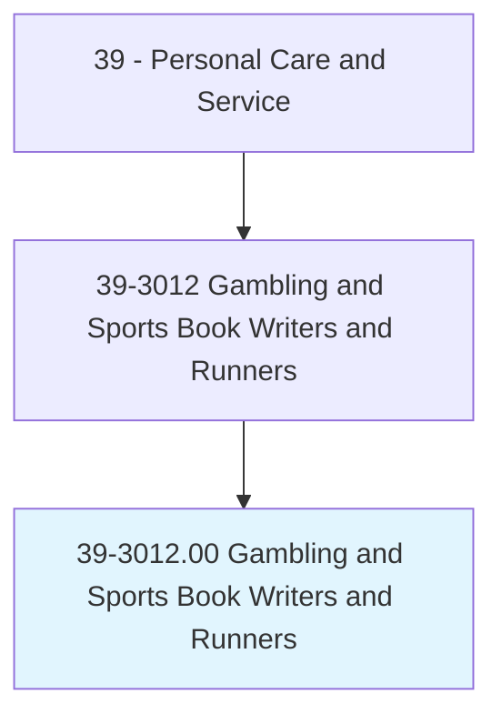
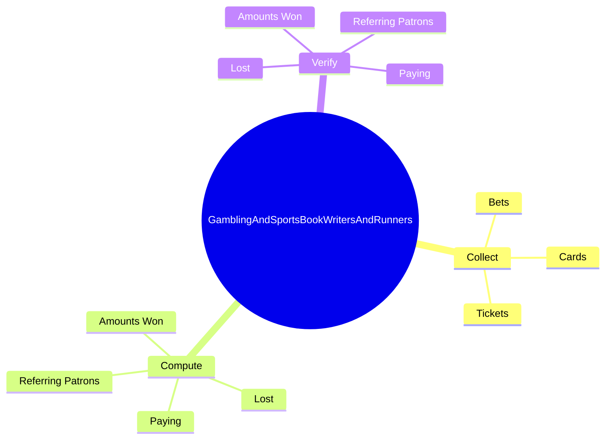
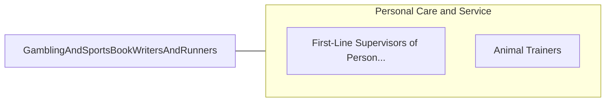

# Gambling and Sports Book Writers and Runners

> Post information enabling patrons to wager on various races and sporting events. Assist in the operation of games such as keno and bingo. May operate random number-generating equipment and announce the numbers for patrons. Receive, verify, and record patrons' wagers. Scan and process winning tickets presented by patrons and pay out winnings for those wagers.

## Overview

Gambling and Sports Book Writers and Runners is an occupation within the Personal Care and Service category. Post information enabling patrons to wager on various races and sporting events. Assist in the operation of games such as keno and bingo.

## Classification Hierarchy

## Key Statistics

| Metric | Value |
|--------|-------|
| SOC Code | 39-3012.00 |
| Category | [Personal Care and Service](/occupations/PersonalService) |
| Task Count | 56 |
| Source | O*NET |

## Core Tasks

### collect.Bets

Gambling and Sports Book Writers and Runners collect bets as part of their core responsibilities.

**Actions:**
- `collect.Bets.in.Form.of.Cash`
- `collect.Bets.in.Chips`
- `collect.Bets.in.Verifying`
- `collect.Bets.in.RecordingAmounts`

### compute.AmountsWon

Gambling and Sports Book Writers and Runners compute amounts won as part of their core responsibilities.

**Actions:**
- `compute.AmountsWon.to.Workers`
- `compute.AmountsWon.to.GamingCashiers`
- `compute.AmountsWon.to.SoWinningsCanBeCollected`
- `compute.Lost.to.Workers`

### verify.AmountsWon

Gambling and Sports Book Writers and Runners verify amounts won as part of their core responsibilities.

**Actions:**
- `verify.AmountsWon.to.Workers`
- `verify.AmountsWon.to.GamingCashiers`
- `verify.AmountsWon.to.SoWinningsCanBeCollected`
- `verify.Lost.to.Workers`

## Skills & Competencies

### Technical Skills
- **Customer Service** - Advanced
- **Personal Care** - Advanced
- **Service Delivery** - Advanced

### Soft Skills
- **Communication** - Essential
- **Problem Solving** - Essential
- **Critical Thinking** - Important
- **Teamwork** - Important
- **Adaptability** - Important

## Related Occupations

## Industries

This occupation is found across multiple industries. See [Industries](/industries) for sector-specific employment data.

## Career Progression

---

*Source: O*NET 39-3012.00 - ONETOccupation*
