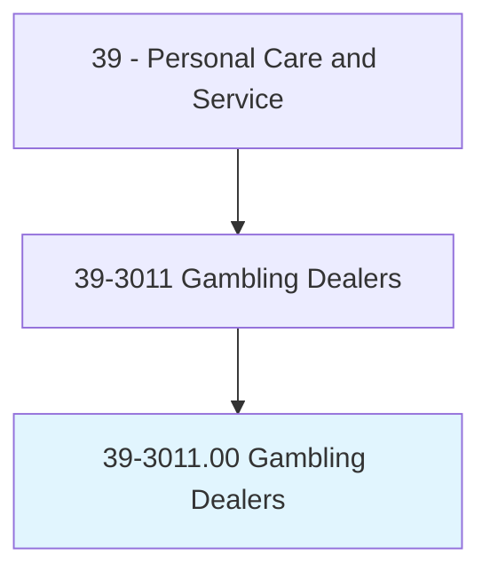
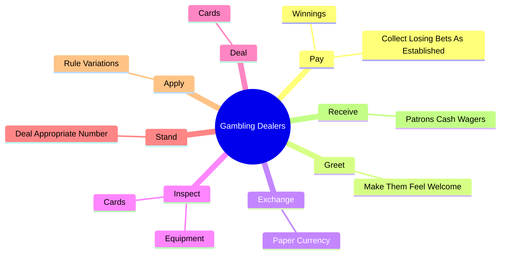
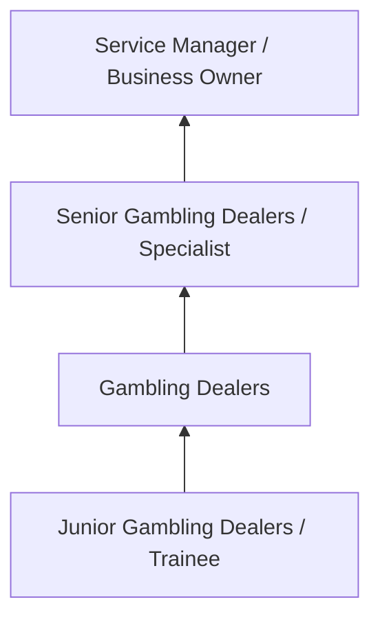
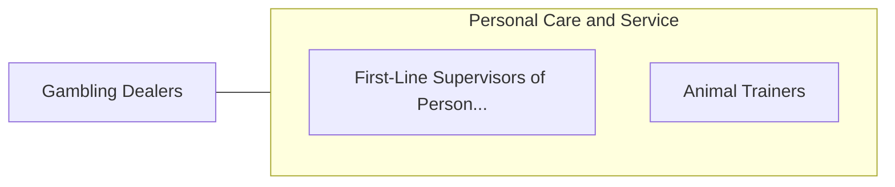

# Gambling Dealers

> Operate table games. Stand or sit behind table and operate games of chance by dispensing the appropriate number of cards or blocks to players, or operating other gambling equipment. Distribute winnings or collect players' money or chips. May compare the house's hand against players' hands.

## Overview

Gambling Dealers professionals operate table games. This occupation falls within the Personal Care and Service category and requires a combination of specialized knowledge, technical skills, and practical experience.

These professionals work across diverse settings and organizational contexts, applying their expertise to meet the demands of their field. They must stay current with industry standards, emerging practices, and regulatory requirements that affect their work. The role demands both independent judgment and collaborative skills, as practitioners regularly interact with colleagues, stakeholders, and the public.

As the field continues to evolve, Gambling Dealers professionals increasingly leverage technology and data-driven approaches to enhance their effectiveness. Career opportunities span the public and private sectors, with demand influenced by economic conditions, demographic shifts, and technological advancement.

## Classification Hierarchy



## Key Statistics

| Metric | Value |
|--------|-------|
| SOC Code | 39-3011.00 |
| Job Zone | N/A |
| Category | [Personal Care and Service](/occupations/PersonalService/index) |
| Core Tasks | 52+ |
| Salary Range | $25,000 - $60,000 |
| Median Salary | $35,000 |
| Growth Outlook | 8% (Faster than average) |
| Source | O*NET |

## Core Tasks



### conduct.GamblingGames

Gambling Dealers conduct gambling games as part of their core responsibilities.

**Actions:**
- `conduct.GamblingGames` - Conduct gambling games, such as dice, roulette, cards, or keno, following all...
- `conduct.Dice` - Conduct gambling games, such as dice, roulette, cards, or keno, following all...
- `conduct.Roulette` - Conduct gambling games, such as dice, roulette, cards, or keno, following all...
- `conduct.Cards` - Conduct gambling games, such as dice, roulette, cards, or keno, following all...
- `conduct.Keno` - Conduct gambling games, such as dice, roulette, cards, or keno, following all...

### pay.Winnings

Gambling Dealers pay winnings as part of their core responsibilities.

**Actions:**
- `pay.Winnings.by.Rules.of.SpecificGame` - Pay winnings or collect losing bets as established by the rules and procedure...
- `pay.Winnings.by.Procedures.of.SpecificGame` - Pay winnings or collect losing bets as established by the rules and procedure...
- `pay.CollectLosingBetsAsEstablished.by.Rules.of.SpecificGame` - Pay winnings or collect losing bets as established by the rules and procedure...
- `pay.CollectLosingBetsAsEstablished.by.Procedures.of.SpecificGame` - Pay winnings or collect losing bets as established by the rules and procedure...

### start.GamesEquipment

Gambling Dealers start games equipment as part of their core responsibilities.

**Actions:**
- `start.GamesEquipment` - Start and control games and gaming equipment, and announce winning numbers or...
- `start.GamingEquipment` - Start and control games and gaming equipment, and announce winning numbers or...
- `start.AnnounceWinningNumbers` - Start and control games and gaming equipment, and announce winning numbers or...
- `start.Colors` - Start and control games and gaming equipment, and announce winning numbers or...

### control.GamesEquipment

Gambling Dealers control games equipment as part of their core responsibilities.

**Actions:**
- `control.GamesEquipment` - Start and control games and gaming equipment, and announce winning numbers or...
- `control.GamingEquipment` - Start and control games and gaming equipment, and announce winning numbers or...
- `control.AnnounceWinningNumbers` - Start and control games and gaming equipment, and announce winning numbers or...
- `control.Colors` - Start and control games and gaming equipment, and announce winning numbers or...


## Skills & Competencies

### Technical Skills
- **Service Delivery** - Advanced
- **Customer Relations** - Advanced
- **Scheduling and Planning** - Proficient
- **Safety and Hygiene** - Proficient
- **Specialty Skills** - Proficient
- **Point-of-Sale Systems** - Proficient

### Soft Skills
- **Customer Service** - Critical
- **Communication** - Critical
- **Patience** - Essential
- **Adaptability** - Essential
- **Interpersonal Skills** - Essential

## Education & Certifications

| Requirement | Details |
|-------------|---------|
| Typical Education | High school diploma to post-secondary certificate |
| Work Experience | 0-2 years service experience |
| On-the-Job Training | Short to moderate - customer service and specialty skills |
| Certifications | State licensure for cosmetology, massage, etc. |

## Career Progression



## Industry Variations

### Hospitality and Leisure
Service delivery in hotels, resorts, and entertainment venues. Gambling Dealers professionals focus on guest satisfaction and experience.

### Health and Wellness
Personal services supporting physical and mental well-being. Emphasis on client relationships and customized service.

### Retail and Consumer Services
Direct consumer-facing service delivery. Focus on customer experience and repeat business.

### Self-Employment
Independent service provision with entrepreneurial responsibilities including marketing, scheduling, and business management.

## Technology & Tools

- **Scheduling and booking software**
- **Point-of-sale systems**
- **Customer relationship management (CRM)**
- **Specialty service equipment**
- **Social media marketing tools**

## Related Occupations



## Industries

- [Personal and Laundry Services](/industries/PersonalServices) - High Employment
- Amusement and Recreation - High Employment
- [Accommodation](/industries/Accommodation) - Moderate Employment
- [Fitness and Wellness](/industries/Fitness) - Growing Employment

## Departments

This occupation typically works in:
- Guest Services
- Client Relations
- [Operations](/departments/Operations/index)

## GraphDL Semantic Structure

```graphdl
Gambling Dealers perform:
- pay.Winnings.by.Rules.of.SpecificGame
- pay.Winnings.by.Procedures.of.SpecificGame
- pay.CollectLosingBetsAsEstablished.by.Rules.of.SpecificGame
- pay.CollectLosingBetsAsEstablished.by.Procedures.of.SpecificGame
- greet.MakeThemFeelWelcome
- exchange.PaperCurrency.for.PlayingChipsMoney
```

---

*Source: O*NET 39-3011.00 - ONETOccupation*
