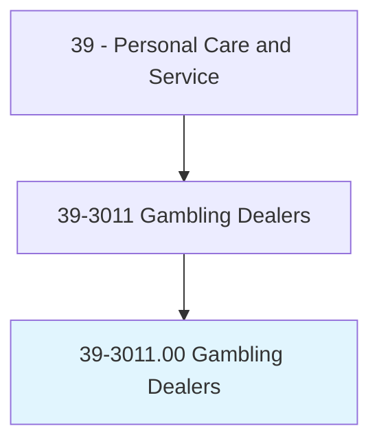
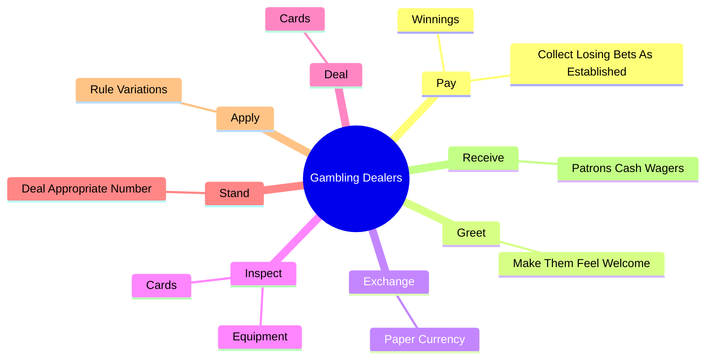
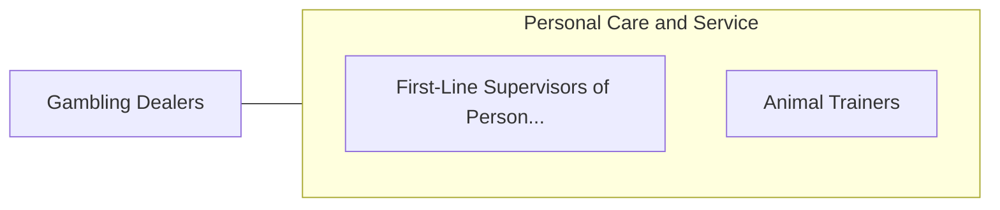

# Gambling Dealers

> Operate table games. Stand or sit behind table and operate games of chance by dispensing the appropriate number of cards or blocks to players, or operating other gambling equipment. Distribute winnings or collect players' money or chips. May compare the house's hand against players' hands.

## Overview

Gambling Dealers is an occupation within the Personal Care and Service category. Operate table games. Stand or sit behind table and operate games of chance by dispensing the appropriate number of cards or blocks to players, or operating other gambling equipment.

## Classification Hierarchy

## Key Statistics

| Metric | Value |
|--------|-------|
| SOC Code | 39-3011.00 |
| Category | [Personal Care and Service](/occupations/PersonalService/index) |
| Task Count | 52 |
| Source | O*NET |

## Core Tasks

### pay.Winnings

Gambling Dealers pay winnings as part of their core responsibilities.

**Actions:**
- `pay.Winnings.by.Rules.of.SpecificGame`
- `pay.Winnings.by.Procedures.of.SpecificGame`
- `pay.CollectLosingBetsAsEstablished.by.Rules.of.SpecificGame`
- `pay.CollectLosingBetsAsEstablished.by.Procedures.of.SpecificGame`

### greet.MakeThemFeelWelcome

Gambling Dealers greet make them feel welcome as part of their core responsibilities.

**Actions:**
- `greet.MakeThemFeelWelcome`

### exchange.PaperCurrency

Gambling Dealers exchange paper currency as part of their core responsibilities.

**Actions:**
- `exchange.PaperCurrency.for.PlayingChipsMoney`
- `exchange.PaperCurrency.for.CoinMoney`

## Skills & Competencies

### Technical Skills
- **Customer Service** - Advanced
- **Personal Care** - Advanced
- **Service Delivery** - Advanced

### Soft Skills
- **Communication** - Essential
- **Problem Solving** - Essential
- **Critical Thinking** - Important
- **Teamwork** - Important
- **Adaptability** - Important

## Related Occupations

## Industries

This occupation is found across multiple industries. See [Industries](/industries) for sector-specific employment data.

## Career Progression

---

*Source: O*NET 39-3011.00 - ONETOccupation*
