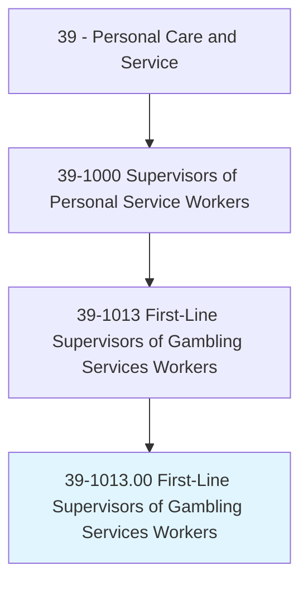
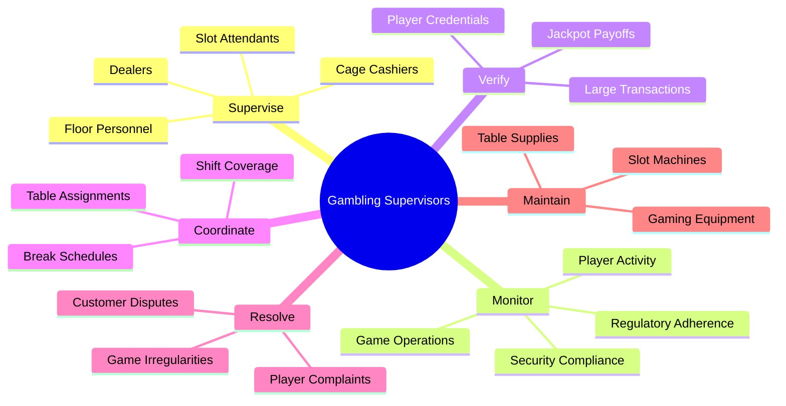
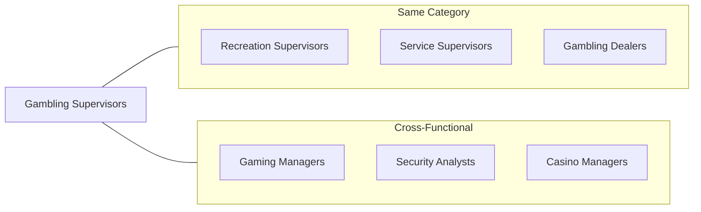
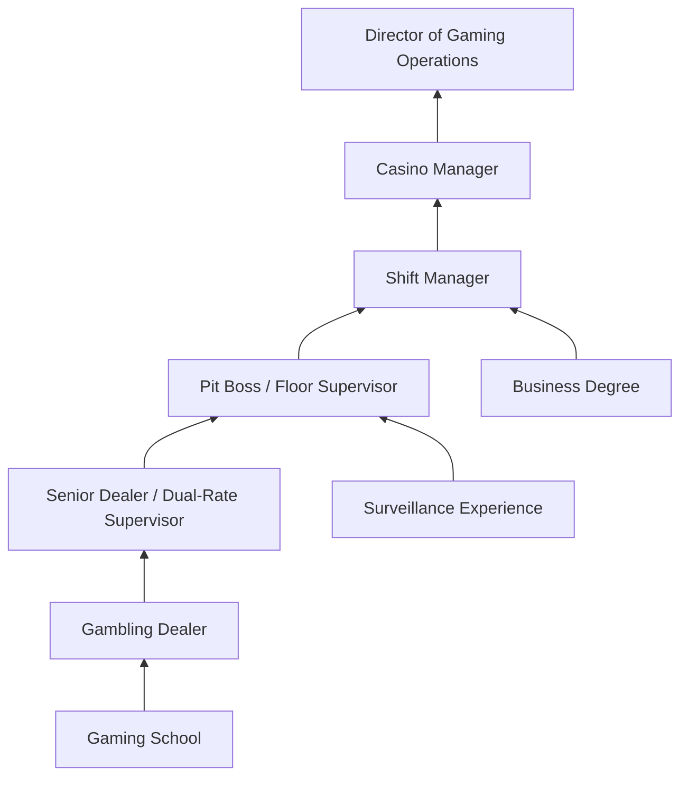

# First-Line Supervisors of Gambling Services Workers

> Directly supervise and coordinate activities of workers in assigned gambling areas. May circulate among tables, observe operations, and ensure that stations and games are covered for each shift. May verify and pay off jackpots. May reset slot machines after payoffs and make repairs or adjustments to slot machines or recommend removal of slot machines for repair. May plan and organize activities and services for guests in hotels/casinos.

## Overview

First-Line Supervisors of Gambling Services Workers, commonly known as Pit Bosses, Floor Supervisors, or Shift Managers, oversee gambling operations on casino floors. They manage dealers, monitor games for compliance and security, handle customer disputes, verify large payouts, and ensure smooth operations across table games and slot machine areas. These supervisors are critical to maintaining gaming integrity, regulatory compliance, and exceptional customer service in the high-stakes casino environment. They must balance security vigilance with creating an enjoyable gaming atmosphere for patrons.

## Classification Hierarchy



## Key Statistics

| Metric | Value |
|--------|-------|
| SOC Code | 39-1013.00 |
| Job Zone | 3 (Medium Preparation) |
| Category | [Personal Care and Service](/occupations/PersonalService/index) |
| Core Tasks | 15+ |
| Source | O*NET |

## Core Tasks



### supervise.GamblingWorkers

Gambling Supervisors oversee all staff in assigned gaming areas to ensure professional operations.

**Actions:**
- `supervise.Dealers.to.ensure.GameIntegrity` - Monitor dealer performance and game procedures
- `supervise.SlotAttendants.to.maintain.MachineOperations` - Oversee slot floor personnel
- `supervise.Workers.to.coordinate.ShiftCoverage` - Ensure adequate staffing for all positions
- `supervise.Staff.to.enforce.CasinoRegulations` - Maintain compliance with gaming laws

### monitor.GamingOperations

Supervisors observe games and player activity to detect irregularities and maintain security.

**Actions:**
- `monitor.TableGames.to.detect.Irregularities` - Watch for cheating or procedural violations
- `monitor.PlayerActivity.to.identify.SuspiciousBehavior` - Track unusual betting patterns
- `monitor.Operations.to.ensure.RegulatoryCompliance` - Verify adherence to gaming commission rules
- `monitor.SecurityCameras.to.verify.Transactions` - Coordinate with surveillance teams

### verify.JackpotPayoffs

Supervisors authenticate and authorize large payouts and significant transactions.

**Actions:**
- `verify.JackpotPayoffs.to.authorize.Payments` - Confirm winning amounts before payout
- `verify.PlayerIdentification.for.LargeTransactions` - Ensure regulatory compliance for big wins
- `verify.SlotMachineReadings.to.confirm.Winnings` - Validate machine-generated results
- `verify.Transactions.to.prevent.Fraud` - Protect casino from fraudulent claims

### resolve.CustomerDisputes

Supervisors handle player complaints and game-related conflicts professionally.

**Actions:**
- `resolve.CustomerDisputes.to.ensure.Satisfaction` - Mediate player concerns fairly
- `resolve.GameIrregularities.to.maintain.Integrity` - Address procedural issues
- `resolve.PlayerComplaints.to.retain.Customers` - Balance security with hospitality
- `resolve.Conflicts.between.PlayersAndStaff` - De-escalate tense situations

### maintain.GamingEquipment

Supervisors ensure gaming equipment functions properly and arrange for repairs.

**Actions:**
- `maintain.SlotMachines.to.ensure.Functionality` - Monitor machine performance
- `reset.SlotMachines.after.Payoffs` - Restore machines to operational status
- `recommend.MachineRemoval.for.Repair` - Identify equipment needing service
- `maintain.TableSupplies.for.Operations` - Ensure adequate cards, chips, and equipment

## Skills & Competencies

### Technical Skills
- **Gaming Regulations** - Expert
- **Game Procedures** - Expert
- **Surveillance Coordination** - Advanced
- **Cash Handling** - Advanced
- **Slot Machine Operations** - Advanced
- **Mathematical Aptitude** - Advanced
- **Security Protocols** - Expert

### Soft Skills
- **Observation** - Critical
- **Decision Making** - Critical
- **Customer Service** - Essential
- **Conflict Resolution** - Essential
- **Leadership** - Critical
- **Composure Under Pressure** - Essential
- **Communication** - Essential

## Related Occupations



## Industries

- [Gambling Industries](/industries/Gambling) - Primary Employment
- [Accommodation (Casino Hotels)](/industries/Accommodation) - High Employment
- Amusement, Gambling, and Recreation - High Employment
- Cruise Lines - Moderate Employment

## Industry Variations

### Casino Floor Operations
Primary setting with table games (blackjack, poker, roulette, craps) and slot machine oversight. Emphasis on high-volume transaction monitoring and customer experience.

### Poker Room Supervision
Specialized focus on tournament operations, player rake collection, seat assignments, and poker-specific rules enforcement.

### Slot Floor Management
Concentration on electronic gaming machines, progressive jackpot verification, machine maintenance, and patron assistance.

### Casino Hotel Operations
Integration of gaming supervision with hospitality services, VIP player programs, and coordinated guest experiences.

### Cruise Ship Casinos
Unique regulatory environment with international waters considerations, limited space operations, and vacation-oriented gaming atmosphere.

### Tribal Gaming
Operations under tribal gaming compacts with specific regulatory frameworks and community-oriented policies.

## Career Progression



## Education & Training

| Requirement | Details |
|-------------|---------|
| Typical Education | High school diploma required; some college preferred |
| Work Experience | 3-5 years as a gambling dealer or gaming floor worker |
| On-the-Job Training | Extensive - gaming regulations, supervisory procedures, equipment |
| Licensing | State gaming license required; background check mandatory |
| Common Certifications | Gaming commission certification; responsible gaming training |

## Regulatory Requirements

| Requirement | Description |
|-------------|-------------|
| Gaming License | Must obtain and maintain state/tribal gaming authority license |
| Background Check | Extensive criminal and financial background investigation |
| Drug Testing | Regular testing required by most jurisdictions |
| Continuing Education | Ongoing training on regulations and procedures |
| Age Requirement | Typically 21 years or older |

## Departments

This occupation typically works in:
- Table Games
- Slot Operations
- Casino Floor
- Gaming Operations

## GraphDL Semantic Structure

```graphdl
Namespace: occupations.org.ai
Entity: FirstLineSupervisorsOfGamblingServicesWorkers

Relationships:
- supervises.GamblingDealers
- supervises.SlotAttendants
- coordinatesWith.Surveillance
- coordinatesWith.CasinoManagement
- reportsTo.ShiftManager
- verifies.JackpotPayoffs
- monitors.GamingOperations
- ensures.RegulatoryCompliance
```

---

*Source: O*NET 39-1013.00 - ONETOccupation*
