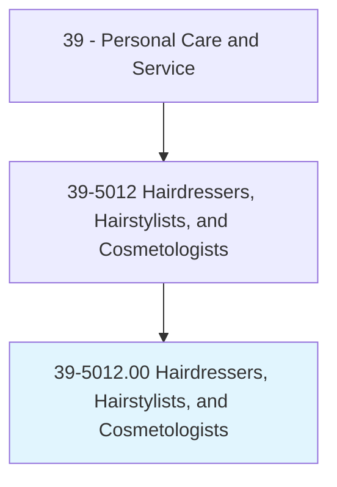
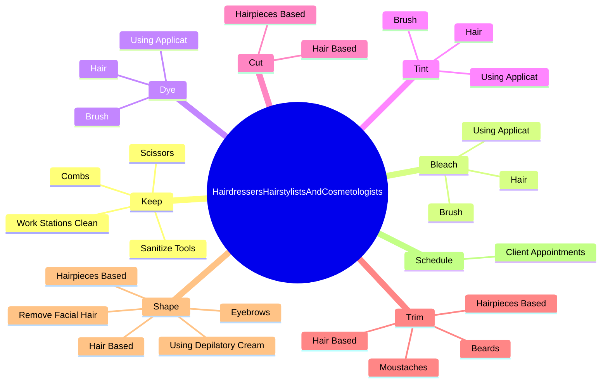
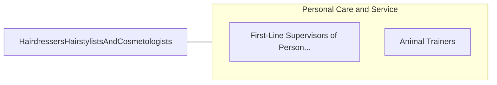

# Hairdressers, Hairstylists, and Cosmetologists

> Provide beauty services, such as cutting, coloring, and styling hair, and massaging and treating scalp. May shampoo hair, apply makeup, dress wigs, remove hair, and provide nail and skincare services.

## Overview

Hairdressers, Hairstylists, and Cosmetologists is an occupation within the Personal Care and Service category. Provide beauty services, such as cutting, coloring, and styling hair, and massaging and treating scalp. 

## Classification Hierarchy

## Key Statistics

| Metric | Value |
|--------|-------|
| SOC Code | 39-5012.00 |
| Category | [Personal Care and Service](/occupations/PersonalService/index) |
| Task Count | 192 |
| Source | O*NET |

## Core Tasks

### keep.WorkStationsClean

Hairdressers, Hairstylists, and Cosmetologists keep work stations clean as part of their core responsibilities.

**Actions:**
- `keep.WorkStationsClean`
- `keep.SanitizeTools`
- `keep.Scissors`
- `keep.Combs`

### bleach.Hair

Hairdressers, Hairstylists, and Cosmetologists bleach hair as part of their core responsibilities.

**Actions:**
- `bleach.Hair`
- `bleach.UsingApplicat`
- `bleach.Brush`

### dye.Hair

Hairdressers, Hairstylists, and Cosmetologists dye hair as part of their core responsibilities.

**Actions:**
- `dye.Hair`
- `dye.UsingApplicat`
- `dye.Brush`

## Skills & Competencies

### Technical Skills
- **Customer Service** - Advanced
- **Personal Care** - Advanced
- **Service Delivery** - Advanced

### Soft Skills
- **Communication** - Essential
- **Problem Solving** - Essential
- **Critical Thinking** - Important
- **Teamwork** - Important
- **Adaptability** - Important

## Related Occupations

## Industries

This occupation is found across multiple industries. See [Industries](/industries) for sector-specific employment data.

## Career Progression

---

*Source: O*NET 39-5012.00 - ONETOccupation*
