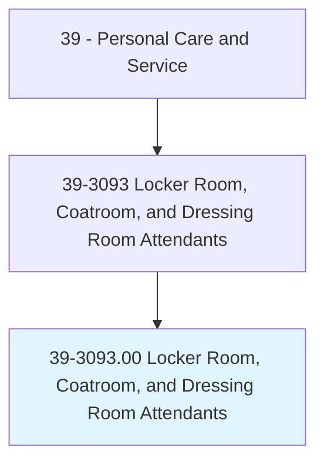
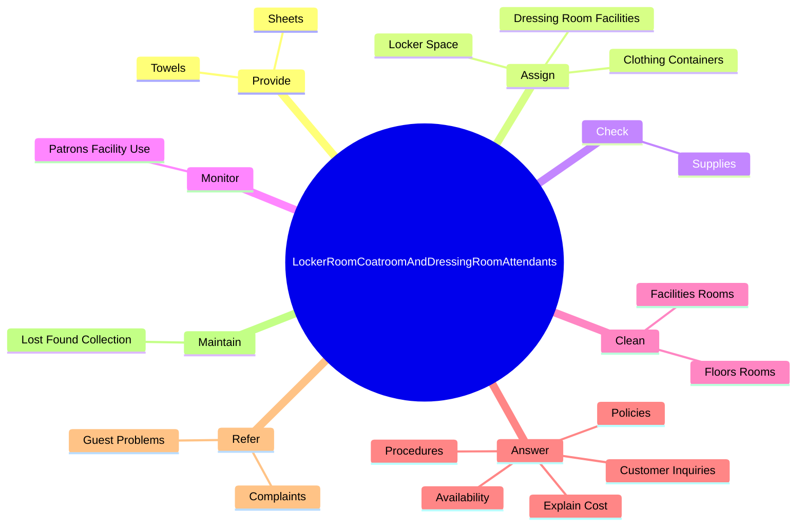
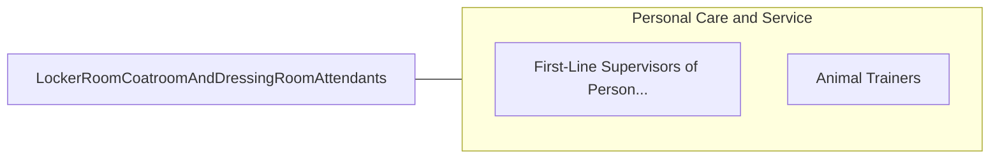

# Locker Room, Coatroom, and Dressing Room Attendants

> Provide personal items to patrons or customers in locker rooms, dressing rooms, or coatrooms.

## Overview

Locker Room, Coatroom, and Dressing Room Attendants is classified under Personal Care and Service (SOC 39). Provide personal items to patrons or customers in locker rooms, dressing rooms, or coatrooms.

## Classification Hierarchy

## Key Statistics

| Metric | Value |
|--------|-------|
| SOC Code | 39-3093.00 |
| Category | [Personal Care and Service](/occupations/PersonalService) |
| Task Count | 89 |
| Source | O*NET |

## Core Tasks

### provide.Towels

Locker Room, Coatroom, and Dressing Room Attendants provide towels as part of their core responsibilities.

**Actions:**
- `provide.Towels.to.ClientsInPublicBaths`
- `provide.Towels.to.SteamRooms`
- `provide.Towels.to.Restrooms`
- `provide.Sheets.to.ClientsInPublicBaths`

### assign.DressingRoomFacilities

Locker Room, Coatroom, and Dressing Room Attendants assign dressing room facilities as part of their core responsibilities.

**Actions:**
- `assign.DressingRoomFacilities.to.PatronsOfAthletic`
- `assign.DressingRoomFacilities.to.BathingEstablishments`
- `assign.LockerSpace.to.PatronsOfAthletic`
- `assign.LockerSpace.to.BathingEstablishments`

### check.Supplies

Locker Room, Coatroom, and Dressing Room Attendants check supplies as part of their core responsibilities.

**Actions:**
- `check.Supplies.to.ensure.AdequateAvailability`
- `check.Supplies.to.order.NewSuppliesWhenNecessary`

## Skills & Competencies

### Technical Skills
- **Customer Service** - Advanced
- **Personal Care** - Advanced
- **Service Delivery** - Advanced

### Soft Skills
- **Communication** - Essential
- **Problem Solving** - Essential
- **Critical Thinking** - Important
- **Teamwork** - Important
- **Adaptability** - Important

## Related Occupations

## Industries

This occupation is found across multiple industries. See [Industries](/industries) for sector-specific employment data.

## Career Progression

---

*Source: O*NET 39-3093.00 - ONETOccupation*
