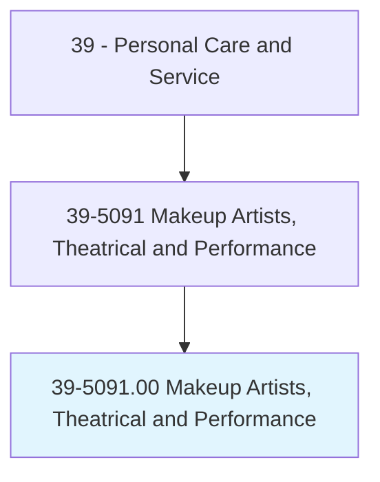
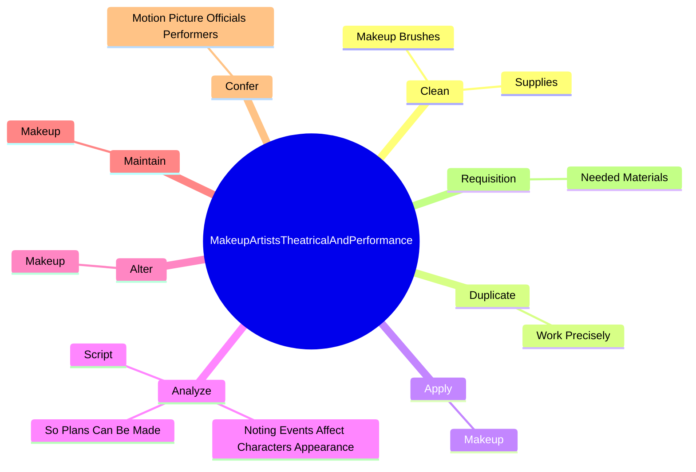
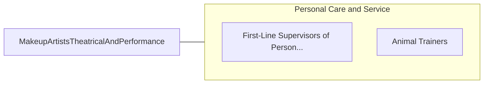

# Makeup Artists, Theatrical and Performance

> Apply makeup to performers to reflect period, setting, and situation of their role.

## Overview

Makeup Artists, Theatrical and Performance is classified under Personal Care and Service (SOC 39). Apply makeup to performers to reflect period, setting, and situation of their role.

## Classification Hierarchy

## Key Statistics

| Metric | Value |
|--------|-------|
| SOC Code | 39-5091.00 |
| Category | [Personal Care and Service](/occupations/PersonalService/index) |
| Task Count | 60 |
| Source | O*NET |

## Core Tasks

### clean.Supplies

Makeup Artists, Theatrical and Performance clean supplies as part of their core responsibilities.

**Actions:**
- `clean.Supplies`
- `clean.MakeupBrushes`

### duplicate.WorkPrecisely

Makeup Artists, Theatrical and Performance duplicate work precisely as part of their core responsibilities.

**Actions:**
- `duplicate.WorkPrecisely.to.replicate.CharactersAppearancesOnDailyBasis`

### apply.Makeup

Makeup Artists, Theatrical and Performance apply makeup as part of their core responsibilities.

**Actions:**
- `apply.Makeup.to.enhance.AppearanceOfPeopleAppearingInProductions`
- `apply.Makeup.to.alter.AppearanceOfPeopleAppearingInProductions`
- `apply.Makeup.to.Movies`

## Skills & Competencies

### Technical Skills
- **Customer Service** - Advanced
- **Personal Care** - Advanced
- **Service Delivery** - Advanced

### Soft Skills
- **Communication** - Essential
- **Problem Solving** - Essential
- **Critical Thinking** - Important
- **Teamwork** - Important
- **Adaptability** - Important

## Related Occupations

## Industries

This occupation is found across multiple industries. See [Industries](/industries) for sector-specific employment data.

## Career Progression

---

*Source: O*NET 39-5091.00 - ONETOccupation*
