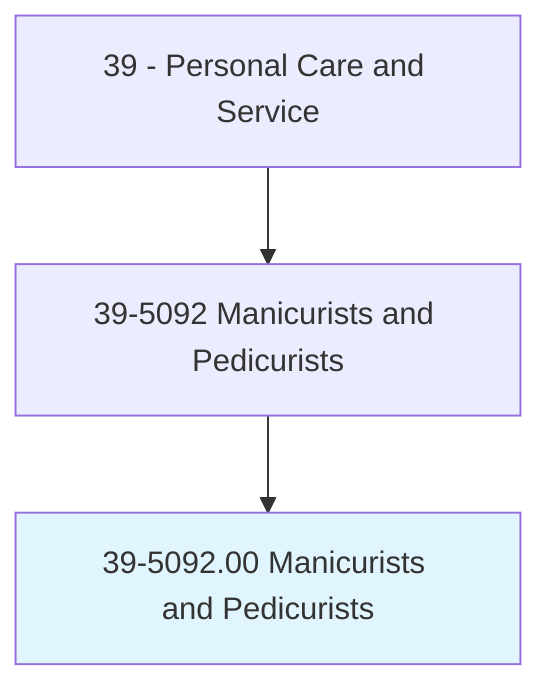
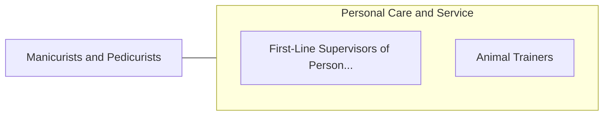

# Manicurists and Pedicurists

> Clean and shape customers' fingernails and toenails. May polish or decorate nails.

## Overview

Manicurists and Pedicurists is an occupation within the Personal Care and Service category. Clean and shape customers' fingernails and toenails. 

## Classification Hierarchy

## Key Statistics

| Metric | Value |
|--------|-------|
| SOC Code | 39-5092.00 |
| Category | [Personal Care and Service](/occupations/PersonalService) |
| Task Count | 56 |
| Source | O*NET |

## Core Tasks

```mermaid
mindmap
    root(("Manicurists and Pedicurists"))
        Clean
            Work Environment
        Sanitize
            Tools
            Work Environment
        Apply
            Undercoat
            Clear Polish
            Colored Polish
        Maintain
            Supply Inventories
            Records
        Shape
            Ends
        Smooth
            Ends
        Prepare
            Nail Cuticles
            Customers Nails
        Remove
            Previously Applied Nail Polish
            Using Liquid Remover
            Swabs
```

### clean.WorkEnvironment

Manicurists and Pedicurists clean work environment as part of their core responsibilities.

**Actions:**
- `clean.WorkEnvironment`

### sanitize.Tools

Manicurists and Pedicurists sanitize tools as part of their core responsibilities.

**Actions:**
- `sanitize.Tools`
- `sanitize.WorkEnvironment`

### apply.Undercoat

Manicurists and Pedicurists apply undercoat as part of their core responsibilities.

**Actions:**
- `apply.Undercoat.with.Brush`
- `apply.ClearPolish.onto.Nails.with.Brush`
- `apply.ColoredPolish.onto.Nails.with.Brush`

## Skills & Competencies

### Technical Skills
- **Customer Service** - Advanced
- **Personal Care** - Advanced
- **Service Delivery** - Advanced

### Soft Skills
- **Communication** - Essential
- **Problem Solving** - Essential
- **Critical Thinking** - Important
- **Teamwork** - Important
- **Adaptability** - Important

## Related Occupations

## Industries

This occupation is found across multiple industries. See [Industries](/industries) for sector-specific employment data.

## Career Progression

---

*Source: O*NET 39-5092.00 - ONETOccupation*
