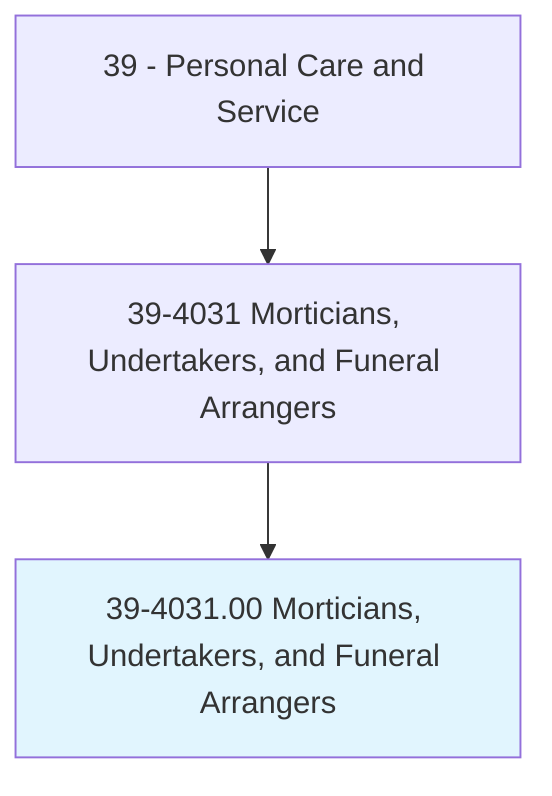
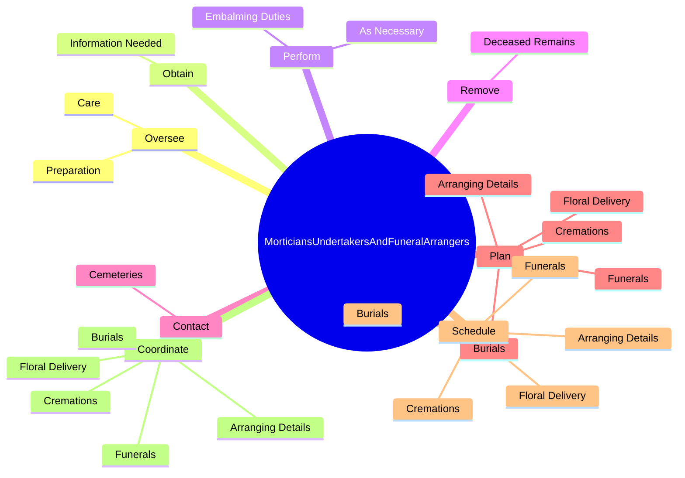

# Morticians, Undertakers, and Funeral Arrangers

> Perform various tasks to arrange and direct individual funeral services, such as coordinating transportation of body to mortuary, interviewing family or other authorized person to arrange details, selecting pallbearers, aiding with the selection of officials for religious rites, and providing transportation for mourners.

## Overview

Morticians, Undertakers, and Funeral Arrangers is classified under Personal Care and Service (SOC 39). Perform various tasks to arrange and direct individual funeral services, such as coordinating transportation of body to mortuary, interviewing family or other authorized person to arrange details, selecting pallbearers, aiding with the selection of officials for religious rites, and providing transportation for mourners.

## Classification Hierarchy

## Key Statistics

| Metric | Value |
|--------|-------|
| SOC Code | 39-4031.00 |
| Category | [Personal Care and Service](/occupations/PersonalService/index) |
| Task Count | 78 |
| Source | O*NET |

## Core Tasks

### oversee.Preparation

Morticians, Undertakers, and Funeral Arrangers oversee preparation as part of their core responsibilities.

**Actions:**
- `oversee.Preparation.of.Remains.of.PeopleWhoHaveDied`
- `oversee.Care.of.Remains.of.PeopleWhoHaveDied`

### obtain.InformationNeeded

Morticians, Undertakers, and Funeral Arrangers obtain information needed as part of their core responsibilities.

**Actions:**
- `obtain.InformationNeeded.to.complete.LegalDocuments`
- `obtain.InformationNeeded.to.DeathCertificates`
- `obtain.InformationNeeded.to.BurialPermits`

### perform.EmbalmingDuties

Morticians, Undertakers, and Funeral Arrangers perform embalming duties as part of their core responsibilities.

**Actions:**
- `perform.EmbalmingDuties`
- `perform.AsNecessary`

## Skills & Competencies

### Technical Skills
- **Customer Service** - Advanced
- **Personal Care** - Advanced
- **Service Delivery** - Advanced

### Soft Skills
- **Communication** - Essential
- **Problem Solving** - Essential
- **Critical Thinking** - Important
- **Teamwork** - Important
- **Adaptability** - Important

## Related Occupations

## Industries

This occupation is found across multiple industries. See [Industries](/industries) for sector-specific employment data.

## Career Progression

---

*Source: O*NET 39-4031.00 - ONETOccupation*
