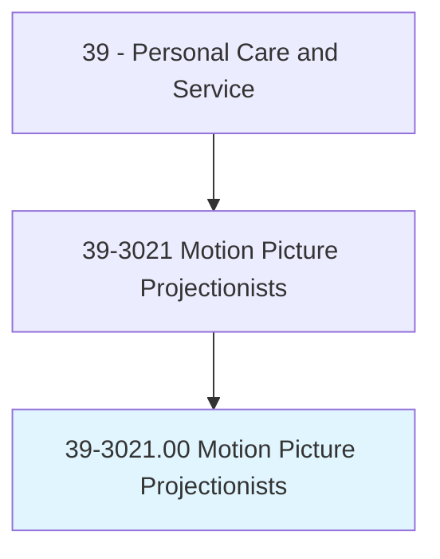
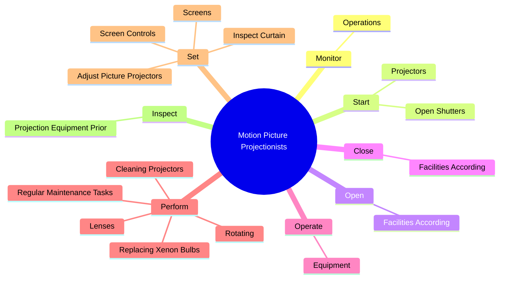
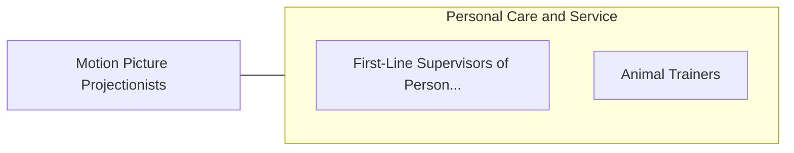

# Motion Picture Projectionists

> Set up and operate motion picture projection and related sound reproduction equipment.

## Overview

Motion Picture Projectionists is classified under Personal Care and Service (SOC 39). Set up and operate motion picture projection and related sound reproduction equipment.

## Classification Hierarchy

## Key Statistics

| Metric | Value |
|--------|-------|
| SOC Code | 39-3021.00 |
| Category | [Personal Care and Service](/occupations/PersonalService/index) |
| Task Count | 59 |
| Source | O*NET |

## Core Tasks

### monitor.Operations

Motion Picture Projectionists monitor operations as part of their core responsibilities.

**Actions:**
- `monitor.Operations.to.ensure.StandardsForSoundProjectionQualityAreMet`
- `monitor.Operations.to.ImageProjectionQualityAreMet`

### start.Projectors

Motion Picture Projectionists start projectors as part of their core responsibilities.

**Actions:**
- `start.Projectors.to.project.ImagesOntoScreens`
- `start.OpenShutters.to.project.ImagesOntoScreens`

### open.FacilitiesAccording

Motion Picture Projectionists open facilities according as part of their core responsibilities.

**Actions:**
- `open.FacilitiesAccording.to.rules`
- `open.FacilitiesAccording.to.schedules`

## Skills & Competencies

### Technical Skills
- **Customer Service** - Advanced
- **Personal Care** - Advanced
- **Service Delivery** - Advanced

### Soft Skills
- **Communication** - Essential
- **Problem Solving** - Essential
- **Critical Thinking** - Important
- **Teamwork** - Important
- **Adaptability** - Important

## Related Occupations

## Industries

This occupation is found across multiple industries. See [Industries](/industries) for sector-specific employment data.

## Career Progression

---

*Source: O*NET 39-3021.00 - ONETOccupation*
