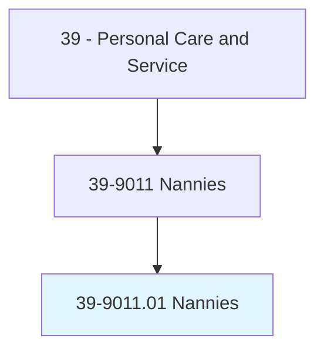
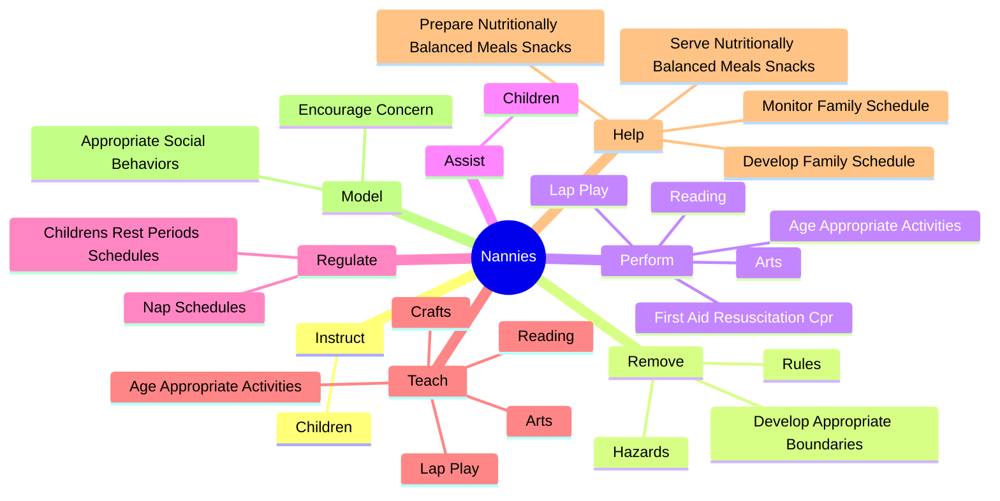
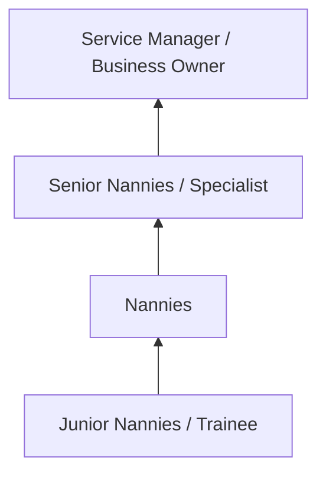
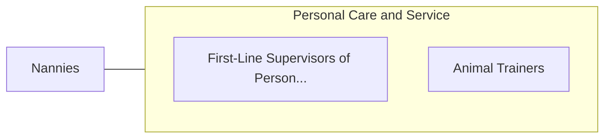

# Nannies

> Care for children in private households and provide support and expertise to parents in satisfying children's physical, emotional, intellectual, and social needs. Duties may include meal planning and preparation, laundry and clothing care, organization of play activities and outings, discipline, intellectual stimulation, language activities, and transportation.

## Overview

Nannies professionals care for children in private households and provide support and expertise to parents in satisfying children's physical, emotional, intellectual, and social needs. This occupation falls within the Personal Care and Service category and requires a combination of specialized knowledge, technical skills, and practical experience.

These professionals work across diverse settings and organizational contexts, applying their expertise to meet the demands of their field. They must stay current with industry standards, emerging practices, and regulatory requirements that affect their work. The role demands both independent judgment and collaborative skills, as practitioners regularly interact with colleagues, stakeholders, and the public.

As the field continues to evolve, Nannies professionals increasingly leverage technology and data-driven approaches to enhance their effectiveness. Career opportunities span the public and private sectors, with demand influenced by economic conditions, demographic shifts, and technological advancement.

## Classification Hierarchy



## Key Statistics

| Metric | Value |
|--------|-------|
| SOC Code | 39-9011.01 |
| Job Zone | N/A |
| Category | [Personal Care and Service](/occupations/PersonalService/index) |
| Core Tasks | 69+ |
| Salary Range | $25,000 - $60,000 |
| Median Salary | $35,000 |
| Growth Outlook | 8% (Faster than average) |
| Source | O*NET |

## Core Tasks



### perform.FirstAidResuscitationCpr

Nannies perform first aid resuscitation cpr as part of their core responsibilities.

**Actions:**
- `perform.FirstAidResuscitationCpr` - Perform first aid or cardiopulmonary resuscitation (CPR) when required.
- `perform.AgeAppropriateActivities.to.encourage.IntellectualDevelopmentOfChildren` - Teach and perform age-appropriate activities, such as lap play, reading, and ...
- `perform.LapPlay.to.encourage.IntellectualDevelopmentOfChildren` - Teach and perform age-appropriate activities, such as lap play, reading, and ...
- `perform.Reading.to.encourage.IntellectualDevelopmentOfChildren` - Teach and perform age-appropriate activities, such as lap play, reading, and ...
- `perform.Arts.to.encourage.IntellectualDevelopmentOfChildren` - Teach and perform age-appropriate activities, such as lap play, reading, and ...

### conduct.AgeAppropriateRecreationalActivities

Nannies conduct age appropriate recreational activities as part of their core responsibilities.

**Actions:**
- `conduct.AgeAppropriateRecreationalActivities` - Organize and conduct age-appropriate recreational activities, such as games, ...
- `conduct.Arts` - Organize and conduct age-appropriate recreational activities, such as games, ...
- `conduct.Crafts` - Organize and conduct age-appropriate recreational activities, such as games, ...
- `conduct.Sports` - Organize and conduct age-appropriate recreational activities, such as games, ...
- `conduct.Walks` - Organize and conduct age-appropriate recreational activities, such as games, ...

### assign.AppropriateChoresTargetedBehaviors

Nannies assign appropriate chores targeted behaviors as part of their core responsibilities.

**Actions:**
- `assign.AppropriateChoresTargetedBehaviors.to.encourage.DevelopmentOfSelfControl` - Assign appropriate chores and praise targeted behaviors to encourage developm...
- `assign.AppropriateChoresTargetedBehaviors.to.SelfConfidence` - Assign appropriate chores and praise targeted behaviors to encourage developm...
- `assign.AppropriateChoresTargetedBehaviors.to.Responsibility` - Assign appropriate chores and praise targeted behaviors to encourage developm...
- `assign.PraiseTargetedBehaviors.to.encourage.DevelopmentOfSelfControl` - Assign appropriate chores and praise targeted behaviors to encourage developm...
- `assign.PraiseTargetedBehaviors.to.SelfConfidence` - Assign appropriate chores and praise targeted behaviors to encourage developm...

### observe.ChildrensBehavior

Nannies observe childrens behavior as part of their core responsibilities.

**Actions:**
- `observe.ChildrensBehavior.for.Irregularities` - Observe children's behavior for irregularities, take temperature, transport c...
- `observe.ChildrensBehavior.for.TakeTemperature` - Observe children's behavior for irregularities, take temperature, transport c...
- `observe.ChildrensBehavior.for.TransportChildren.to.Doctor` - Observe children's behavior for irregularities, take temperature, transport c...
- `observe.ChildrensBehavior.for.AdministerMedications` - Observe children's behavior for irregularities, take temperature, transport c...
- `observe.ChildrensBehavior.for.AsDirected` - Observe children's behavior for irregularities, take temperature, transport c...


## Skills & Competencies

### Technical Skills
- **Service Delivery** - Advanced
- **Customer Relations** - Advanced
- **Scheduling and Planning** - Proficient
- **Safety and Hygiene** - Proficient
- **Specialty Skills** - Proficient
- **Point-of-Sale Systems** - Proficient

### Soft Skills
- **Customer Service** - Critical
- **Communication** - Critical
- **Patience** - Essential
- **Adaptability** - Essential
- **Interpersonal Skills** - Essential

## Education & Certifications

| Requirement | Details |
|-------------|---------|
| Typical Education | High school diploma to post-secondary certificate |
| Work Experience | 0-2 years service experience |
| On-the-Job Training | Short to moderate - customer service and specialty skills |
| Certifications | State licensure for cosmetology, massage, etc. |

## Career Progression



## Industry Variations

### Hospitality and Leisure
Service delivery in hotels, resorts, and entertainment venues. Nannies professionals focus on guest satisfaction and experience.

### Health and Wellness
Personal services supporting physical and mental well-being. Emphasis on client relationships and customized service.

### Retail and Consumer Services
Direct consumer-facing service delivery. Focus on customer experience and repeat business.

### Self-Employment
Independent service provision with entrepreneurial responsibilities including marketing, scheduling, and business management.

## Technology & Tools

- **Scheduling and booking software**
- **Point-of-sale systems**
- **Customer relationship management (CRM)**
- **Specialty service equipment**
- **Social media marketing tools**

## Related Occupations



## Industries

- [Personal and Laundry Services](/industries/PersonalServices) - High Employment
- Amusement and Recreation - High Employment
- [Accommodation](/industries/Accommodation) - Moderate Employment
- [Fitness and Wellness](/industries/Fitness) - Growing Employment

## Departments

This occupation typically works in:
- Guest Services
- Client Relations
- [Operations](/departments/Operations/index)

## GraphDL Semantic Structure

```graphdl
Nannies perform:
- instruct.Children.in.SafeBehavior
- instruct.Children.in.SeekingAdultAssistanceWhenCrossingStreet
- instruct.Children.in.AvoidingContact.with.UnsafeObjects
- remove.Hazards.to.create.SafeEnvironmentForChildren
- remove.DevelopAppropriateBoundaries.to.create.SafeEnvironmentForChildren
- remove.Rules.to.create.SafeEnvironmentForChildren
```

---

*Source: O*NET 39-9011.01 - ONETOccupation*
